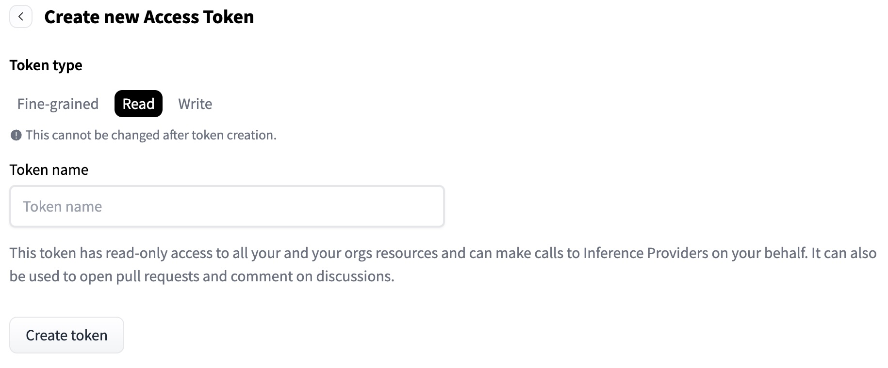

## Build 

In this learning path, we will use Arm’s downstream canary release of PyTorch, which includes ready-to-use examples and scripts. While this release offers access to the latest downstream features, it is intended for experimentation rather than production use.

### 1. Create HuggingFace Account

Create up a [huggingface account](https://huggingface.co/) if you do not already have one. Once created, request access to the [1B](https://huggingface.co/google/gemma-3-1b-it) and [270M](https://huggingface.co/google/gemma-3-270m-it) variants of Google's Gemma-3 model. It will take around 15 minutes to be granted access. 

### 2. Connect to an Arm system and install Docker

lease see our [getting started guide](https://learn.arm.com/learning-paths/servers-and-cloud-computing/csp/) if it is your first time using Arm-based cloud instances. 

In this example I will be using an AWS Graviton 4 (`m8g.24xlarge`)instance running Ubuntu 24.04 LTS. This is based on the Neoverse V2 architecture.


Install docker through the [official documentation](https://docs.docker.com/engine/install/ubuntu/) or our [Arm install guide](https://learn.arm.com/install-guides/docker/docker-desktop-arm-linux/). Make sure to follow the post-installation steps. 


### 3. Build the PyTorch-AArch64 Docker Container

Connect to the Arm instance and run the following to clone the repository.

```bash
git clone https://github.com/ARM-software/Tool-Solutions.git
cd Tool-Solutions/ML-Frameworks/pytorch-aarch64/
```
Run the following bash script to build the container

```bash
./build.sh -n $(nproc - 1)
```

> **Note**: On a 96-core instance `m8g.24` AWS this will take approximately 20 minutes to build. 

Once the build has finished, run the following command replacing `<version>` with the version of torch and torchao just built. 

```bash
./dockerize.sh ./results/torch-<version>linux_aarch64.whl ./results/torchao-<version>-py3-none-any.whl 
```

You should see the following output in your terminal, confirming that you are in the correct directory inside the Docker container.

```outpu
aarch64_pytorch ~> 
```

### 5. Login to HuggingFace


Create a new `read` token on HuggingFace by clicking [this link](https://huggingface.co/settings/tokens/new?tokenType=read). 



Provide a suitable token name, press create token and copy the generated token value. From within docker container, enter the following command and paste the token to login.

```bash
huggingface-cli login
```

> **Note**: The login will not persist once the docker session has ended