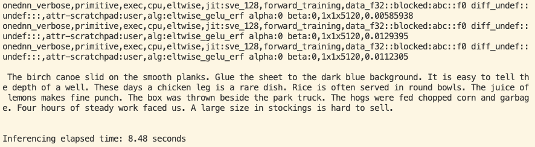

---
# User change
title: "Set up the Whisper Model"

weight: 3

# Do not modify these elements
layout: "learningpathall"
---

## Before you begin

This Learning Path demonstrates how to run the [whisper-large-v3-turbo model](https://huggingface.co/openai/whisper-large-v3-turbo) as an application that accepts an audio input and computes its text transcript. 

The instructions in this Learning Path have been designed for Arm servers running Ubuntu 24.04 LTS. You will need an Arm server instance with 32 cores, at least 8GB of RAM, and 32GB of disk space. 

These steps have been tested on an AWS Graviton4 `c8g.8xlarge` instance.

## Overview and Focus of Learning Path

OpenAI Whisper is an open-source Automatic Speech Recognition (ASR) model trained on multilingual, multitask data. It can generate transcripts in multiple languages and translate various languages into English. 

In this Learning Path, you will learn about the foundational aspects of speech-to-text transcription applications, with a focus on running OpenAI’s Whisper on an Arm CPU. You will explore the implementation and performance considerations required to efficiently deploy Whisper using the Hugging Face Transformers framework.

### Speech-to-text ML applications

Speech-to-text (STT) transcription applications transform spoken language into written text, enabling voice-driven interfaces, accessibility tools, and real-time communication services. 

Audio is first cleaned and converted into a format suitable for processing, then passed through a deep learning model trained to recognize speech patterns. Advanced language models help refine the output, improving accuracy by predicting likely word sequences based on context. When deployed on cloud servers, STT applications must balance accuracy, latency, and computational efficiency to meet diverse use cases.

## Learning Path Setup

To get set up, follow these steps, copying the code snippets at each stage.

### Install dependencies

Install the following packages on your Arm-based server instance:

```bash
sudo apt update
sudo apt install python3-pip python3-venv ffmpeg wget -y
```

### Install Python Dependencies

Create a Python virtual environment:

```bash
python3 -m venv whisper-env
```

Activate the virtual environment:

```bash
source whisper-env/bin/activate
```

Install the required libraries using pip:

```python3
pip install torch transformers accelerate
```

### Download the Sample Audio File

Download this sample audio file, which is about 33 seconds in .wav format. 

You can use any .wav file to try different examples:
```bash
wget https://www.voiptroubleshooter.com/open_speech/american/OSR_us_000_0010_8k.wav
```

### Create a Python Script for Audio-To-Text Transcription

Use the Hugging Face `Transformers` framework to process the audio. It provides classes to configure the model and prepare it for inference. 

The `pipeline` function is an end-to-end solution for NLP tasks. In the code below, it is configured to do pre- and post-processing of the sample in this example, as well as running inference.

Using a file editor of your choice, create a Python file named `whisper-application.py` with the following content:

```python { file_name="whisper-application.py" }
import torch
from transformers import AutoModelForSpeechSeq2Seq, AutoProcessor, pipeline
import time

# Set the device to CPU and specify the torch data type
device = "cpu"
torch_dtype = torch.float32

# Specify the model name
model_id = "openai/whisper-large-v3-turbo"

# Load the model with specified configurations
model = AutoModelForSpeechSeq2Seq.from_pretrained(
    model_id, torch_dtype=torch_dtype, low_cpu_mem_usage=True, use_safetensors=True
)

# Move the model to the specified device
model.to(device)

# Load the processor for the model
processor = AutoProcessor.from_pretrained(model_id)

# Create a pipeline for automatic speech recognition
pipe = pipeline(
    "automatic-speech-recognition",
    model=model,
    tokenizer=processor.tokenizer,
    feature_extractor=processor.feature_extractor,
    torch_dtype=torch_dtype,
    device=device,
    return_timestamps=True
)

# Record the start time of the inference
start_time = time.time()

# Perform speech recognition on the audio file
result = pipe("OSR_us_000_0010_8k.wav")

# Record the end time of the inference
end_time = time.time()

# Print the transcribed text
print(f'\n{result["text"]}\n')

# Calculate and print the duration of the inference
duration = end_time - start_time
hours = duration // 3600
minutes = (duration - (hours * 3600)) // 60
seconds = (duration - ((hours * 3600) + (minutes * 60)))
msg = f'\nInferencing elapsed time: {seconds:4.2f} seconds\n'

print(msg)
```

Enable verbose mode for the output and run the script:

```bash
export DNNL_VERBOSE=1
python3 whisper-application.py
```

You should see output similar to the image below, which includes the log output, the audio transcript, and the `Inferencing elapsed time`.




You have now run the Whisper model successfully on your Arm-based CPU. 

Continue to the next section to configure flags that can boost your model's performance.
