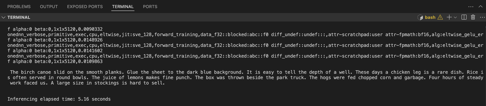

## Optimize Environment Variables to Boost Performance

Speech-to-text applications often process large amounts of audio data in real time, requiring efficient computation to balance accuracy and speed. Low-level implementations of neural network kernels can enhance performance by reducing processing overhead. 

When tailored for specific hardware architectures, such as Arm CPUs, these kernels accelerate key tasks such as feature extraction and neural network inference. Optimized kernels ensure that speech models like OpenAI's Whisper run efficiently, making high-quality transcription more accessible across various server applications.

Other factors contribute to more efficient memory usage. For example, allocating additional memory and threads for specific tasks can boost performance. By leveraging these hardware-aware optimizations, applications can achieve lower latency, reduced power consumption, and smoother real-time transcription.

Use the following flags to optimize performance on Arm machines:

```bash
export DNNL_DEFAULT_FPMATH_MODE=BF16
export THP_MEM_ALLOC_ENABLE=1
export LRU_CACHE_CAPACITY=1024
export OMP_NUM_THREADS=32
```
These variables do the following:

*`export DNNL_DEFAULT_FPMATH_MODE=BF16` - sets the default floating-point math mode for the oneDNN library to BF16 (bfloat16). This can improve performance and efficiency on hardware that supports BF16 precision.

*`export THP_MEM_ALLOC_ENABLE=1` - enables an optimized memory allocation strategy - often leveraging transparent huge pages - which can enhance memory management and reduce fragmentation in frameworks like PyTorch.
 
*`export LRU_CACHE_CAPACITY=1024` - configures the capacity of a Least Recently Used (LRU) cache to 1024 entries. This helps store and quickly retrieve recently used data, reducing redundant computations. 

*`export OMP_NUM_THREADS=32` - sets the number of threads for OpenMP-based parallel processing to 32, allowing your application to take full advantage of multi-core systems for faster performance.

{}
BF16 support is merged into PyTorch versions greater than 2.3.0.
{}

## Run Whisper File
After setting the environment variables in the previous step, run the Whisper model again and analyze the performance impact.

Run the `whisper-application.py` file:

```python
python3 whisper-application.py
```

## Analyze output

You should now see that the processing time has gone down compared to the last run:



The output in the above image has the log containing `attr-fpmath:bf16`, which confirms that the compute process uses fast math BF16 kernels to improve performance.

You have now learned how configuring these environment variables can achieve performance uplift of OpenAI's Whisper model when using Hugging Face Transformers framework on Arm-based systems.
