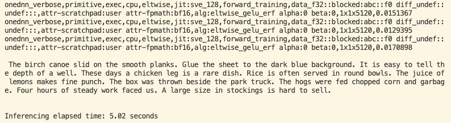

## Setting Environment Variables that Impact Performance

Speech-to-text applications often process large amounts of audio data in real time, requiring efficient computation to balance accuracy and speed. Low-level implementations of neural network kernels can enhance performance by reducing processing overhead. When tailored for specific hardware architectures, such as Arm CPUs, these kernels accelerate key tasks like feature extraction and neural network inference. Optimized kernels ensure that speech models like OpenAI’s Whisper run efficiently, making high-quality transcription more accessible across various server applications.

Other considerations allow for more efficient memory usage. For example, allocating additional memory and threads for specific tasks can increase performance. By enabling these hardware-aware options, applications achieve lower latency, reduced power consumption, and smoother real-time transcription.

Use the following flags to optimize performance on Arm machines:

* Enable fast math BFloat16(BF16) GEMM kernels.
* Enable Linux Transparent Huge Page (THP) allocations.
* Enable logs to confirm kernel and set LRU cache capacity and OMP_NUM_THREADS.

```bash
export DNNL_DEFAULT_FPMATH_MODE=BF16
export THP_MEM_ALLOC_ENABLE=1
export LRU_CACHE_CAPACITY=1024
export OMP_NUM_THREADS=32
```

{}
BF16 support is merged into PyTorch versions greater than 2.3.0.
{}

## Run Whisper File
After setting the environment variables in the previous step, you can now run the Whisper model again and analyze the performance impact.

Run the `whisper-application.py` file:

```python
python3 whisper-application.py
```

## Analyze output

You should now see that the processing time has gone down compared to the last run:



The output in the above image has the log containing `attr-fpmath:bf16`, which confirms that fast math BF16 kernels are used in the compute process to improve the performance.

Enable the environment variables detailed in this Learning Path to achieve performance uplift of OpenAI Whisper using Hugging Face Transformers framework on Arm.
