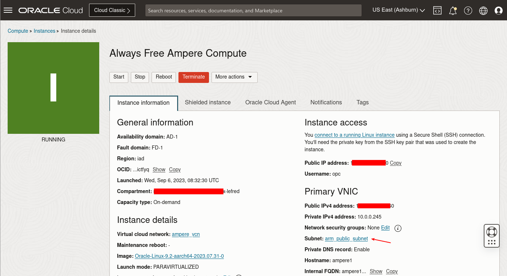
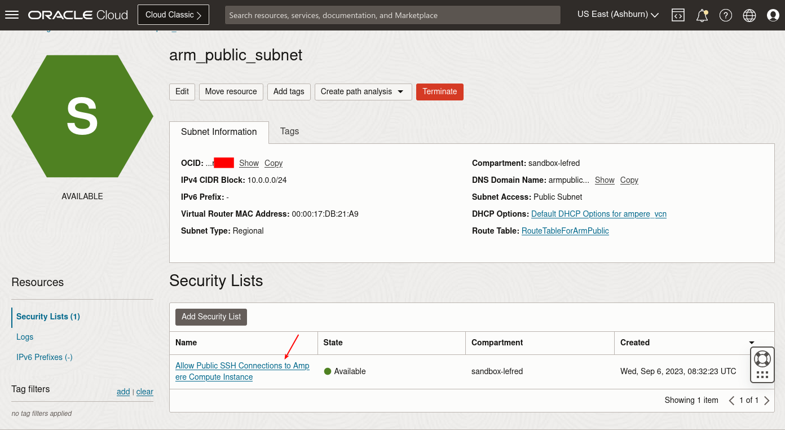
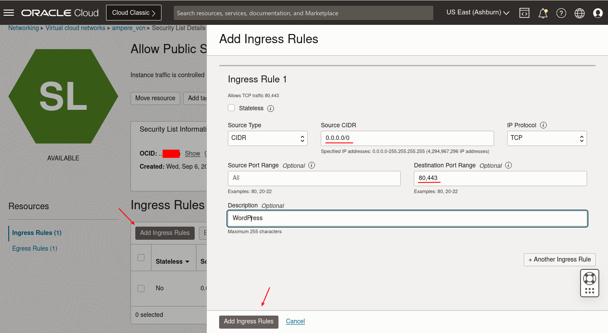
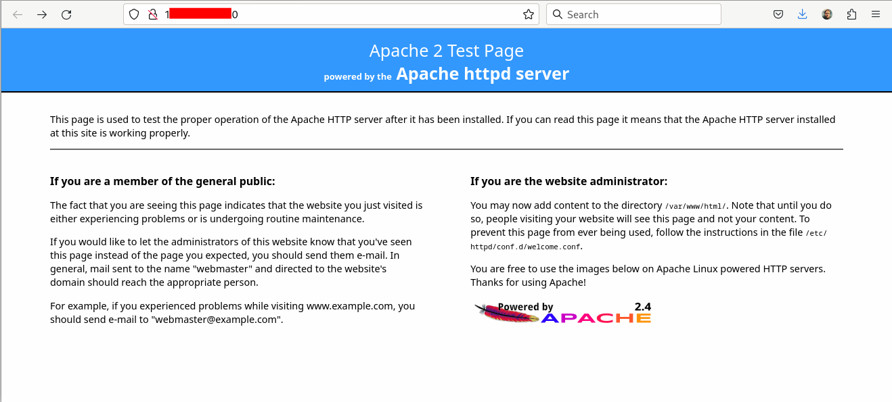
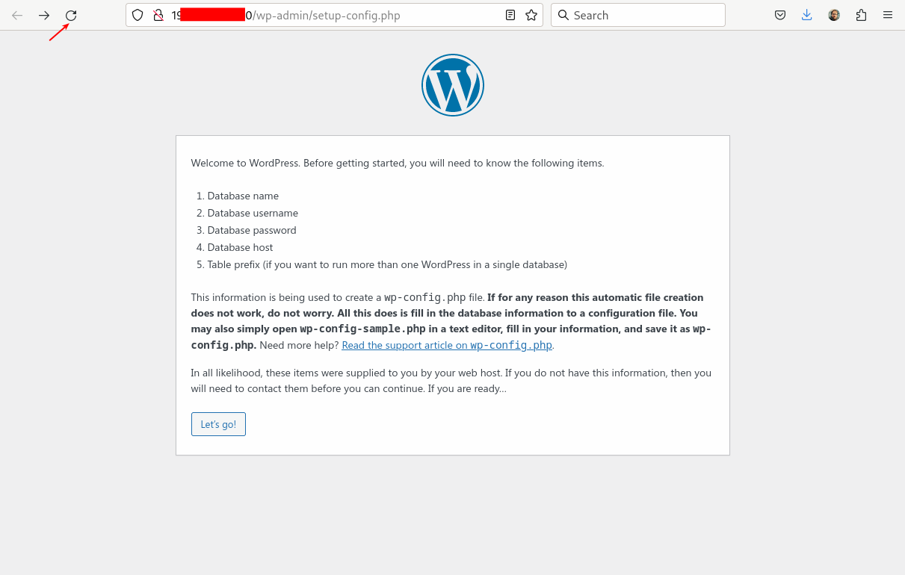
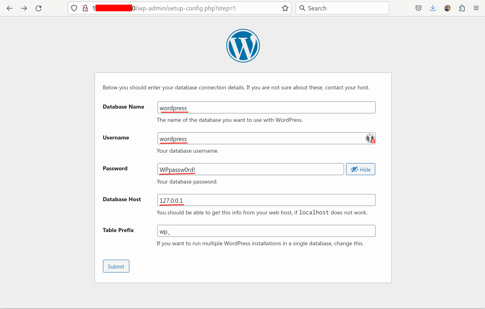
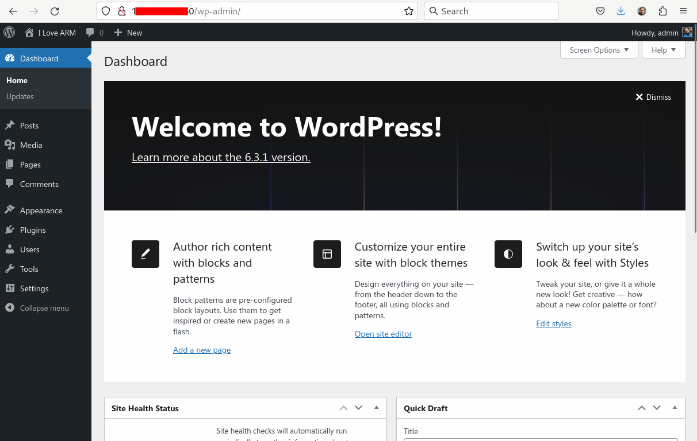

This Learning Path explains how to install MySQL Community Server and WordPress on an Arm virtual machine instance in Oracle Cloud Infrastructure (OCI).

## Before you begin

You may want to review the Learning Path [Getting Started with Oracle OCI](/learning-paths/servers-and-cloud-computing/csp/oci/) before proceeding.

You will need an [Oracle OCI account](https://cloud.oracle.com/) to complete this Learning Path. [Create an account](https://signup.oraclecloud.com/) and use Oracle Cloud Free Tier if you don’t already have an account.

## Deploy a compute instance

You can deploy an Arm (Ampere) compute instance in OCI via the console or using Terraform.

If you want to deploy a compute instance using Terraform, you can follow the Learning Path [Deploy Arm Instances on Oracle Cloud Infrastructure (OCI) using Terraform](/learning-paths/servers-and-cloud-computing/oci-terraform/).

The compute instance should be created with Oracle Linux 9 as the operating system. 

## Connect to the compute instance using SSH

To install WordPress and MySQL, connect to the compute instance using SSH. For Oracle Linux the username is `opc`.
Use the SSH key you setup when creating the instance and your public IP address. 

Run `ssh` and substitute your SSH key and your public IP address:

```console
ssh -i <your-ssh-key> opc@<your public IP>
```

You are now connected to your OCI instance and ready to start installing WordPress.

## Install MySQL

Start by installing MySQL 8.1, the latest Innovation Release, using the Community repository.

You need to install the Yum repository for the correct OS version, in this case Oracle Linux 9:

```console
cat /etc/oracle-release 
```

The output should be similar to:

```output
Oracle Linux Server release 9.2
```

Visit https://dev.mysql.com/downloads/repo/yum/ to see the contents of the latest YUM repository.

Run `rpm` to install the repository setup package:

```console
sudo rpm -ivh https://dev.mysql.com/get/mysql80-community-release-el9-4.noarch.rpm
```

Next, install MySQL and MySQL Shell:

```console
sudo dnf install -y mysql-community-server mysql-shell \
                 --enablerepo mysql-innovation-community --enablerepo mysql-tools-innovation-community
```

## Prepare the database

Start MySQL using `systemctl`:

```console
sudo systemctl start mysqld
```

By default, MySQL generates a password for the `root` user. Use the `grep` command to find the generated password:

```console
sudo grep password /var/log/mysqld.log 
```

The password is shown in the output (your password will be different). 

```output
2023-09-06T08:47:37.029047Z 6 [Note] [MY-010454] [Server] A temporary password is generated for root@localhost: cMP,ycA01Yoq
```

Make a note of the `root` password. 

Connect to the MySQL instance using MySQL Shell:

```console
mysqlsh --sql mysql://root@localhost
```

Proceed through the questions. Enter your saved `root` password and answer `No` that you don't want to save it. 

You will end up at a MySQL prompt that includes ` SQL >` 

```output
Please provide the password for 'root@localhost': ************
Save password for 'root@localhost'? [Y]es/[N]o/Ne[v]er (default No): no
Error during auto-completion cache update: You must reset your password using ALTER USER statement before executing this statement.
MySQL Shell 8.1.1

Copyright (c) 2016, 2023, Oracle and/or its affiliates.
Oracle is a registered trademark of Oracle Corporation and/or its affiliates.
Other names may be trademarks of their respective owners.

Type '\help' or '\?' for help; '\quit' to exit.
Creating a Classic session to 'root@localhost'
Your MySQL connection id is 8
No default schema selected; type \use <schema> to set one.
 MySQL  localhost  SQL > 
```

At the SQL prompt change the password:

```sql
set password='MyPassw0rd!';
```

The output will be similar to:
```output
Query OK, 0 rows affected (0.0247 sec)
```

Next, create a database for WordPress and a dedicated user. Make sure you are entering these commands at the ` SQL >` prompt:

```sql
create database wordpress;
create user wordpress identified by 'WPpassw0rd!';
grant all privileges on wordpress.* to wordpress;
```

The database name `wordpress`, the user name `wordpress`, and the new password will be used later during WordPress installation. 


## Install the Apache server

WordPress can use Apache as a web server. Install `httpd`, PHP, and several PHP modules:

```console
sudo yum install -y httpd php php-mysqlnd php-zip php-gd php-mbstring php-xml php-json
```

## Start Apache 

You can now start Apache and configure the system to restart it after reboot:

```console
sudo systemctl enable httpd --now
```

## Configure Security

To reach the web server from your local machine, you need to modify the firewall to allow http and https connections to reach the web server.

Open the firewall using the commands:

```console
sudo firewall-cmd --permanent --add-port=80/tcp
sudo firewall-cmd --permanent --add-port=443/tcp
sudo firewall-cmd --reload
```

You also need to modify the security list in the OCI console.

Select the compute instance's subnet:



Click on the default security list.



Add a new rule to allow http and https connections (TCP ports 80 and 443) for the world (0.0.0.0/0):



When you are done, enter the compute instance's public IP address in your browser and you should see the following page:



### Configure SE Linux

You also need to make modifications to SE Linux to allow Apache to connect and write data to MySQL:

Run the commands:

```console
sudo chcon -t httpd_sys_rw_content_t /var/www/html -R
sudo setsebool -P httpd_can_network_connect_db 1
```

## Install WordPress

You can download the latest WordPress release using the commands below.

Download the latest release:

```console
curl -O https://wordpress.org/latest.tar.gz
```

Extract the downloaded file in the web server root directory:

```console
sudo tar zxf latest.tar.gz -C /var/www/html/ --strip 1
```

Adjust the ownership of the newly installed files:

```console
sudo chown apache. -R /var/www/html/
```

Create a new folder for future content uploads and set the ownership:

```console
sudo mkdir /var/www/html/wp-content/uploads
sudo chown apache:apache /var/www/html/wp-content/uploads
```

In the browser where you entered the public IP, refresh the page and you should now see the WordPress installation wizard:



Next, use the database name, user name, and password you created in MySQL and use `127.0.0.1` as database host:



Follow the next steps in the Wizard and at the end you should see your WordPress instance using MySQL running on an Arm Shape (Ampere always free) on OCI:

