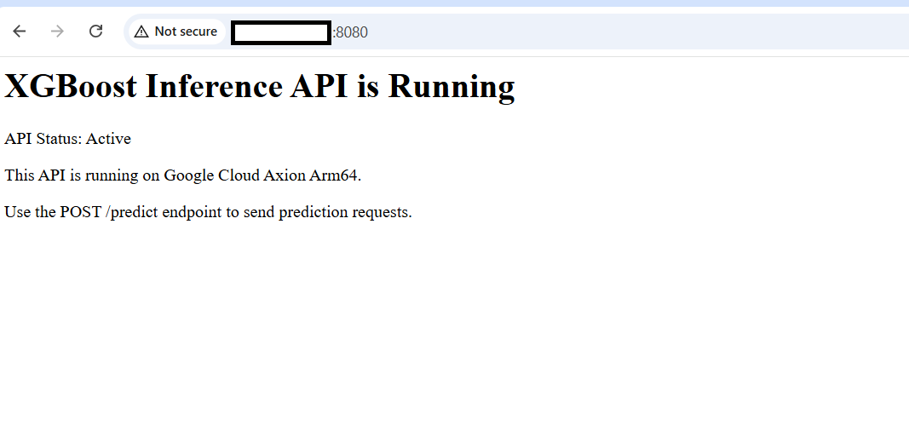

## Run the XGBoost inference API on SUSE Linux

In this section, you'll deploy the trained XGBoost model as a Flask-based inference API on the Google Axion Arm64 VM and test it with a sample prediction request.

If you're continuing in the same SSH session from the previous section, the `xgb-env` virtual environment is already active and your working directory is `~/xgboost-learning-path`. If you've opened a new session, re-activate the environment and navigate to the project directory:

```bash
cd ~/xgboost-learning-path
source xgb-env/bin/activate
```

### Install Flask

Flask is a lightweight Python web framework used to serve the XGBoost model over HTTP. Add it to the requirements file and install it:

```bash
cat > requirements.txt <<'EOF'
xgboost
numpy
pandas
scikit-learn
matplotlib
joblib
flask
EOF
```

Install all dependencies including Flask inside the Python virtual environment.

```bash
pip install -r requirements.txt
```

Verify that Flask is installed successfully.

```bash
pip list | grep Flask
```

The output is similar to:

```output
Flask            3.1.3
```

### Create the inference API

Create a Flask application that loads the trained XGBoost model and exposes two endpoints: a `GET /` route for browser health checks, and a `POST /predict` route that accepts a JSON array of features and returns a prediction. The model is loaded once at startup using `joblib` so it doesn't need to be reloaded on every request:

```bash
cat > inference_api.py <<'EOF'
from flask import Flask, request, jsonify
import numpy as np
import joblib

app = Flask(__name__)

model = joblib.load("xgboost-model.pkl")

@app.route("/", methods=["GET"])
def home():
    return """
    <h1>XGBoost API Running on GCP Axion Arm64</h1>
    <p>Inference API Status : Active</p>
    <p>Use POST /predict endpoint for predictions.</p>
    """

@app.route("/predict", methods=["POST"])
def predict():

    try:
        data = request.json["features"]

        prediction = model.predict(np.array([data]))

        return jsonify({
            "prediction": int(prediction[0])
        })

    except Exception as e:
        return jsonify({
            "error": str(e)
        })

if __name__ == "__main__":
    app.run(host="0.0.0.0", port=8080)
EOF
```

### Start the inference API

Start the Flask server in the background so you can continue using the same terminal for testing:

```bash
python inference_api.py &
```

The output is similar to:

```output
 * Running on all addresses (0.0.0.0)
 * Running on http://127.0.0.1:8080
 * Running on http://10.128.15.209:8080
```

The server is now listening on all network interfaces, including the VM's external IP on port 8080.

### Access the API from a browser

Open your browser and navigate to the VM public IP on port 8080:

```text
http://<VM-PUBLIC-IP>:8080
```

Example:

```text
http://35.xxx.xxx.xxx:8080
```

The page displays the HTML response from the `/` route, confirming the API is running:



### Test inference

Send a prediction request to the `/predict` endpoint using `curl`. The input data is a 30-feature vector from the breast cancer dataset — the same format used during training. The `features` array must contain exactly 30 values to match the model's expected input shape. For example:

```bash
curl -X POST http://127.0.0.1:8080/predict \
-H "Content-Type: application/json" \
-d '{"features":[17.99,10.38,122.8,1001.0,0.1184,0.2776,0.3001,0.1471,0.2419,0.07871,1.095,0.9053,8.589,153.4,0.006399,0.04904,0.05373,0.01587,0.03003,0.006193,25.38,17.33,184.6,2019.0,0.1622,0.6656,0.7119,0.2654,0.4601,0.1189]}'
```

The output is similar to:

```output
{"prediction":0}
```

A prediction of `0` corresponds to a malignant classification in the breast cancer dataset, and a prediction of `1` corresponds to a benign classification. The model received the feature array, ran inference, and returned the result through the REST API.

## What you've accomplished 

You've successfully deployed a trained XGBoost model as a Flask REST API on a Google Axion Arm64 VM, confirmed browser access through the external IP, and validated inference with a live prediction request. 
