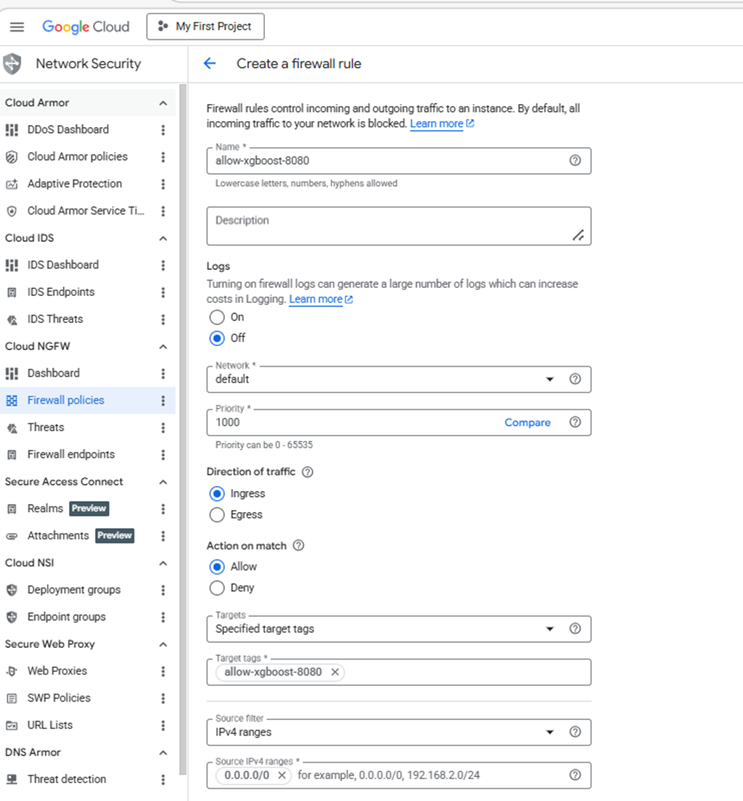
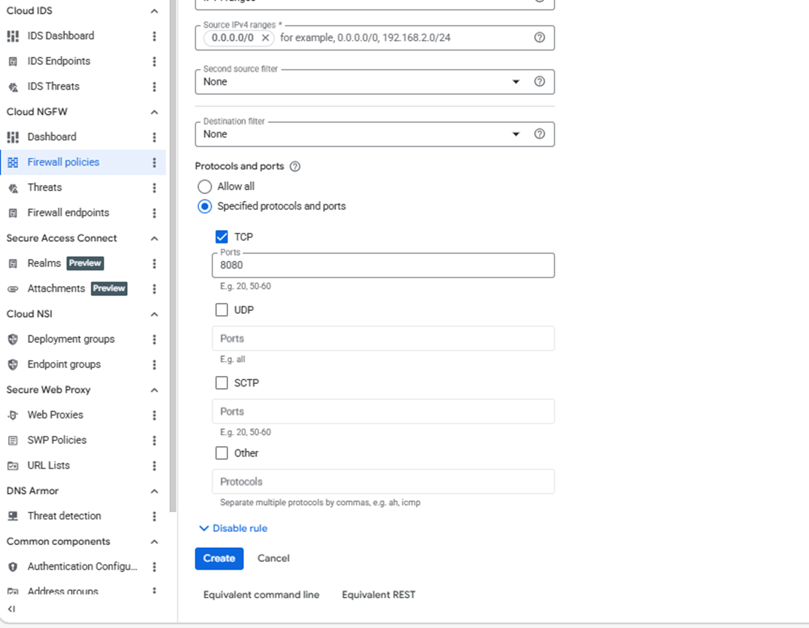

## Allow inbound access to the XGBoost inference API

Create a firewall rule in Google Cloud console to expose the required port for the XGBoost inference API and browser-based access.

{} For help with Google Cloud Platform setup, see the Learning Path [Getting started with Google Cloud Platform](/learning-paths/servers-and-cloud-computing/csp/google/).{}

### Configure the firewall rule in Google Cloud Console

To configure a firewall rule for the XGBoost inference API:

1. Navigate to the [Google Cloud console](https://console.cloud.google.com/).
2. Go to **VPC Network > Firewall**, then select **Create firewall rule**.


3. Set **Name** to `allow-xgboost-8080`, then select the network you want to bind to your virtual machine.

4. Set **Direction of traffic** to **Ingress** and **Action on match** to **Allow**.

5. Set **Targets** to **Specified target tags** and enter `allow-xgboost-8080` in the **Target tags** field. You'll use this tag when you create a virtual machine in the next section. 

6. Set **Source IPv4 ranges** to your current machine's public IP address. Run the following command in a terminal on your local machine to find it:

```bash
curl -4 ifconfig.me
```

Take the returned address and append `/32` to convert it to CIDR notation, for example `203.0.113.42/32`. Restricting access to your own IP prevents port 8080 from being exposed to the public internet.

{} If your IP address changes or you need to access the API from a different machine, update this field with the new IP address. Using `0.0.0.0/0` opens the port to all traffic and is not recommended.{}



7. Under **Protocols and ports**, select **Specified protocols and ports**.
8. Select the **TCP** checkbox and enter:

```text
8080
```

Port 8080 is used by the XGBoost inference API for browser-based validation and remote REST requests.



9. Select **Create**.

## What you've accomplished and what's next

You've now created a firewall rule to expose the XGBoost inference API to your public IP address. You've also enabled browser access and remote API connectivity for inference testing.

Next, you'll create a Google Axion C4A Arm virtual machine and attach it to this firewall rule.
