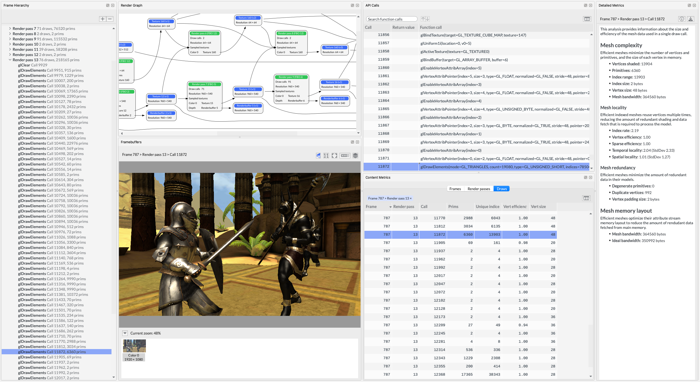
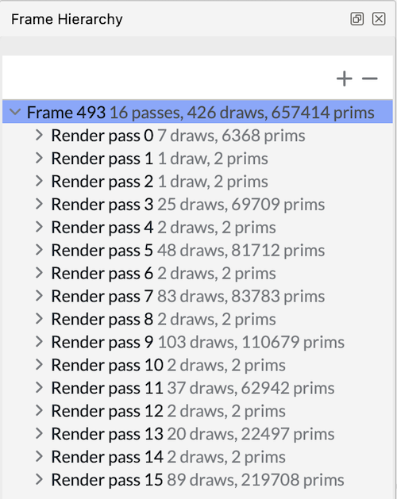
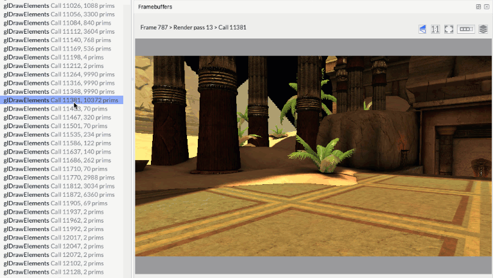
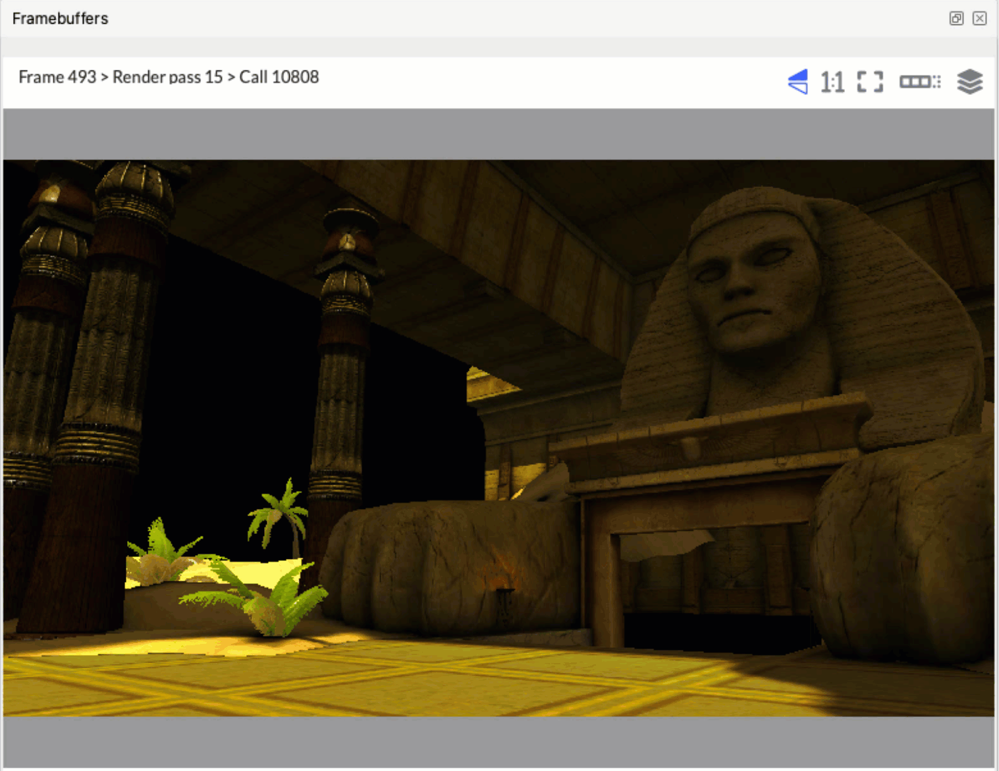

When the analysis completes, you will see Frame Advisor’s `Analysis` screen.

1. Captured frames are listed in the Frame hierarchy view. Here, we can see that this frame draws over 657,000 primitives using 426 draw calls within 16 render passes.

    

1. You can see all the render passes that make up the frame. Expand a render pass to see the draw calls within it. Step through the draw calls to see how the scene is built.

    

    Draw calls are expensive for the CPU to process, so it is important to reduce the number of them where possible. Look for draw calls that don’t render visible changes to the framebuffer. If you don’t see any change, draws could be outside of the frustum or behind other objects. Use software culling techniques to eliminate them.

    You might notice that some objects are drawn with a large number of primitives. As you see the object being drawn, decide whether its size and position on screen requires such a high level of detail. Using simpler meshes particularly when objects are far away from the camera could significantly increase performance.
    
1. Look for instances where many identical objects are being drawn individually, like these pillars. There could be an opportunity to reduce the number of draw calls by batching multiple objects into a single combined mesh or by using an instanced draw call.

    
