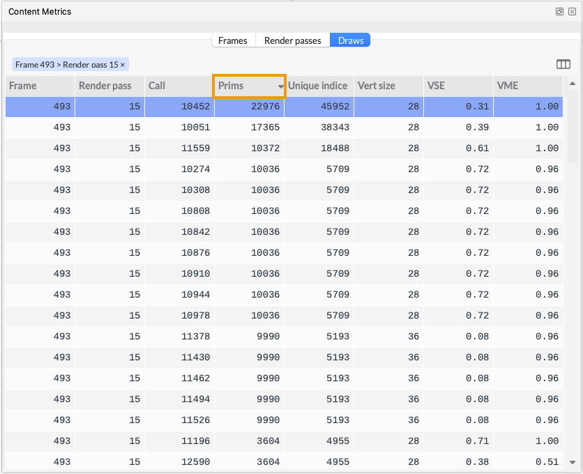
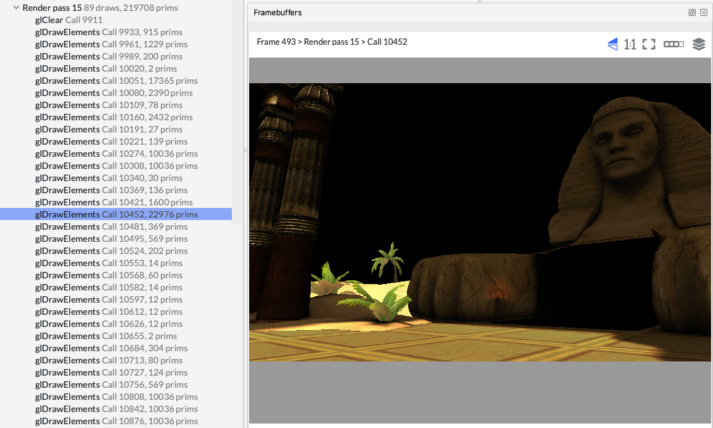
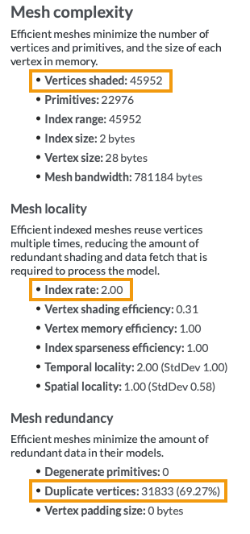
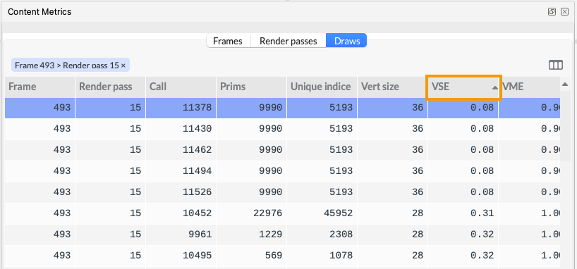
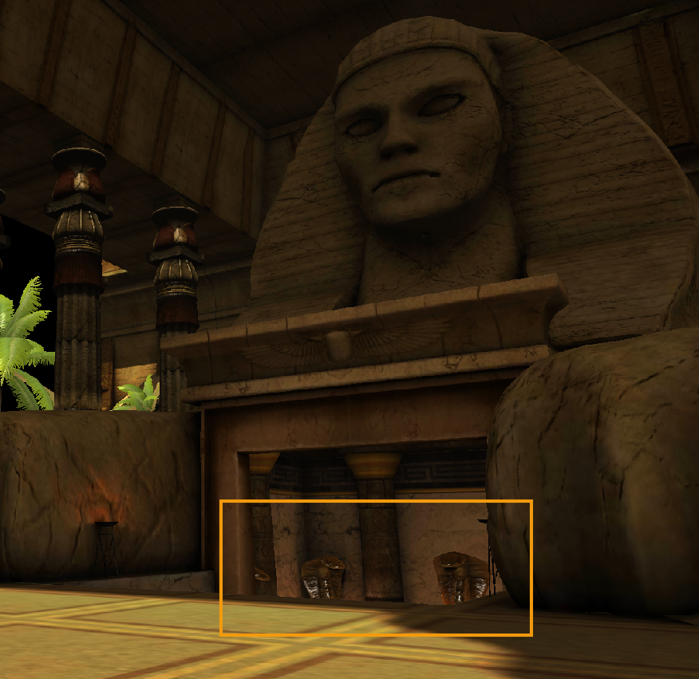
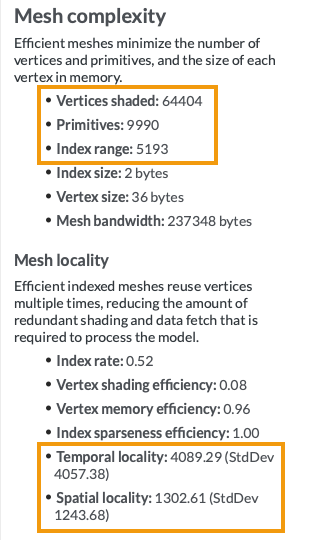

Use the Content Metrics view in Frame Advisor to find geometry-related problems with the objects in the scene. This shows a range of useful metrics, broken down by frame, render pass and draw call.

1. In the `Content Metrics` view, select `Draws` and sort the table by the highest number of primitives (`Prims`), to find the most complex objects.

    
    
1. Right-click the draw call at the top of the list and choose `Navigate to call`. This complex object is now selected in the `Frame Hierarchy` view and you can see it in the `Framebuffers` view. This object is the Sphinx model and it is built using almost 23,000 primitives. This is a high number for a game object on mobile, so the first step is to see whether this model can be simplified. Fewer primitives reduces GPU processing cost and memory bandwidth.

    

    In cases where the model cannot be simplified any further, there are other options to consider.
    
1. Look at the `Detailed Metrics` view, where you can see a range of metrics about the mesh. Here, the Sphinx mesh uses almost 46,000 indices, and each index is used by 2 primitives, so there is some index reuse going on here, which is good.

    However, almost 32,000 of the vertices are duplicates, which means they have identical data to another vertex in the model. It would be worth removing the duplicate vertices, which would give a significant reduction in processing cost and memory bandwidth.

    

    {}
    To see full descriptions of all the metrics in the Detailed Metrics view, use the i button.
    {}

1. Next, sort the `Content Metrics` table by lowest VSE (vertex shading efficiency). This helps us find objects that shade more indices than they are using. This can be caused by gaps in the index stream, which cause unused indices to be shaded, or poor reuse locality which causes indices to be shaded multiple times.

    

    VSE values range from 0 to 1. A VSE of 1 indicates optimal shading, with 1 shader invocation per useful input vertex. An efficiency of 0.5 indicates that there are two shader invocations per useful input vertex.

    The object with the lowest VSE is the snake head statue model. There are 5 instances of this model in the scene, although only 3 are partially visible in this frame.

    

    For this model, we can see in the `Detailed Metrics` view that over 5000 indices are used to create almost 10,000 primitives, which is reasonable. However, we can also see that over 64,000 vertices are being shaded. This is far higher than our index count, which means that some vertices are being shaded multiple times. This is very wasteful.

    

1. The report also shows that the temporal and spatial locality figures are very high.  
 
    Temporal locality shows that, on average, there are over 4000 indices between reuse of an index value. This is much larger than the post-transform cache on many mainstream Arm GPUs, which can store 1024 indices. This means that vertices are likely to be evicted from the cache before an index is reused, resulting in reshading.
    
    Ideally index temporal locality should be under 500, to maximize the chance of post-transform cache hits. To reduce temporal locality, try reordering the data to move reuses closer together in the index buffer.

    Spatial locality shows that, on average, there are around 1300 indices between neighbouring indices. This means that data for a single primitive is likely to be far apart in memory, which can reduce the effectiveness of the shader core data caches during vertex shading.
    
    Spatial locality should be kept as low as possible, ensuring that vertices within neighbouring primitives are using data that is the same set of cache lines and memory pages. To reduce spatial locality, try  reordering the data to move neighbours closer together in the source data buffer.
