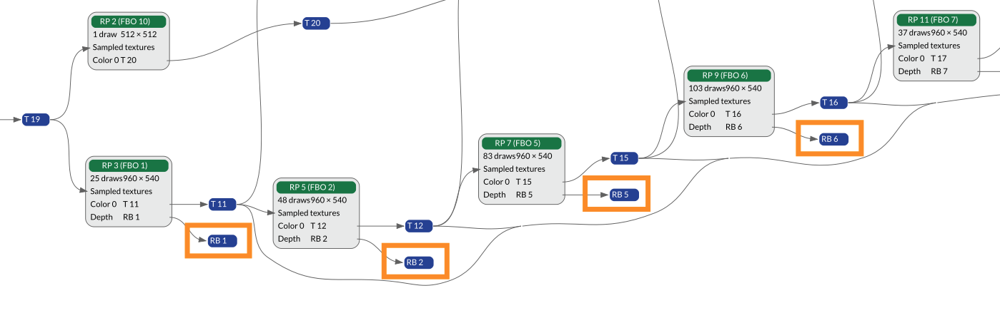
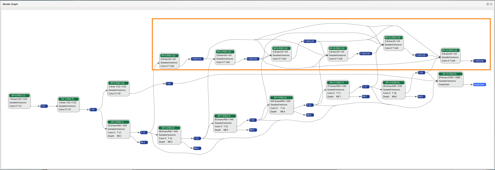

The render graph in Frame Advisor shows a visualization of the rendering operations that make up the frame. It shows how data flows between render passes as well as how resources such as textures are produced and consumed. Use the render graph to find render passes, input or output attachments that are not used in the final output, and which could be removed.

Render passes flow from left to right. The render pass that outputs to the swapchain is the final render pass that outputs to the screen.

1. Here, we can see some output attachments that are not used in a future render pass.

    

    You should clear or invalidate input and output attachments that are not used to avoid unnecessary memory accesses. If clear or invalidate calls are present within a render pass, they are shown in the `Frame Hierarchy` view.  

1. In this example, we can see that some render passes have no consumers at all and that they do not contribute to the final rendered output.

    

    These render passes could therefore be removed, without affecting the output, saving processing power and bandwidth.
