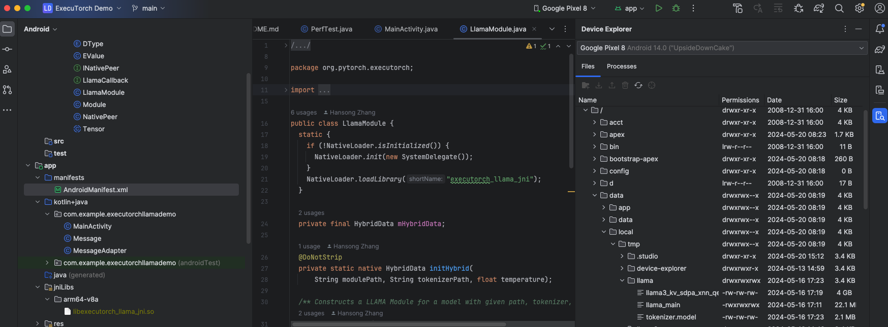
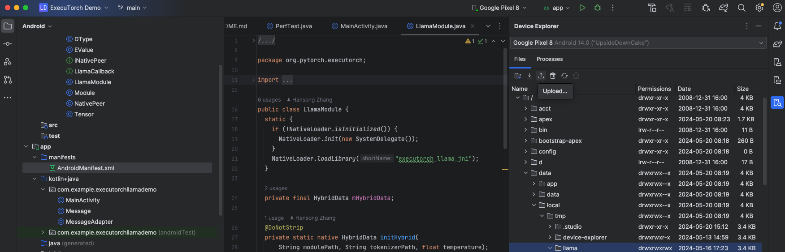
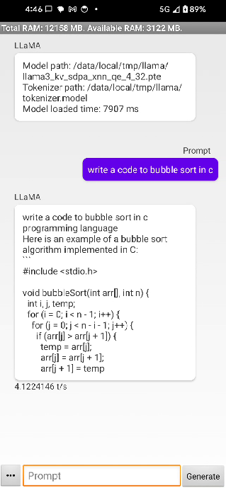
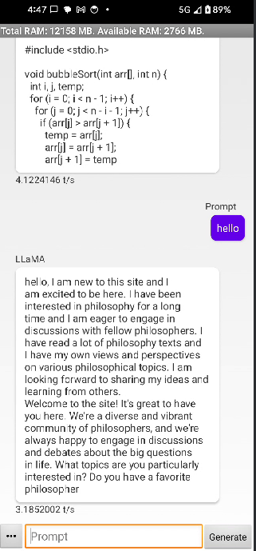

We will use the demo Android application in ExecuTorch repository [LlamaDema](https://github.com/pytorch/executorch/tree/main/examples/demo-apps/android/LlamaDemo).

## Build JNI library

1. Open a terminal window and navigate to the root directory of the `executorch`
2. Set the following environment variables:

    ``` bash
    export ANDROID_NDK=<path_to_android_ndk>
    export ANDROID_ABI=arm64-v8a
    ```

{}
<path_to_android_ndk> is the root for the NDK, which is usually under ~/Library/Android/sdk/ndk/XX.Y.ZZZZZ for macOS, and contains NOTICE and README.md. We use <path_to_android_ndk>/build/cmake/android.toolchain.cmake for CMake to cross-compile.
{}

3. (Optional) If you need to use tiktoken as the tokenizer (for LLaMA3), set `EXECUTORCH_USE_TIKTOKEN=ON` and later CMake will use it as the tokenizer. If you need to run other models like LLaMA2, skip this skip.

    ``` bash
    export EXECUTORCH_USE_TIKTOKEN=ON # Only for LLaMA3
    ```

4. Run the following command set up the required JNI library:

    ``` bash
    pushd examples/demo-apps/android/LlamaDemo
    ./gradlew :app:setup
    popd
    ```

{}
This is running the shell script setup.sh which configures the required core ExecuTorch, LLAMA2, and Android libraries, builds them, and copy to jniLibs.
{}

## Getting models

Make sure the exported model and tokenizer are copied to the Android phone

### Option 1: using adb

1. Check if the files are available on the phone

``` bash
adb shell "ls -la /data/local/tmp/llama/"
```

2. If not, copy them

``` bash
adb shell mkdir -p /data/local/tmp/llama
adb push <model.pte> /data/local/tmp/llama/
adb push <tokenizer.bin> /data/local/tmp/llama/
```

### option 2: Using Android Studio

1. Use Android Studio's device explorer



2. Upload the files



## Build APK

### Option 1: Using Android Studio (Recommended)

1. Open Android Studio and select “Open an existing Android Studio project” to open examples/demo-apps/android/LlamaDemo
2. Run the app (^R). This builds and launches the app on the phone.

### Option 2: Command line

Without Android Studio UI, we can run gradle directly to build the app. We need to set up the Android SDK path and invoke gradle.

``` bash
export ANDROID_HOME=<path_to_android_sdk_home>
pushd examples/demo-apps/android/LlamaDemo
./gradlew :app:installDebug
popd
```

After successful build, you can try running the app on phone or emulator:




