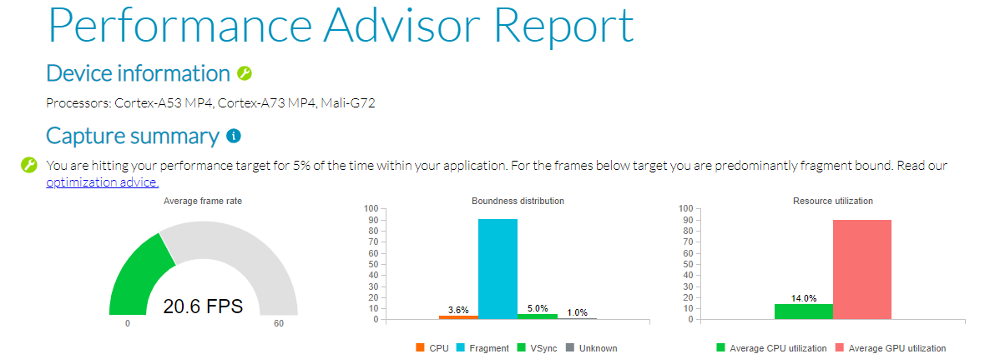

---
# User change
title: "Performance Advisor example report "

weight: 4 # 1 is first, 2 is second, etc.

# Do not modify these elements
layout: "learningpathall"
---
Performance Advisor analyzes a Streamline capture to better illustrate how your Android application performs on a mobile device.

## Generate example report

The supplied Streamline capture from [earlier](../streamline_example) can be used to generate a `Performance Analyzer` report.

Open a terminal, and navigate to the location of the imported capture.

Run the Performance Analyzer tool on the report:
```command
streamline-cli -pa "Android - GPU Bound Example.apc"
```
The capture is processed, and a `html` report generated. Warnings shown can be ignored for now:
```output
Importing capture...
Fetching data...
Preparing report type html...
Problems were found preparing html report:
WARNING: Build name not provided. You can add this as a command line argument (use --build-name).
WARNING: Build timestamp not provided. You can add this as a command line argument (use --build-timestamp).
WARNING: Device name not provided. You can add this as a command line argument (use --device-name).
WARNING: End of region Wave: 3Target NPC: 12 is after end of the last frame (44960). Setting end of this region (45000) to the end of the last frame (44960).

Processing data...
Generating report type html...
Report performance_advisor-<timestamp>.html" successfully generated
```
Open the report in a browser and explore the report.


## Understand the report

A detailed explanation of understanding the report is given in the [Performance Advisor tutorial](https://developer.arm.com/documentation/102478/latest/Example-Performance-Advisor-report).
