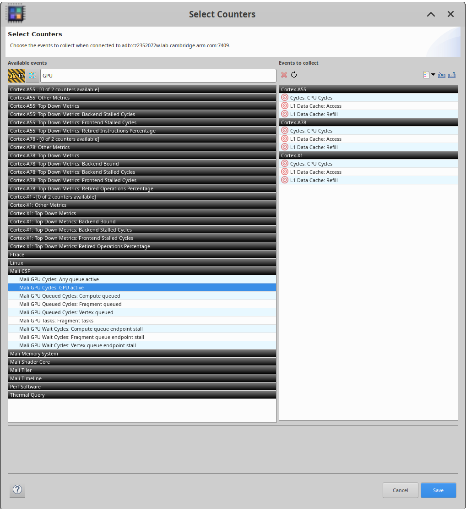
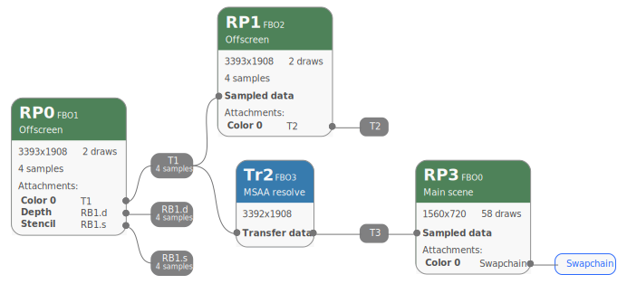

## Finding parts of your application to optimize

Your first step is to identify which parts of your application need optimization.

Arm's [Streamline](../../streamline) is a good place to start. This is included as another part of Arm Performance Studio.

Inside Streamline, open the Counters window (see “Counter Configuration” in the Streamline User Guide). Here, you can select counters reporting GPU performance, as shown in this screenshot:

This is simply an example: [other counters may be available](https://developer.arm.com/documentation#numberOfResults=48&q=Performance%20Counters&sort=relevancy&f:@navigationhierarchiesproducts=[IP%20Products,Graphics%20and%20Multimedia%20Processors,Mali%20GPUs]) depending upon your GPU.

Once these counters are included in a capture, Streamline will produce a graph showing the most GPU-heavy parts of your application.

## Recording application behavior

Follow the instructions in the “Get Started” document's [“Frame Advisor”](../../fa) section to capture a render graph for the parts of the application you wish to analyze.

In summary:

- Connect to the application you want to test
- In the Capture screen, select the number of frames you wish to capture
- When you've reached the GPU-heavy part of the application run, click “Capture”, then “Analyze” to advance to the Analysis screen

## Analysis

Observe that part of the Frame Advisor window is labelled “Render Graph”. This contains the render graph relating to the frames you asked Frame Advisor to analyze.

For the purpose of this Learning Path, we will assume that you've captured the following render graph:

In the next section, we will use this graph to illustrate some common application faults.
