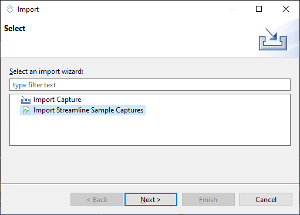
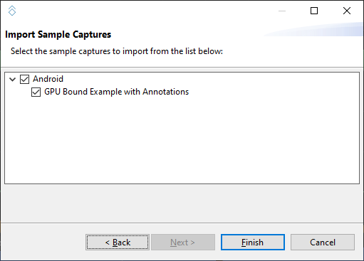
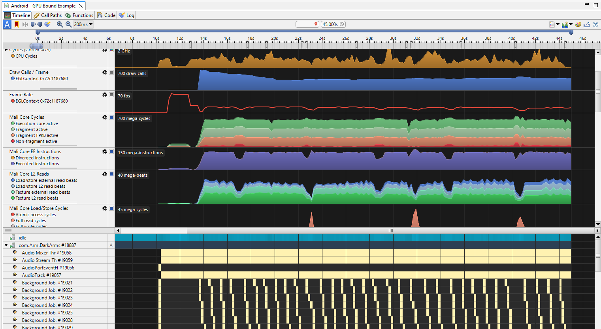

---
# User change
title: "Arm Streamline example capture"

weight: 4 # 1 is first, 2 is second, etc.

# Do not modify these elements
layout: "learningpathall"
---
This learning path explores Streamline for Android application profiling on a mobile device. For other use cases, refer to the supporting materials for [Arm Development Studio](https://developer.arm.com/Tools%20and%20Software/Arm%20Development%20Studio).

## Example Streamline report

To help you understand the capabilities of Streamline, an example Streamline profile is provided with Arm Performance Studio.

1. To open the example profile, in Streamline, select `File` > `Import`.
1. Select `Import Streamline Sample Captures` and click `Next`.
    

1. Select the Android example and click `Finish`.
    

1. Double-click on the report in `Streamline Data`, then click `Analyze` when prompted. The report will be processed, and an interactive timeline will be shown.

## Analyze the results

The charts in the `Timeline` view show the performance counter activity captured from the device. Hover over the charts to see the values at that point in time. Use the Calipers to focus on particular windows of activity. Refer to the [Streamline User Guide](https://developer.arm.com/documentation/101816/latest/Analyze-your-capture) for full instructions on how to use the features in the `Timeline` view.

Understanding the output of Streamline is key to the usefulness of Streamline. [Android performance triage with Streamline](https://developer.arm.com/documentation/102540/latest/) describes how to understand the capture from a number of points of view, depending on what information you are trying to extract from it.
