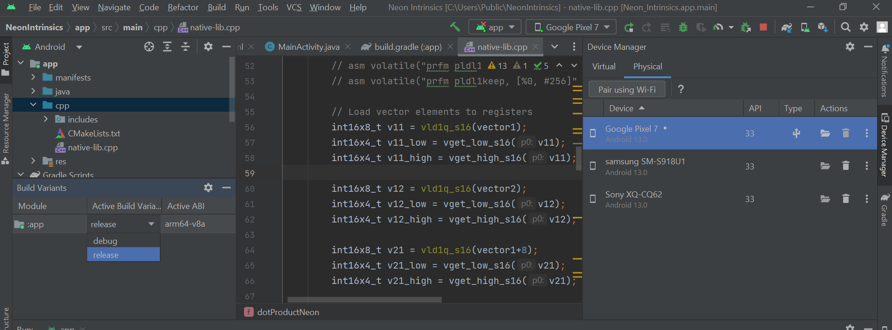
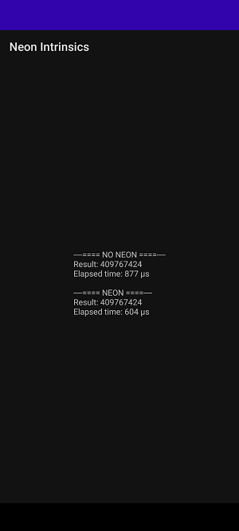

---
# User change
title: "Implement dot product of two vectors"

weight: 3

layout: "learningpathall"
---

In this section you will implement the dot product of two vectors using C++. Starting with Armv8.4a architecture, dot product is part of the instruction set.

## Implement dot product without Neon intrinsics

You will first implement the dot product of two vectors without using Neon intrinsics. Open `app/cpp/native-lib.cpp` from the Project pane and replace the contents of this file with the code below:

```console
#include <jni.h>
#include <string>
#include <arm_neon.h>
#include <chrono>

using namespace std;

short* generateRamp(short startValue, short len) {
    short* ramp = new short[len];

    for(short i = 0; i < len; i++) {
        ramp[i] = startValue + i;
    }

    return ramp;
}

double µsElapsedTime(chrono::system_clock::time_point start) {
    auto end = chrono::system_clock::now();

    return chrono::duration_cast<chrono::microseconds>(end - start).count();
}

chrono::system_clock::time_point now() {
    return chrono::system_clock::now();
}

int dotProduct(short* vector1, short* vector2, short len) {
    int result = 0;

    for(short i = 0; i < len; i++) {
        result += vector1[i] * vector2[i];
    }

    return result;
}
```

With this code, you have now implemented two helper methods `generateRamp` and `µsElapsedTime`.

- `generateRamp` generates the ramp, which is the vector of 16-bit integers. 
- `µsElapsedTime` is used to measure the code execution time. 

The `dotProduct` function calculates the dot product of two equal length vectors by multiplying the vectors element by element and then accumulating the resulting products. This implementation of dot product uses a for loop and does not use Neon intrinsics.


## Implement dot product with Neon intrinsics

You will now calculate the dot product using Neon intrinsics. To modify the dotProduct function to benefit from Neon intrinsics, you must split the for loop so that it uses data lanes. This means that you will partition, or vectorize, the loop to operate on sequences of data during a single CPU cycle. These sequences are defined as vectors. However, to distinguish from the vectors that we use as inputs for the dot product, we call these sequences register vectors.

With register vectors, reduce the loop iterations so that, at every iteration, you multiply, then accumulate, multiple vector elements to calculate the dot product. The number of elements that you can work with depends on the register layout.

The Arm Neon architecture uses a 64-bit or 128-bit register file. In a 64-bit case, you can work with either eight 8-bit, four 16-bit, or two 32-bit elements. In a 128-bit case, you can work with either sixteen 8-bit, eight 16-bit, four 32-bit, or two 64-bit elements.

To represent various register vectors, Neon intrinsics use the following name convention:

`<type><size>x<number of lanes>_t`

In this convention:

- `<type>` is the data type (int, uint, float, or poly).
- `<size>` is the number of bits used for the data type (8, 16, 32, 64).
- `<number of lanes>` defines how many lanes.

For example, int16x4_t represents a vector register with 4 lanes of 16-bit integer elements, which is equivalent to a four-element int16 one-dimensional array (short[4]).

Use dedicated methods to load data from the arrays to CPU registers. The names of these methods start with `vld`. Method naming uses a convention that is similar to the one for type naming. All methods start with `v`, which is followed by a method short name, like `ld` for load, and the combination of a letter and a number of bits, for example, `s16`, to specify the input data type.

Add the implementation of the dot product of two vectors using Neon intrinsics to the `app/cpp/native-lib.cpp` file. Append the code below into the file:

```console
int dotProductNeon(short* vector1, short* vector2, short len) {
    const short transferSize = 4;
    short segments = len / transferSize;

    // 4-element vector of zeros
    int32x4_t partialSumsNeon = vdupq_n_s32(0);
    int32x4_t sum1 = vdupq_n_s32(0);
    int32x4_t sum2 = vdupq_n_s32(0);
    int32x4_t sum3 = vdupq_n_s32(0);
    int32x4_t sum4 = vdupq_n_s32(0);

    // Main loop (note that loop index goes through segments). Unroll with 4
    int i = 0;
    for(; i+3 < segments; i+=4) {
        // Preload may help speed up sometimes
        // asm volatile("prfm pldl1keep, [%0, #256]" : :"r"(vector1) :);
        // asm volatile("prfm pldl1keep, [%0, #256]" : :"r"(vector2) :);

        // Load vector elements to registers
        int16x8_t v11 = vld1q_s16(vector1);
        int16x4_t v11_low = vget_low_s16(v11);
        int16x4_t v11_high = vget_high_s16(v11);

        int16x8_t v12 = vld1q_s16(vector2);
        int16x4_t v12_low = vget_low_s16(v12);
        int16x4_t v12_high = vget_high_s16(v12);

        int16x8_t v21 = vld1q_s16(vector1+8);
        int16x4_t v21_low = vget_low_s16(v21);
        int16x4_t v21_high = vget_high_s16(v21);

        int16x8_t v22 = vld1q_s16(vector2+8);
        int16x4_t v22_low = vget_low_s16(v22);
        int16x4_t v22_high = vget_high_s16(v22);

        // Multiply and accumulate: partialSumsNeon += vector1Neon * vector2Neon
        sum1 = vmlal_s16(sum1, v11_low, v12_low);
        sum2 = vmlal_s16(sum2, v11_high, v12_high);
        sum3 = vmlal_s16(sum3, v21_low, v22_low);
        sum4 = vmlal_s16(sum4, v21_high, v22_high);

        vector1 += 16;
        vector2 += 16;
    }
    partialSumsNeon = sum1 + sum2 + sum3 + sum4;

    // Sum up remain parts
    int remain = len % transferSize;
    for(i=0; i<remain; i++) {

        int16x4_t vector1Neon = vld1_s16(vector1);
        int16x4_t vector2Neon = vld1_s16(vector2);
        partialSumsNeon = vmlal_s16(partialSumsNeon, vector1Neon, vector2Neon);

        vector1 += 4;
        vector2 += 4;
    }

    // Store partial sums
    int partialSums[transferSize];
    vst1q_s32(partialSums, partialSumsNeon);

    // Sum up partial sums
    int result = 0;
    for(i=0; i < transferSize; i++) {
        result += partialSums[i];
    }

    return result;
}
```

To load data from memory, the `vld1_s16` method is used. This method loads four elements to the CPU registers from the array of short signed 16-bit integers, or s16 for short. The `vld1q_s16` method is used where we want to load eight s16 elements at once.

When the elements are in the CPU registers, add the elements using the `vmlal` (multiply and accumulate) method. This method adds elements from two arrays and accumulates the result in a third array.

This array is stored within the `partialSumsNeon` variable. To initialize this variable, use the `vdupq_n_s32` method, which sets all CPU registers to the specific value. In this case, the value is 0. It is the vectorized equivalent of writing int sum = 0.

When all the loop iterations complete, store the resulting sums back to memory using the `vst` method.

When the partial sums are back in memory, sum them to get the final result.

## Measure the performance uplift by using Neon intrinsics

You will finally add the `MainActivity.stringFromJNI` method to `app/cpp/native-lib.cpp` file. Append the code shown below to this file:

```console
extern "C" JNIEXPORT jstring JNICALL
Java_com_example_neonintrinsics_MainActivity_stringFromJNI(
        JNIEnv* env,
        jobject /* this */) {

    // Ramp length and number of trials
    const int rampLength = 1024;
    const int trials = 10000;

    // Generate two input vectors
    // (0, 1, ..., rampLength - 1)
    // (100, 101, ..., 100 + rampLength-1)
    auto ramp1 = generateRamp(0, rampLength);
    auto ramp2 = generateRamp(100, rampLength);

    // Without NEON intrinsics
    // Invoke dotProduct and measure performance
    int lastResult = 0;

    auto start = now();
    for (int i = 0; i < trials; i++) {
        lastResult = dotProduct(ramp1, ramp2, rampLength);
    }
    auto elapsedTime = µsElapsedTime(start);

    // With NEON intrinsics
    // Invoke dotProductNeon and measure performance
    int lastResultNeon = 0;

    start = now();
    for (int i = 0; i < trials; i++) {
        lastResultNeon = dotProductNeon(ramp1, ramp2, rampLength);
    }
    auto elapsedTimeNeon = µsElapsedTime(start);

    // Clean up
    delete ramp1, ramp2;

    // Display results
    std::string resultsString =
            "----==== NO NEON ====----\nResult: " + to_string(lastResult)
            + "\nElapsed time: " + to_string((int) elapsedTime) + " µs"
            + "\n\n----==== NEON ====----\n"
            + "Result: " + to_string(lastResultNeon)
            + "\nElapsed time: " + to_string((int) elapsedTimeNeon) + " µs";

    return env->NewStringUTF(resultsString.c_str());
}
```
The`MainActivity.stringFromJNI` method does the following:

 1. Creates two equal-length vectors using `generateRamp` methods.
 2. Calculates the dot product of these vectors using the method without Neon intrinsics `dotProduct`. Repeats this calculation several times (trials constant) and measures the computation time using `µsElasedTime`.
 3. Repeats Step 2, but this time using the method with Neon intrinsics `dotProductNeon`.
 4. Combines the results of these two methods along with the computation times within `resultsString`. This is displayed in the TextView.

You have now added all the code to this file and can proceed to building the app.

## Build and Run the code

By default, the Build Variant is `debug` for this project. Select `Build-> Select Build Variant...` and change the Active Build Variant to `release` as shown in the image below:



Now build the code. Select `Build-> Make Project`. Once the build completes, you should see output similar to what is shown below:

```output
BUILD SUCCESSFUL in 1m 9s
47 actionable tasks: 12 executed, 35 up-to-date

Build Analyzer results available
```

You can now run the app on your 64-bit Arm powered Android smartphone. With your phone connected, select `Run-> Run app`. The image below shows the app running on a Google Pixel 7 phone:



In this case, using built-in Neon intrinsics provided over a 30 percent improvement in elapsed time. The results will vary based on the phone you are running on.

You have now successfully implemented dot product using Neon intrinsics on your 64-bit Arm smartphone running Android.


