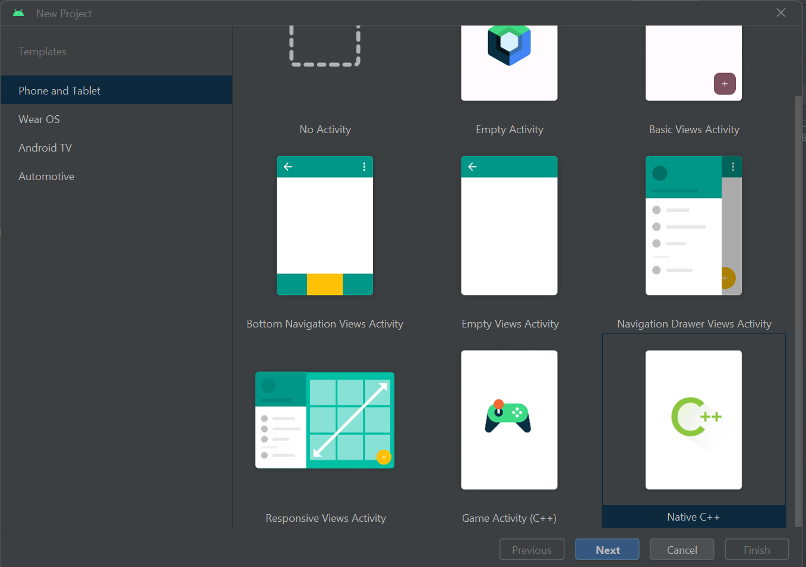
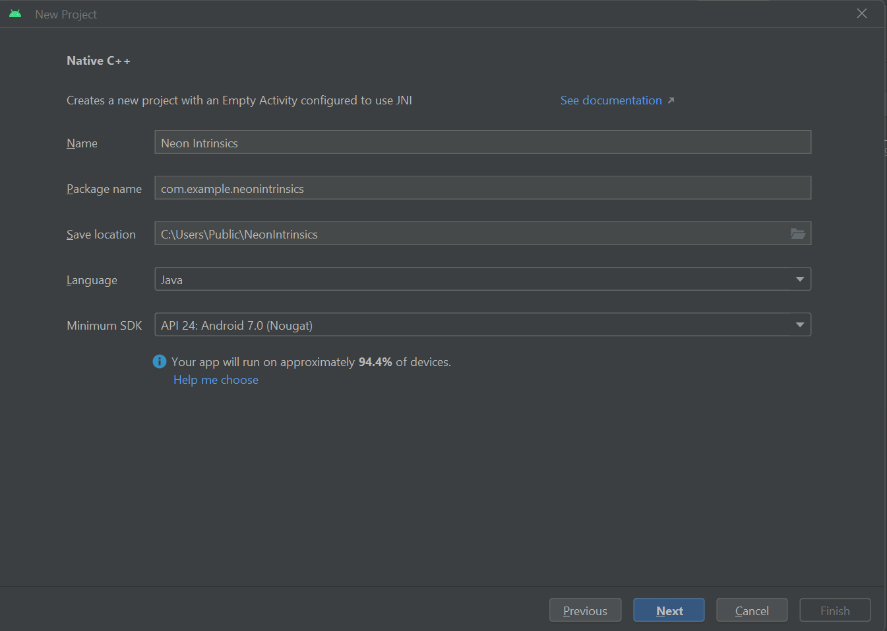
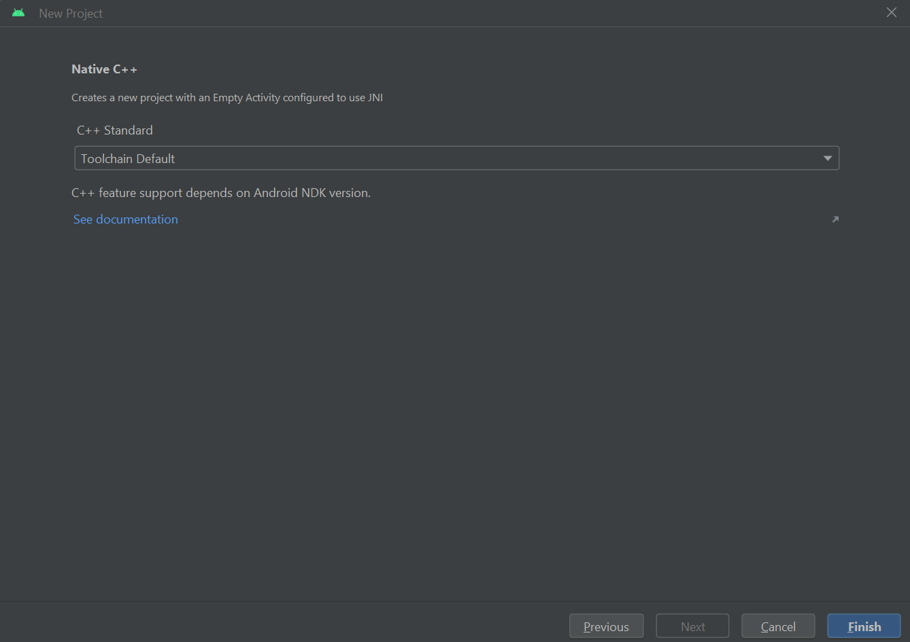
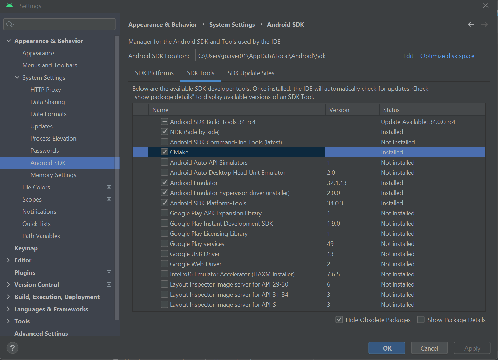
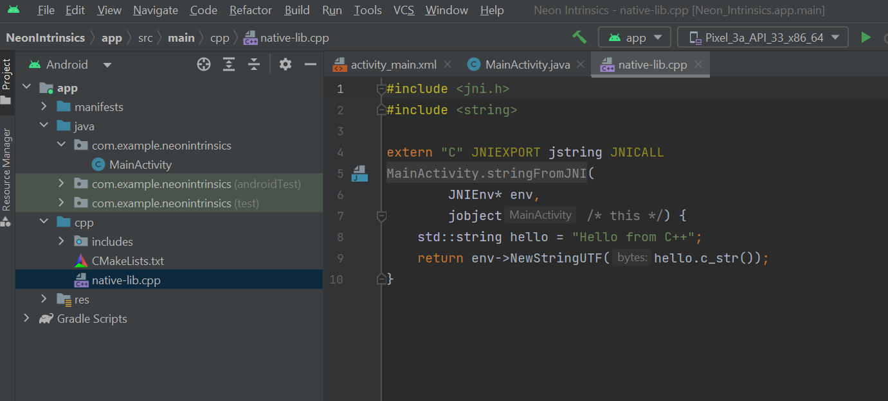
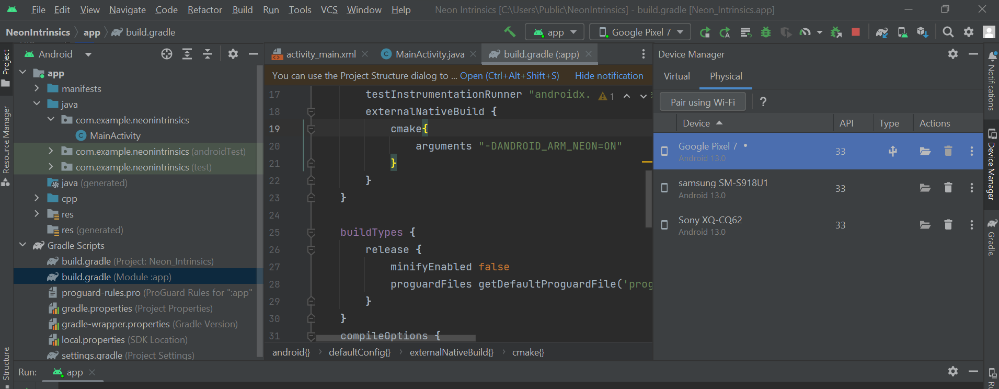
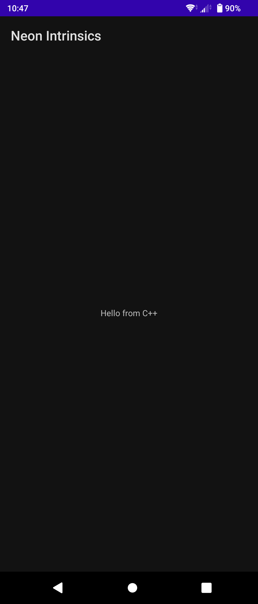

---
# User change
title: "Enable Neon Intrinsics support in Android Studio"

weight: 2

layout: "learningpathall"
---

## Before you begin

You will need a x86_64 or Apple silicon computer with [Android Studio](https://developer.android.com/studio) installed. Currently, Android Studio is not supported on Windows and Linux machines with Arm based CPUs.

You will also need a Armv8 powered smartphone running Android to run your application on. We tested the application in this learning path on a Google Pixel 7 smartphone.

## Overview

Don't repeat yourself (DRY) is one of the major principles of software development. Following this principle means reusing your code using functions. However, invoking a function adds extra overhead. In certain cases compilers can reduce this overhead by taking advantage of built-in functions called intrinsics. The compiler replaces the intrinsics that are used in high-level programming languages, for example C/C++, with mostly 1:1 mapped assembly instructions.

To further improve performance, you need to use assembly code. However, with Arm Neon intrinsics you can avoid the complication of writing assembly functions. Instead you only need to program in C/C++ and call the intrinsics or instruction functions that are declared in the `arm_neon.h` header file. Neon intrinsics can improve the performance of your application.

[Arm Neon intrinsics technology](https://developer.arm.com/architectures/instruction-sets/intrinsics/) is an advanced Single Instruction Multiple Data (SIMD) architecture extension for Arm processors. SIMD performs the same operation on a sequence, or vector, of data during a single CPU cycle.

## Enable Neon Intrinsics support in Android Studio

In this section, you will setup your Android development environment to use Neon Intrinsics.

1. Open Android Studio on your development machine.

2. Create a project using the `Native C++ Project` option in the Phone and Tablet section and click `Next`, as shown below:



3. Set the application name to `Neon Intrinsics`, select `Java` as the language, leave the Minimum SDK selection as `API 24: Android 7.0(Nougat)`. Make sure you choose `Groovy DSL` as the Build configuration language, which may not be the default option. Then click `Next`.



4. Leave the `Toolchain Default` selection for C++ Standard and then click `Finish`, as shown below:



5. Install `CMake` and `Android NDK`. Click on `Android Studio` or `File`and choose `Settings`. On the left pane, under `System Settings` select `Android SDK`. From the tabs on the right, click on `SDK Tools`. Select the `CMake` and `NDK(Side by side)` packages and click on `Apply` followed by `OK`, as shown below:



6. The project that you created comprises of one activity that is implemented within the `MainActivity` class. It prints a "Hello from C++" string in the app which comes from the `native-lib` library. Open `app/cpp/native-lib.cpp` as shown below to view the code for this library:



7. The Android NDK supports different Application Binary Interfaces(ABI). Set the NDK for this project to use `arm64-v8a` ABI. This ABI is for Armv8-A based CPUs, which support the 64-bit Arm architecture. On the left pane, expand `Gradle Scripts` and open `build.gradle(Module :app)` file. Add the line below to the `defaultConfig` section:

```console
ndk.abiFilters 'arm64-v8a'
```

The code in this section should look like:

```console
defaultConfig {
        applicationId "com.example.neonintrinsics"
        minSdk 24
        targetSdk 34
        versionCode 1
        versionName "1.0"
        ndk.abiFilters 'arm64-v8a'

        testInstrumentationRunner "androidx.test.runner.AndroidJUnitRunner"
    }

```
8. Enable support for Neon intrinsics, by passing the following CMake argument in `build.grade(Module :app)`

```console
arguments "-DANDROID_ARM_NEON=ON"
```

This argument is added under `externalNativeBuild` in the `defaultConfig` section of the file. The complete `build.gradle(Module :app)` file is shown below for completeness:

```console
plugins {
    alias(libs.plugins.android.application)
}

android {
    namespace 'com.example.neonintrinsics'
    compileSdk 34

    defaultConfig {
        applicationId "com.example.neonintrinsics"
        minSdk 24
        targetSdk 34
        versionCode 1
        versionName "1.0"
        ndk.abiFilters 'arm64-v8a'

        testInstrumentationRunner "androidx.test.runner.AndroidJUnitRunner"
        externalNativeBuild {
            cmake{
                arguments "-DANDROID_ARM_NEON=ON"
            }
        }

    }

    buildTypes {
        release {
            minifyEnabled false
            proguardFiles getDefaultProguardFile('proguard-android-optimize.txt'), 'proguard-rules.pro'
        }
    }
    compileOptions {
        sourceCompatibility JavaVersion.VERSION_1_8
        targetCompatibility JavaVersion.VERSION_1_8
    }
    externalNativeBuild {
        cmake {
            path file('src/main/cpp/CMakeLists.txt')
            version '3.22.1'
        }
    }
    buildFeatures {
        viewBinding true
    }
}

dependencies {

    implementation libs.appcompat
    implementation libs.material
    implementation libs.constraintlayout
    testImplementation libs.junit
    androidTestImplementation libs.ext.junit
    androidTestImplementation libs.espresso.core
}
```

With these changes you can use Neon intrinsics, which are declared within the `arm_neon.h` header.

9. Build the application to make sure your Android app development setup is working properly.
   Select `Build->Make Project`. When the build completes, you should see messages in the Build console similar to those shown below:

```output
BUILD SUCCESSFUL in 2m 44s
37 actionable tasks: 37 executed

Build Analyzer results available
```

10. Run this application on an 64-bit Arm powered smartphone running Android. We ran the app on a Google Pixel 7 phone using a USB cable connected to the development machine running Android Studio. You can also pair your phone over Wi-Fi.
Connect your device and select `Tools->Device Manager`. Select the `Physical` tab and your connected phone should show up on the list of devices as shown in the image below:



Then select `Run->Run app` or press `Shift+F10` to run the app on the connected phone.

The output from the app running on the Google Pixel 7 running Android 13 is shown below:



You have now successfully setup and validated your Android development environment for running applications with Neon intrinsics on a 64-bit Arm powered smartphone.

In the next section, you will implement the dot product of two vectors using Neon intrinsics.

