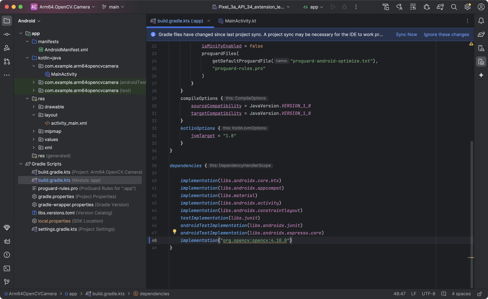

---
# User change
title: "Create a project and add OpenCV"

weight: 3

layout: "learningpathall"
---
## Create a project
You will need a development computer with [Android Studio](https://developer.android.com/studio) installed (this examples uses Android Studio Jellyfish | 2023.3.1 Patch 1).

Follow these steps to create a project and add OpenCV:

1. Open Android Studio on your development machine and then click the **+ New Project** icon:


2. In the New Project window, select **Empty Views Activity**:


3. Configure the project as follows (see figure below):
- Name: **Arm64.OpenCV.Camera**.
- Package name: **com.example.arm64opencvcamera**.
- Save location: *Select relevant file location*.
- Language: **Kotlin**.
- Minimum SDK: **API 24**.
- Build configuration language: **Kotlin DSL**.


4. Click the **Finish** button. 

The project will be ready in a few moments, and Android Studio should appear as shown below:


## Add OpenCV support
To add OpenCV for Arm64, open the *build.gradle.ts (Module: app)*, and add the following line under the dependencies:

```JSON
implementation("org.opencv:opencv:4.10.0")
```

Then, click the **Sync Now** link in the top pane that appears:



From here on, you can use OpenCV in your application. 

In the next step, you will initialize OpenCV. To do so, you will slightly modify the application view to display the OpenCV initialization status in the TextView.

## OpenCV initialization
To initialize OpenCV and check the initialization status, follow these steps:
1. Under the Project (left window) double-click `app/res/layout/activity_main.xml`. This opens the view designer. 

2. Click the highlighted icon in the top-right corner to switch to the XML view.


3. Modify the `activity_main.xml` file as shown below:

```XML
<?xml version="1.0" encoding="utf-8"?>
<LinearLayout xmlns:android="http://schemas.android.com/apk/res/android"
    android:layout_width="match_parent"
    android:layout_height="match_parent"
    android:orientation="vertical"
    android:padding="16dp">

    <!-- TextViewStatus -->
    <TextView
        android:id="@+id/textViewStatus"
        android:layout_width="wrap_content"
        android:layout_height="wrap_content"
        android:text=""
        android:layout_gravity="center_horizontal"
        android:layout_margin="16dp"
        android:textSize="64px"/>

</LinearLayout>
```

4. Open `MainActivity.kt` (*app/kotlin+java/com.example.arm64opencvcamera*), and replace the file contents with the following code:

```java
package com.example.arm64opencvcamera

import android.os.Bundle
import android.widget.TextView
import androidx.activity.enableEdgeToEdge
import androidx.appcompat.app.AppCompatActivity
import org.opencv.android.OpenCVLoader

class MainActivity : AppCompatActivity() {
    private lateinit var textViewStatus: TextView
    private var isOpenCvInitialized = false

    override fun onCreate(savedInstanceState: Bundle?) {
        super.onCreate(savedInstanceState)
        enableEdgeToEdge()
        setContentView(R.layout.activity_main)

        textViewStatus = findViewById(R.id.textViewStatus)

        isOpenCvInitialized = OpenCVLoader.initLocal()

        updateControls()
    }

    private fun updateControls() {
        if(!isOpenCvInitialized) {
            textViewStatus.text = "OpenCV initialization error"
        } else {
            textViewStatus.text = "OpenCV initialized"
        }
    }
}
```

The Kotlin code above imports the necessary Android and OpenCV classes. OpenCVLoader is used to load the OpenCV library, enableEdgeToEdge for edge-to-edge design, and TextView.

The `MainActivity` class declares a TextView to display the status of OpenCV initialization. This class also declares the Boolean variable `isOpenCvInitialized`, which is used to track whether OpenCV has been successfully initialized.

The onCreate method is a lifecycle method called when the activity is created. You will use it to enable edge-to-edge design for the activity (enableEdgeToEdge), set the layout for the activity using `activity_main.xml` (setContentView), and bind the TextView with the textViewStatus declared in the XML layout (findViewById). Next, you will use the OpenCVLoader.initLocal() method, which attempts to initialize OpenCV and sets `isOpenCvInitialized` based on the success or failure of the initialization.

Finally, you call updateControls(), which updates the UI based on whether OpenCV was initialized successfully. Specifically, if `isOpenCvInitialized` is false, it sets the TextView's text to “OpenCV initialization error”. Otherwise, the text is set to “OpenCV initialized”.

## Launch the application
You can now launch the application in the simulator. To do so, use the top menu, where you click Run -> Run ‘app’. The application should start, and you should see the “OpenCV initialized” text as shown below:


You have successfully added OpenCV to the Android application. In the next step, you will extend the application to get images from the device’s camera and process them in real-time.
