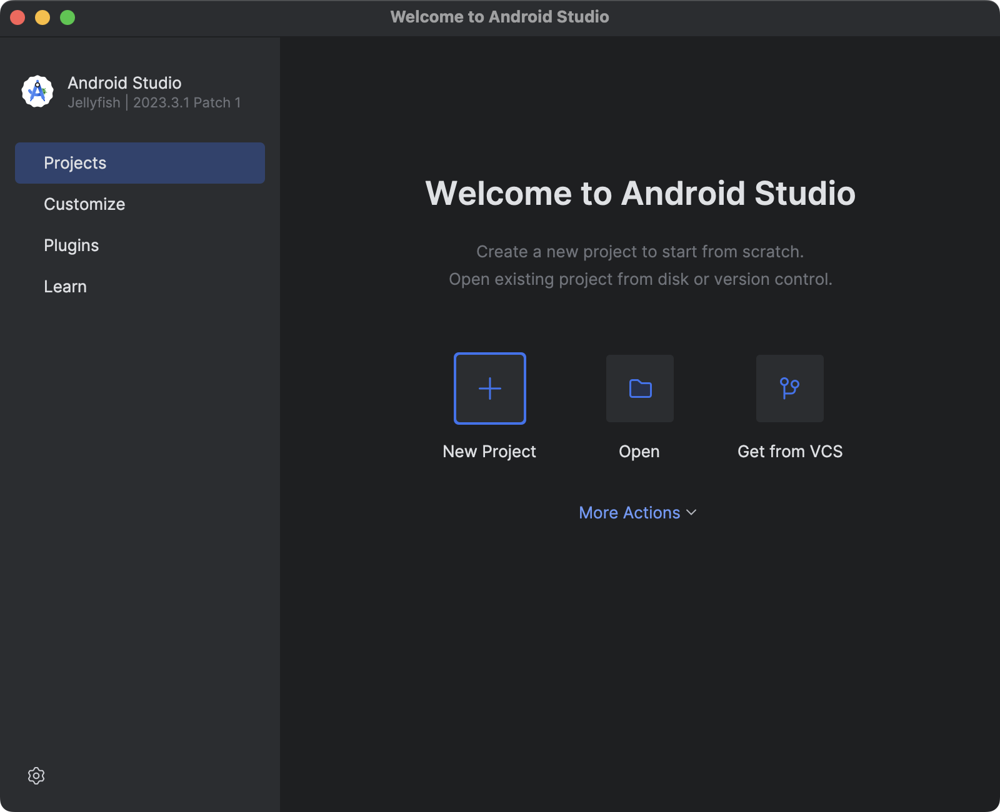
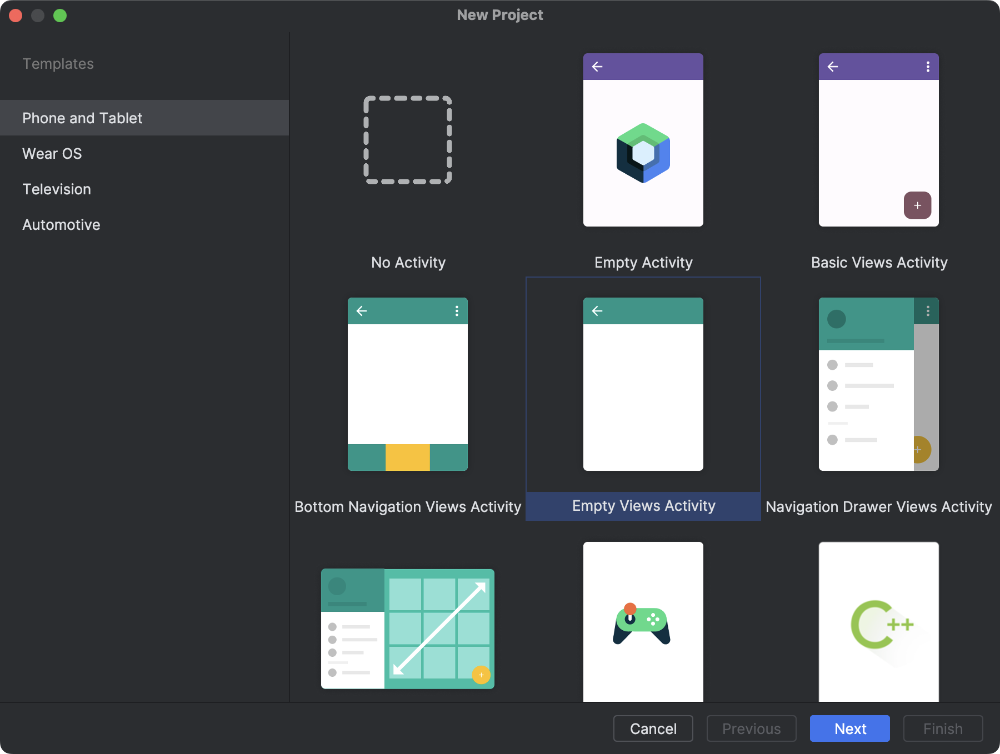
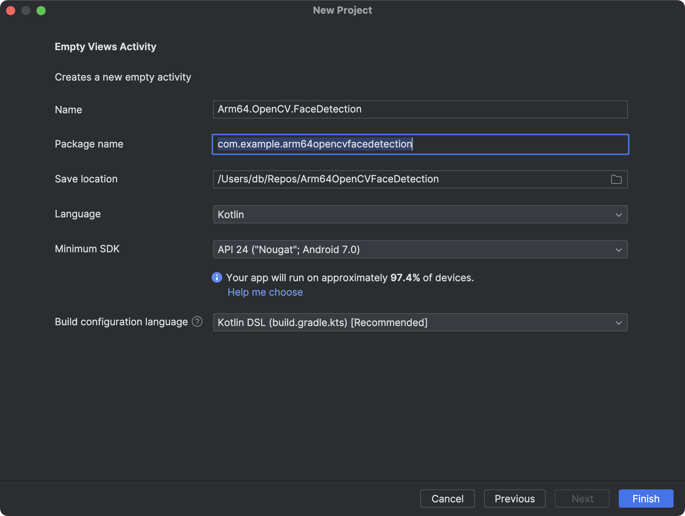
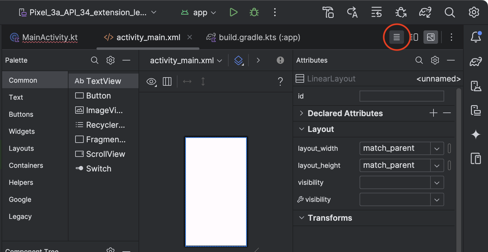

---
# User change
title: "Create a project, add OpenCV, and read camera frames"

weight: 3

layout: "learningpathall"
---
## Create a project

{}
You will need a development computer with [Android Studio](https://developer.android.com/studio) installed (this example uses Android Studio Jellyfish | 2023.3.1 Patch 1). 
{}

Follow these steps to create a project and add OpenCV:

1. Open Android Studio on your development machine and then click the **+ New Project** icon:



2. In the New Project window, select **Empty Views Activity**:



3. Configure the project as follows (see figure below):
- Name: **Arm64.OpenCV.FaceDetection**.
- Package name: **com.example.arm64opencvfacedetection**.
- Save location: **select location**.
- Language: **Kotlin**.
- Minimum SDK: **API 24**.
- Build configuration language: **Kotlin DSL**.



4. Click the **Finish** button. 

## Add OpenCV support
To add OpenCV for Arm64, open the *build.gradle.ts (Module: app)*, and add the following line under the dependencies:

```JSON
implementation("org.opencv:opencv:4.10.0")
```

Then, click the **Sync Now** link in the top pane that appears.

From now on, you can use OpenCV in your application. In the next step, you will initialize OpenCV. To do so, you will slightly modify the application view to display the OpenCV initialization status in the TextView.

## Use OpenCV to retrieve camera frames
You will now initialize OpenCV and prepare the application to stream frames from the front camera. In the next step you will process the frames to detect faces in the video stream.

1. Under the Project in the left window, double-click *app/res/layout/activity_main.xml*. This opens the view designer. 
2. Click the highlighted icon in the top right corner to switch to the XML view.



3. Modify the *activity_main.xml* as shown below:

```XML
<?xml version="1.0" encoding="utf-8"?>
<LinearLayout xmlns:android="http://schemas.android.com/apk/res/android"
    android:layout_width="match_parent"
    android:layout_height="match_parent"
    android:orientation="vertical"
    android:padding="16dp">

    <LinearLayout
        android:layout_width="match_parent"
        android:layout_height="wrap_content"
        android:orientation="horizontal"
        android:gravity="center"
        android:layout_marginTop="16dp">

        <!-- Start Preview Button -->
        <Button
            android:id="@+id/buttonStartPreview"
            android:layout_width="0dp"
            android:layout_height="wrap_content"
            android:layout_weight="1"
            android:text="Start"
            android:layout_marginEnd="8dp" />

        <!-- Stop Preview Button -->
        <Button
            android:id="@+id/buttonStopPreview"
            android:layout_width="0dp"
            android:layout_height="wrap_content"
            android:layout_weight="1"
            android:text="Stop"
            android:layout_marginStart="8dp"/>
    </LinearLayout>

    <org.opencv.android.JavaCameraView
        android:id="@+id/cameraView"
        android:layout_width="match_parent"
        android:layout_height="match_parent"
        android:layout_weight="0"
        android:scaleType="centerCrop"
        android:visibility="visible" />

</LinearLayout>
```

4. Open the *AndroidManifest.xml* file (*app/manifests/AndroidManifest.xml*) and add the following declarations, making sure to add them above the application tag:
```XML
<uses-permission android:name="android.permission.CAMERA"/>
<uses-feature android:name="android.hardware.camera"/>
```

5. Open *MainActivity.kt* (*app/kotlin+java/com.example.arm64opencvfacedetection*), and replace the file contents with the following code:

```kotlin
package com.example.arm64opencvfacedetection

import android.Manifest
import android.content.pm.PackageManager
import android.os.Bundle
import android.widget.Button
import androidx.activity.enableEdgeToEdge
import androidx.appcompat.app.AppCompatActivity
import androidx.core.app.ActivityCompat
import androidx.core.content.ContextCompat
import androidx.core.view.ViewCompat
import androidx.core.view.WindowInsetsCompat
import org.opencv.android.CameraBridgeViewBase
import org.opencv.android.OpenCVLoader
import org.opencv.core.Mat

class MainActivity : AppCompatActivity(), CameraBridgeViewBase.CvCameraViewListener2 {
    private lateinit var buttonStartPreview: Button
    private lateinit var buttonStopPreview: Button

    private lateinit var openCvCameraView: CameraBridgeViewBase

    private var isPreviewActive = false
    private var isOpenCvInitialized = false

    private val cameraPermissionRequestCode = 100

    override fun onCreate(savedInstanceState: Bundle?) {
        super.onCreate(savedInstanceState)
        enableEdgeToEdge()
        setContentView(R.layout.activity_main)

        buttonStartPreview = findViewById(R.id.buttonStartPreview)
        buttonStopPreview = findViewById(R.id.buttonStopPreview)

        openCvCameraView = findViewById(R.id.cameraView)

        isOpenCvInitialized = OpenCVLoader.initLocal()

        // Request access to camera
        if (ContextCompat.checkSelfPermission(this, Manifest.permission.CAMERA)
            != PackageManager.PERMISSION_GRANTED) {
            // Permission is not granted, request it
            ActivityCompat.requestPermissions(
                this,
                arrayOf(Manifest.permission.CAMERA),
                cameraPermissionRequestCode
            )
        }

        openCvCameraView.setCvCameraViewListener(this)
        openCvCameraView.setCameraIndex(1)

        buttonStartPreview.setOnClickListener {
            openCvCameraView.setCameraPermissionGranted()
            openCvCameraView.enableView()

            updateControls()
        }

        buttonStopPreview.setOnClickListener {
            openCvCameraView.disableView()

            updateControls()
        }

        updateControls()
    }

    private fun updateControls() {
        if(!isOpenCvInitialized) {
            buttonStartPreview.isEnabled = false
            buttonStopPreview.isEnabled = false
        } else {
            buttonStartPreview.isEnabled = !isPreviewActive
            buttonStopPreview.isEnabled = isPreviewActive
        }
    }

    override fun onCameraViewStarted(width: Int, height: Int) {
        isPreviewActive = true
    }

    override fun onCameraViewStopped() {
        isPreviewActive = false
    }

    override fun onCameraFrame(inputFrame: CameraBridgeViewBase.CvCameraViewFrame?): Mat {
        return inputFrame!!.rgba()
    }
}
```

The above Kotlin code imports necessary Android and OpenCV libraries, including those for handling permissions and camera views. MainActivity extends AppCompatActivity and implements CameraBridgeViewBase.CvCameraViewListener2 for handling camera frames. There are several variables:

- buttonStartPreview and buttonStopPreview: buttons to start and stop the camera preview.
- openCvCameraView: an instance of CameraBridgeViewBase for displaying camera frames.
- isPreviewActive and isOpenCvInitialized: flags to track the preview state and OpenCV initialization status.
- cameraPermissionRequestCode: a constant for the camera permission request.

The onCreate method initializes the buttons and camera view. It checks and requests camera permission if not already granted. Then, it initializes OpenCV using OpenCVLoader.initLocal(), before you set the camera index to 1 to get an access to the front camera. Subsequently, you can configure onClickListeners for the buttons to start and stop the camera preview.

Finally, you call updateControls(), which updates the enabled state of the start and stop preview buttons based on whether OpenCV is initialized and if the preview is active.

The above code also declares CameraBridgeViewBase.CvCameraViewListener2 methods: onCameraViewStarted, onCameraViewStopped, and onCameraFrame. The first two will be called when the camera view starts or stops. Here, you use these methods to set the isPreviewActive variable. The last method will be called for each frame from the camera. Here, you just pass the camera frame as OpenCV's Mat object.

## Launch the application
You have just prepared the application to stream camera frames. You can now launch the application in the emulator. To do so, click the green 'run' button as shown here:


The application should start, and you should see the app running in an emulator. It will ask you for camera permissions.

After ensuring that the application starts, you will next need to set up the application to run on an actual device in order to complete the face detection section. Follow the steps in [Run apps on a hardware device](https://developer.android.com/studio/run/device) to run the app. 

Once you have the application running on your device, you can move on to the next section.

