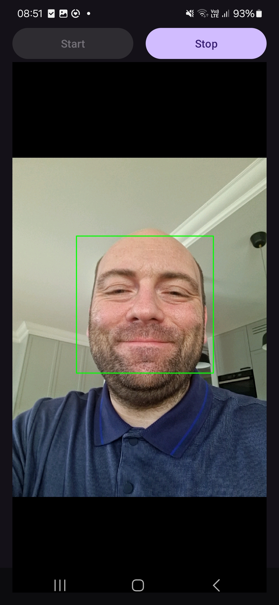

---
# User change
title: "Face detection"

weight: 4

layout: "learningpathall"
---


## Cascade file

{}
This Learning Path uses Haar cascades for face detection. OpenCV provides this classic machine learning approach, which includes pre-trained Haar cascades for various types of object detection.
{}

A Haar cascade file is an XML file used in computer vision, specifically within the OpenCV library, to perform object detection. It contains pre-trained data for detecting specific objects, such as faces, eyes, and cars. The file is created using the Haar cascade classifier algorithm, which is based on machine learning.

The Haar cascade classifier uses Haar-like features to identify objects. These features are essentially rectangular regions in an image that capture the differences in intensity between adjacent areas. For example, a feature might capture the difference in brightness between the eyes and the bridge of the nose.

The classifier is trained using a large number of positive images (containing the object) and negative images (without the object). The AdaBoost algorithm is commonly used to select a small number of critical features from a large set, and combine them into a strong classifier. The result of this training is stored in the XML file, which includes the selected features, their corresponding weights, and thresholds for each stage of the cascade.

You will need to download the pre-trained Haar cascade file for face detection from the [OpenCV GitHub repository](https://github.com/opencv/opencv/blob/master/data/haarcascades/haarcascade_frontalface_default.xml). Ensure your project is in the Android Studio default directory, and follow these steps:

```bash
cd ~/AndroidStudioProjects/Arm64OpenCVFaceDetection/app/src/main/
mkdir assets
cd assets
wget https://raw.githubusercontent.com/opencv/opencv/master/data/haarcascades/haarcascade_frontalface_default.xml
```

After downloading the cascade file to the assets folder, add necessary imports to the `MainActivity.kt` file:

```kotlin
import android.content.Context
import android.util.Log
import org.opencv.core.CvType
import org.opencv.core.MatOfRect
import org.opencv.core.Point
import org.opencv.core.Scalar
import org.opencv.imgproc.Imgproc
import org.opencv.objdetect.CascadeClassifier
import java.io.File
import java.io.FileOutputStream
import java.io.IOException
import java.io.InputStream
```

Then add the following statements to that same file:

```kotlin
private lateinit var faceCascade: CascadeClassifier

private fun loadHaarCascade() {
    try {
        val cascadeFile = getPath("haarcascade_frontalface_default.xml", this)
        faceCascade = CascadeClassifier(cascadeFile)
        if (faceCascade.empty()) {
            Log.e("MainActivity", "Failed to load cascade classifier")
        } else {
            Log.d("MainActivity", "Loaded cascade classifier from $cascadeFile")
        }
    } catch (e: IOException) {
        Log.e("MainActivity", "Error loading cascade classifier: ${e.message}")
    }
}
```

This above code prepares the faceCascade variable to hold the Haar cascade classifier. The loadHaarCascade function loads the Haar cascade XML file from the app’s assets. It initializes the CascadeClassifier with the file and checks if it was loaded successfully, logging appropriate messages for success or failure. If an exception occurs, it is caught and logged.

In Android, files stored in the assets directory cannot be directly accessed as file paths. Instead, they need to be read as input streams. To get input streams, you can use the getPath method. Its definition (which should be placed in the MainActivity) is shown below:

```kotlin
@Throws(IOException::class)
private fun getPath(file: String, context: Context): String {
    val assetManager = context.assets
    val inputStream: InputStream = assetManager.open(file)
    val outFile = File(context.filesDir, file)
    val outputStream = FileOutputStream(outFile)
    val buffer = ByteArray(1024)
    var read: Int
    while (inputStream.read(buffer).also { read = it } != -1) {
        outputStream.write(buffer, 0, read)
    }
    inputStream.close()
    outputStream.close()
    return outFile.absolutePath
}
```

This method takes two parameters: the file name (file) and the context (context). The @Throws(IOException::class) annotation indicates that this method may throw an IOException. The method retrieves the asset manager from the context, which is used to access files in the assets directory. It opens the specified asset file (haarcascade_frontalface_default.xml) as an input stream, creates a new file in the app’s internal storage directory (filesDir) with the same name as the asset file, and opens a file output stream to write to this new file. The method then reads data from the input stream and writes it to the output stream in a loop until the entire file is copied. Finally, it closes both streams and returns the absolute path of the newly created file in the internal storage.

The getPath method is necessary to convert an asset file into a regular file path that can be used by the OpenCV CascadeClassifier. It achieves this by copying the asset file to the app’s internal storage and returning the path to this new file. This allows the classifier to load the cascade file using a standard file path, which is a requirement for its operation.

Finally, we invoke the loadHaarCascade method within the onCreate event handler:

```kotlin
override fun onCreate(savedInstanceState: Bundle?) {
    super.onCreate(savedInstanceState)
    enableEdgeToEdge()
    setContentView(R.layout.activity_main)

    buttonStartPreview = findViewById(R.id.buttonStartPreview)
    buttonStopPreview = findViewById(R.id.buttonStopPreview)

    openCvCameraView = findViewById(R.id.cameraView)

    isOpenCvInitialized = OpenCVLoader.initLocal()

    // Request access to camera
    if (ContextCompat.checkSelfPermission(this, Manifest.permission.CAMERA)
        != PackageManager.PERMISSION_GRANTED) {
        // Permission is not granted, request it
        ActivityCompat.requestPermissions(
            this,
            arrayOf(Manifest.permission.CAMERA),
            cameraPermissionRequestCode
        )
    }

    openCvCameraView.setCvCameraViewListener(this)
    openCvCameraView.setCameraIndex(1)

    buttonStartPreview.setOnClickListener {
        openCvCameraView.setCameraPermissionGranted()
        openCvCameraView.enableView()

        updateControls()
    }

    buttonStopPreview.setOnClickListener {
        openCvCameraView.disableView()

        updateControls()
    }

    updateControls()

    loadHaarCascade()
}
```

## Face detection
We are now ready to add the face detector. To do so, go to MainActivity.kt and modify the onCameraFrame method as follows:

```kotlin
private lateinit var frame: Mat
private lateinit var grayFrame: Mat

override fun onCameraFrame(inputFrame: CameraBridgeViewBase.CvCameraViewFrame?): Mat {
    if (!::frame.isInitialized) {
        frame = Mat(inputFrame?.rgba()?.size(), CvType.CV_8UC4)
        grayFrame = Mat(inputFrame?.rgba()?.size(), CvType.CV_8UC1)
    } else {
        frame = inputFrame?.rgba() ?: return Mat()
        grayFrame = Mat(inputFrame.rgba()?.size(), CvType.CV_8UC1)
    }

    try {        
        Imgproc.cvtColor(frame, grayFrame, Imgproc.COLOR_RGBA2GRAY)
        Imgproc.equalizeHist(grayFrame, grayFrame)

        val faces = MatOfRect()
        faceCascade.detectMultiScale(grayFrame, faces)

        val faceArray = faces.toArray()
        if (faceArray.isNotEmpty()) {
            val rect = faceArray[0]
            Imgproc.rectangle(frame, 
                Point(rect.x.toDouble(), rect.y.toDouble()), 
                Point(rect.x + rect.width.toDouble(), rect.y + rect.height.toDouble()), 
                Scalar(0.0, 255.0, 0.0), 2)
        }
    } catch (e: Exception) {
        Log.e("MainActivity", "Error during face detection: ${e.message}")
    }

    return frame
}
```

In this code above, you first declared two Mat objects:
- frame - to store the color image captured from the camera.
- grayFrame - to store the grayscale version of the captured image.

Then, the onCameraFrame method checks if frame has been initialized. If not, you can initialize frame and grayFrame with the size of the input frame. To do so, you can use:
- CvType.CV_8UC4, which specifies the type for frame as an 8-bit, 4-channel image (RGBA).
- CvType.CV_8UC1, which specifies the type for grayFrame as an 8-bit, single-channel image (grayscale).

Next, you can convert the color frame to grayscale and store it in grayFrame. Afterwards, you apply histogram equalization to grayFrame to improve the contrast, which helps in better face detection. To actually detect faces in the grayscale image, you use faceCascade.detectMultiScale. The result is stored in the faces variable, which is of type MatOfRect.

If at least one face is detected, you retrieve the first detected face, and based on that, you draw a rectangle around the detected face on frame using Imgproc.rectangle.

After running the application, click the Start button, and you will see a green rectangle around the detected face as shown below:



## Summary
In this Learning Path, you learned how to use the Haar cascade classifier to detect faces in camera images. You added the pre-trained Haar cascade XML file for face detection to the project’s assets directory. You implemented the loadHaarCascade method to load the Haar cascade file from the assets and initialize the CascadeClassifier. You also created the getPath method to convert the Haar cascade asset file into a file path that can be used by OpenCV.

You modified the onCameraFrame method to process each frame captured by the camera. Specifically, you converted the captured color image to grayscale and applied histogram equalization to enhance the contrast of the grayscale image. After this preprocessing, you used the CascadeClassifier to detect faces in the processed image. Finally, you drew a rectangle around the first detected face on the color image.
