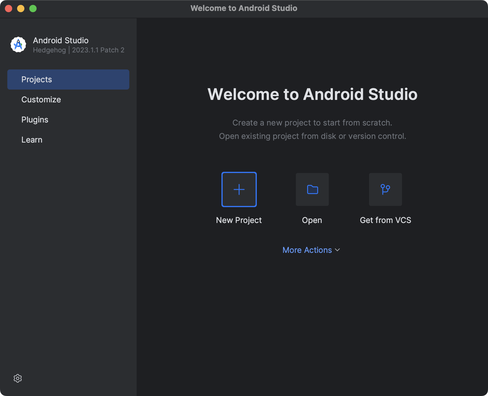
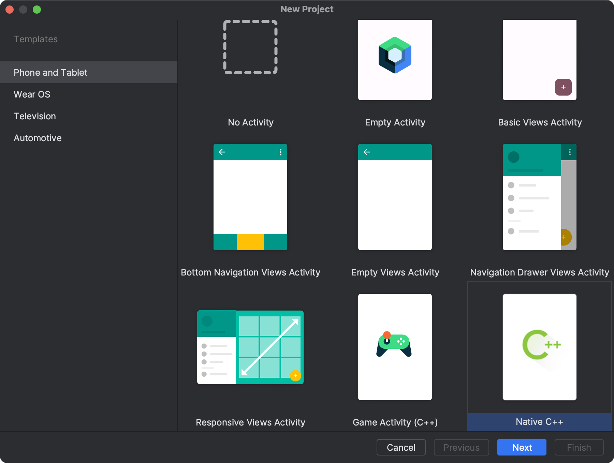
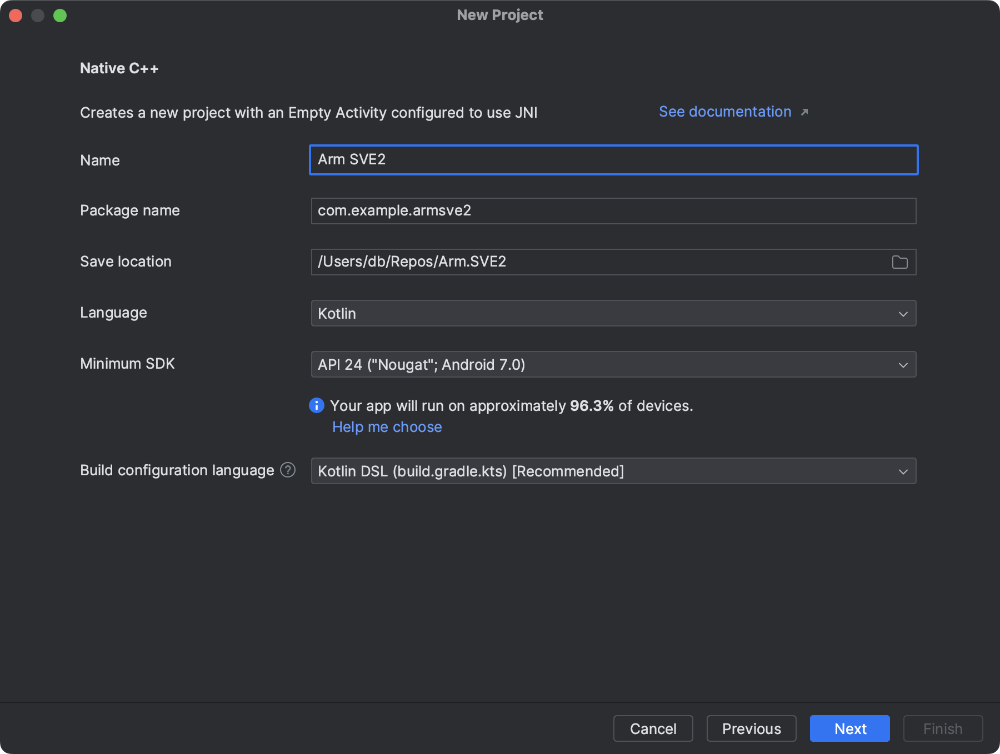
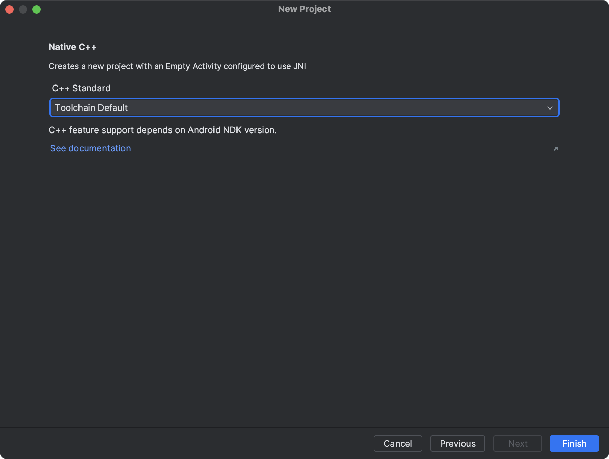
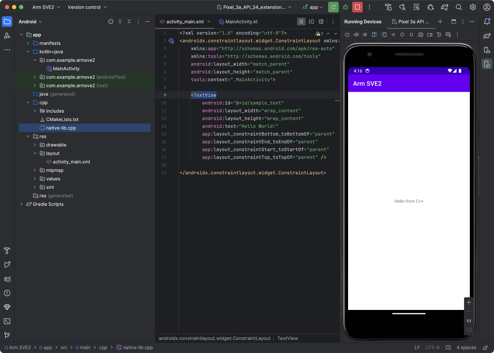
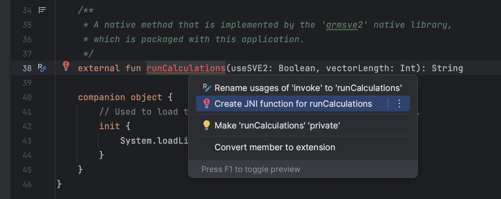

---
# User change
title: "Enable SVE2 support in Android Studio"

weight: 2

layout: "learningpathall"
---

## Introduction
The Scalable Vector Extension 2 (SVE2), is an extension of the ARMv9-A architecture that enhances the processing capabilities for vector operations. It's designed to improve upon the original Scalable Vector Extension (SVE) by offering more extensive and flexible vector processing capabilities. These enhancements allow for better performance in applications that require high levels of parallel data processing, such as scientific computing, machine learning, digital signal processing, and multimedia tasks.

The key feature of SVE and SVE2 is their scalability: unlike traditional SIMD (Single Instruction, Multiple Data) architectures that have fixed vector sizes, SVE and SVE2 vector lengths can vary, enabling the hardware to process vectors more efficiently by adjusting the vector length to best fit the workload. This flexibility allows for a more efficient utilization of the processor's capabilities across different types of applications and workloads, without the need for software to be rewritten or recompiled for specific hardware implementations.

SVE2 extends the original SVE capabilities by adding new instructions and features to improve the handling of complex data patterns and to enhance support for operations commonly used in newer computing paradigms. It's part of Arm's approach to address the increasing demand for high-performance computing across various sectors.

In this learning path, you will explore how to use SVE2 on Android running ARM-based processors that include this feature. Specifically, you will see how to achieve 5x faster computation, when calculating the following a * b + c, where a, b, and c are the floating-point vectors. This operation, defined as fused multiply-add, is commonly used in many high-performance computing, including artificial neural networks.

## Before you begin
You will need a development computer with [Android Studio](https://developer.android.com/studio) installed (we have used Android Studio Hedgehog | 2023.1.1 Patch 2). 

You will also need a Armv8 powered smartphone running Android. We tested the application on a Samsung Galaxy S22. 

You can find the complete source code [here](https://github.com/dawidborycki/Arm.SVE2).

## Create a project and enable SVE2 support
The process of creating and configuring this project is similar to that used for NEON. Follow these steps:

1. Open Android Studio on your development machine and then click the **+ New Project** icon:



2. Create a project using the **Native C++ Project** option in the Phone and Tablet section and click Next, as shown below:



3. Set the application name to **ARM SVE2**, select `Kotlin` as the language, leave the Minimum SDK selection as `API 24: Android 7.0 (Nougat)`, ensure that the build configuration is set to use Kotlin DSL, and click Next, as shown below:



4. Leave the `Toolchain Default` selection for C++ Standard and then click Finish, as shown below:



You have just created the Android application project, which comprises a `MainActivity`. The `MainActivity` contains a single TextView control, which displays the Hello from C++ string as shown in the figure below. This string is retrieved by invoking a `stringFromJNI` function from the C++ library, implemented under the `app/cpp/native-lib.cpp` file and built using the NDK and `CMakeLists.txt`.



SVE2 support is not enabled by default. To enable it, open the `CMakeLists.txt` (under app/cpp), and modify it by adding the following target_compile_options:

```cpp
cmake_minimum_required(VERSION 3.22.1)

project("armsve2")

add_library(${CMAKE_PROJECT_NAME} SHARED
        native-lib.cpp)

target_compile_options(${CMAKE_PROJECT_NAME} PRIVATE
        -march=armv8.2-a+sve2)

target_link_libraries(${CMAKE_PROJECT_NAME}
        # List libraries link to the target library
        android
        log)
```

The project structure is now ready. Next, we will modify the application's `MainActivity` to enhance its functionality. We'll add a text field to allow users to specify vector lengths, a checkbox to enable or disable SVE2 support for vector operations, and a button to invoke the vector calculations.

## Modifying the view
To modify the view, open the `activity_main.xml` file, which is located under app/res/layout, and replace the default file contents with the following declarations provided below:

```xml
<?xml version="1.0" encoding="utf-8"?>
<LinearLayout
    xmlns:android="http://schemas.android.com/apk/res/android"
    android:layout_width="match_parent"
    android:layout_height="match_parent"
    android:orientation="vertical"
    android:padding="16dp">

    <EditText
        android:id="@+id/numericInput"
        android:layout_width="match_parent"
        android:layout_height="wrap_content"
        android:inputType="number"
        android:hint="Provide vector length"
        android:maxLength="6" />

    <CheckBox
        android:id="@+id/controlCheckbox"
        android:layout_width="wrap_content"
        android:layout_height="wrap_content"
        android:text="Use SVE2?"/>

    <Button
        android:id="@+id/actionButton"
        android:layout_width="match_parent"
        android:layout_height="wrap_content"
        android:text="Run calculations"/>

    <TextView
        android:id="@+id/resultLabel"
        android:layout_width="match_parent"
        android:layout_height="wrap_content"
        android:text="Results will appear here"
        android:textSize="18sp"/>
</LinearLayout>
```

The modifications will arrange an `EditText`, `CheckBox`, `Button`, and `TextView` vertically using a LinearLayout with a vertical orientation. The `EditText` is configured to allow the user to input a string with a maximum length of 6 characters. This text field is used to specify the vector length, so the maximum value can be 999999. Next, the `CheckBox` is labeled "Use SVE2?". When this control is checked, vector calculations will be performed using SVE2 support. The view also includes a `Button` labeled "Run calculations" to initiate the calculations. Finally, the `TextView` is used to display results or errors.

To implement the logic, we open the `MainActivity.kt` under kotlin+java/com.example.armsve2. Then we replace the file's original content with the following instructions:

```java
package com.example.armsve2

import androidx.appcompat.app.AppCompatActivity
import android.os.Bundle
import android.widget.Button
import android.widget.CheckBox
import android.widget.EditText
import android.widget.TextView

class MainActivity : AppCompatActivity() {

    override fun onCreate(savedInstanceState: Bundle?) {
        super.onCreate(savedInstanceState)
        setContentView(R.layout.activity_main)

        val numericInput = findViewById<EditText>(R.id.numericInput)
        val actionButton = findViewById<Button>(R.id.actionButton)
        val resultLabel = findViewById<TextView>(R.id.resultLabel)
        val useSVE2Checkbox = findViewById<CheckBox>(R.id.controlCheckbox)

        actionButton.setOnClickListener {
            val inputStr = numericInput.text.toString()

            if (inputStr.isNotEmpty()) {
                resultLabel.text = runCalculations(useSVE2Checkbox.isChecked, inputStr.toInt())
            }
            else {
                resultLabel.text = "Invalid input"
            }
        }
    }
    
    external fun runCalculations(useSVE2: Boolean, vectorLength: Int): String

    companion object {
        // Used to load the 'armsve2' library on application startup.
        init {
            System.loadLibrary("armsve2")
        }
    }
}
```

There are two elements of the above code snippet that warrant further discussion. First, the `onCreate` listener sets the content of `MainActivity` to the XML declaration created earlier. Then, it retrieves references to the view controls: `EditText`, `TextView` (assuming "Label" refers to TextView in Android), `Button`, and `CheckBox`. Subsequently, the `onCreate` callback associates an anonymous method with the `OnClick` listener of the `Button`. This callback retrieves the input provided by the user (an expected vector length). If this input is not empty, it is converted to an integer and then passed to the `runCalculations` method, which we will implement in the C++ library.

To enable Kotlin code to access the native library, we need to create so-called JNI functions for the `runCalculations` method. To do this, place the cursor on the line where the `runCalculations` method is declared. Then, press Alt+Enter, and select **Create JNI function for runCalculations** from the menu that appears.



This action will navigate you to the native-lib.cpp file, which you will implement in the next step.

