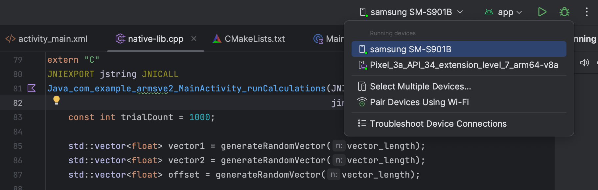
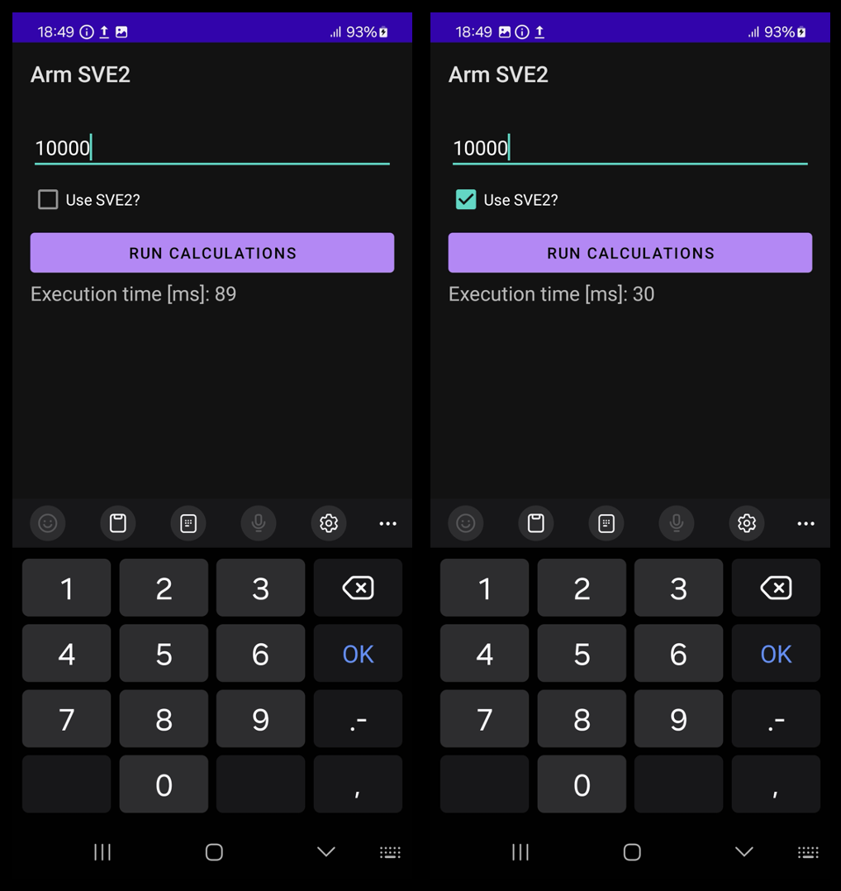
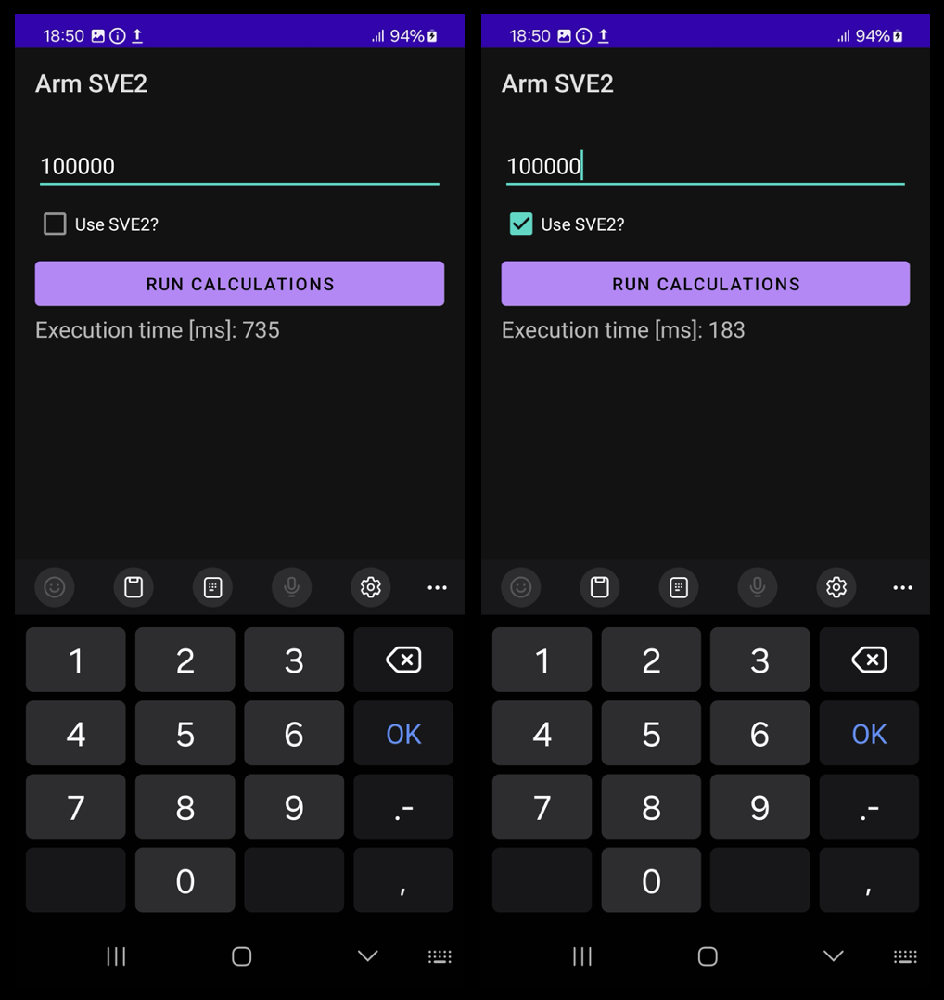

---
# User change
title: "Implement vector operations"

weight: 3

layout: "learningpathall"
---

In this section you will implement the fused multiply-add (FMA) of vectors (a * b + c) using C++. The vectors will be pseudo-randomly generated using the `<random>` library introduced in C++11. To measure the code execution time, you will also create the `measureExecutionTime` template function. The latter will return the execution time of N invocations of functions that calculate the FMA with and without SVE2.

## Implement helper functions
To implement helper functions, we start by modifying `native-lib.cpp` (located under app/cpp/). First, we add the following:

```cpp
#include <jni.h>
#include <string>
#include <vector>
#include <random>
#include <arm_sve.h>
#include <chrono>
```

Note the usage of `vector`, `arm_sve.h` and `chrono`.

Then, we remove the `stringFromJNI` method:

```cpp
extern "C" JNIEXPORT jstring

JNICALL
Java_com_example_armsve2_MainActivity_stringFromJNI(
        JNIEnv *env,
        jobject /* this */) {
    std::string hello = "Hello from C++";
    return env->NewStringUTF(hello.c_str());
}
```

Now, we add a method that generates a random vector of size `n`, whose elements are pseudo-randomly generated:

```cpp
std::vector<float> generateRandomVector(size_t n, float low=0.0, float high=1.0) {
    std::vector<float> result(n);
    std::random_device rd;
    std::mt19937 gen(rd());
    std::uniform_real_distribution<> distr(low, high);

    for (size_t i = 0; i < n; ++i) {
        result[i] = distr(gen);
    }

    return result;
}
```

The above function uses `std::random_device` to generate a truly random seed for the random number generator, `std::mt19937`. The `generateRandomVector` function accepts the size of the vector `n`, and the low and high bounds of the random values as arguments. It returns a `std::vector<float>` filled with random floats within the specified range. By default, the range is set to 0-1.

Next, we implement the `measureExecutionTime` function:

```cpp
template<typename Func, typename... Args>
long long measureExecutionTime(Func func, int trialCount, Args... args) {
    auto start = std::chrono::high_resolution_clock::now();

    for (int i = 0; i < trialCount; ++i) {
        func(args...); // Invoke the function with the provided arguments
    }

    auto stop = std::chrono::high_resolution_clock::now();
    auto duration = std::chrono::duration_cast<std::chrono::milliseconds>(stop - start);

    return duration.count(); // Return the execution time in milliseconds
}
```

This function takes a callable (`func`), the number of invocations (`trialCount`), and a variadic list of arguments (`args`) to pass to `func`. The `measureExecutionTime` function measures and returns the total execution time of specified invocations of `func`. The result is given in milliseconds.

## Implement FMA without SVE2
With the above code, you can now implement FMA without SVE2. To do so, supplement the `native-lib.cpp` with the following function:

```cpp
void additionOfProduct(const std::vector<float>& a,
                       const std::vector<float>& b,
                       const std::vector<float>& c,
                       std::vector<float>& result) {

    // Ensure all vectors have the same size
    if (a.size() != b.size() || a.size() != c.size() || a.size() != result.size()) {
        throw std::invalid_argument("All vectors must be of the same size.");
    }

    for (size_t i = 0; i < a.size(); ++i) {
        result[i] = a[i] * b[i] + c[i];
    }    
}
```

The `additionOfProduct` takes four vectors as input. The first three denote a, b, and c vectors, and the forth is the vector which stores the result. Given these parameters, the function ensures that all vectors have the same size. Then, the function uses a `for` loop to calculate the result as a * b + c.

## Implement FMA with SVE2 intrinsics
The SVE2 intrinsics are defined in the `arm_sve.h` header file, which we have already included in `native-lib.cpp`. Writing code with these intrinsics closely resembles writing standard C code. The compiler undertakes numerous optimizations to enhance performance. These include the efficient utilization of registers for variable storage, ensuring that function calls adhere to the conventions of the C language to facilitate optimized code generation, and automatically converting parts of loops that do not use intrinsics into vectorized instructions to improve execution speed. Moreover, in scenarios where a direct intrinsic is not available, the compiler selects the most optimal instructions to use.

However, programmers bear responsibility for several critical aspects:

1. **Intrinsic Selection**: Programmers must choose the appropriate intrinsics for their application, requiring an understanding of instruction timings to manually optimize performance.
2. **Loop Unrolling**: For loops that incorporate intrinsics, programmers are responsible for unrolling them, including manually writing any necessary loop tails to ensure proper execution.
3. **Vector Operation Selection**: Developers need to select the correct vector operations, including load, store, and arithmetic instructions.

Taking vector operations as an example, to efficiently use SVE2, we need to consider the following operations:
1. **Measuring Vector Length**: This is used to increment the loop appropriately.
2. **Governing Predicate**: This ensures there are no out-of-bounds memory accesses.
3. **Load Operations**: To retrieve the values of vectors, followed by multiplication and addition, and then storing the result.

To select the appropriate intrinsic, it's essential to understand their naming conventions. SVE2 functions defined in `arm_sve.h` adhere to the following format:

`sv<base><_disambiguator><_type0><_type1>...<_predication>`

where:

* `sv<base>` refers to the name of the instruction. For example, svld1 loads a segment of data.
* `<_disambiguator>` denotes any special behavior of the function.
* `<_type0>, <_type1>, ...` indicate the types of values the function operates on.
* `<_predication>` controls which lanes in a vector are active and which are inactive. Zeroing (z) operations set inactive elements to zero in an operation, while merging (m) operations leave the existing inactive elements unchanged.

To denote arithmetic types, SVE2 intrinsics use the pattern: `sv<type>_t`, where `<type>` can be `int16`, `bool`, `float32`, etc.

With the above understanding, we can now implement the SVE2-enhanced version of the addition of the product:

```cpp
void additionOfProductSVE2(const float* a, 
                           const float* b, 
                           const float* c, 
                           float* result, 
                           size_t n) {

    // Get the SVE2 vector register length for floats
    size_t vec_len = svcntw(); 
    
    for (size_t i = 0; i < n; i += vec_len) {
        // Create a predicate for the current vector segment
        svbool_t pg = svwhilelt_b32(i, n); 
        
        // Load a segment of 'a'
        svfloat32_t va = svld1(pg, &a[i]); 

        // Load a segment of 'b'
        svfloat32_t vb = svld1(pg, &b[i]);

        // Load a segment of 'c' 
        svfloat32_t vc = svld1(pg, &c[i]);

        // Perform the calculation: a * b + c
        svfloat32_t vresult = svmla_f32_z(pg, vc, va, vb);

        // Store the result
        svst1(pg, &result[i], vresult);
    }
}
```

The function utilizes `svcntw` to determine the length of SVE vector registers for floats (note that this is not the length of the vectors on which operations are being performed). Based on this information, the function constructs a for loop that increments accordingly. At each iteration of the loop, it's necessary to load segments of each vector (a, b, c). To accomplish this, we use the `svld1` functions, which return variables of type `svfloat32_t`. With these variables, we then call `svmla_f32_z` with zeroing predication to compute `a * b + c`. The result of this operation is subsequently stored in the output vector using the `svst1` intrinsic.

## Measure the performance uplift by using SVE2

You will finally implement the `Java_com_example_armsve2_MainActivity_runCalculations` method to `app/cpp/native-lib.cpp` file. Modify the method accordingly with:

```cpp
extern "C"
JNIEXPORT jstring JNICALL
Java_com_example_armsve2_MainActivity_runCalculations(JNIEnv *env, jobject thiz, jboolean use_sve2,
                                                      jint vector_length) {
    const int trialCount = 1000;

    std::vector<float> vector1 = generateRandomVector(vector_length);
    std::vector<float> vector2 = generateRandomVector(vector_length);
    std::vector<float> offset = generateRandomVector(vector_length);

    std::vector<float> result(vector_length);

    long long executionTime;

    if(use_sve2){
        executionTime = measureExecutionTime(additionOfProductSVE2, trialCount,
                                             vector1.data(), vector2.data(), offset.data(),
                                             result.data(), vector_length);
    }
    else {
        executionTime = measureExecutionTime(additionOfProduct,
                                             trialCount, vector1, vector2, offset, result);
    }

    std::string resultString = "Execution time [ms]: " + std::to_string(executionTime);

    return env->NewStringUTF(resultString.c_str());
}
```

This method generates three pseudo-random vectors of floats and a fourth vector to store the results. The size of each vector is determined by the `vector_length` argument, which is passed to the function from `MainActivity`. Then, depending on whether the "Use SVE2?" checkbox is selected, the method will either measure the execution time of `additionOfProductSVE2` (if the checkbox is on) or `additionOfProduct` (if the checkbox is off). Here, we set the number of invocations at `1000`. However, you have the option to add additional controls to the view, allowing the `trialCount` to be changed dynamically. Once the execution time is measured, it is converted to a `std::string` and returned to the view to display the value to the user.

## Build and Run the code
To test the code described above, you will need an Armv8-powered device (for this example, we used a Samsung Galaxy S22). Follow [these steps](https://developer.android.com/studio/run/device) to prepare your device for development. Once your phone is configured, it will appear in the drop-down list at the top of Android Studio.



Select your phone and then click the play icon. This action will build and deploy the application to your device. Next, enter the vector length, for example, 10,000, and click the **Run calculations** button. Repeat the process after selecting the "Use SVE2?" checkbox. You should observe the following results:





As has just been demonstrated, using SVE2 intrinsics can achieve computation times that are 3-4 times shorter, depending on the vector length.

## Summary
In this learning path, we have explored how to enhance the performance of vector operations in Android applications using Arm's Scalable Vector Extension 2 (SVE2) on compatible Armv8-powered devices, testing on a Samsung Galaxy S22. The process involved creating a method to generate pseudo-random vectors and measure the execution times of vector operations both with and without SVE2 intrinsics. By incorporating conditional logic based on user input (selecting the "Use SVE2?" checkbox), we demonstrated the significant impact of SVE2 optimizations on computation speed. Specifically, we observed that utilizing SVE2 intrinsics can lead to computation times that are 3-4 times shorter compared to traditional methods, illustrating the potential for SVE2 to enhance application performance significantly.
