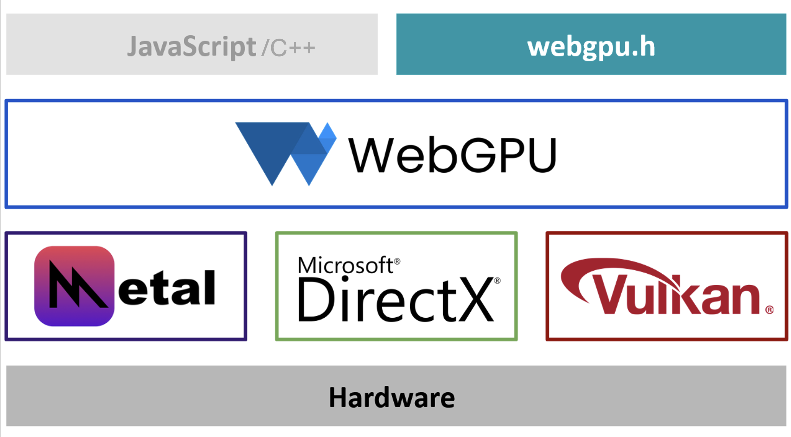

## What is WebGPU?

WebGPU is the successor to [WebGL](https://www.khronos.org/webgl/wiki/), a well adopted modern API standard for interfacing with GPUs. WebGPU provides better compatibility with modern GPUs, support for general-purpose GPU computations, faster operations, and access to more advanced GPU features. It is designed to provide a _unifed access_ to GPUs, agnostic to GPU vendors and Operating System the application runs on. WebGPU is essentially a Render Hardware Interface built on top of various backends APIs like Vulkan, DirectX, Metal depending on OS/platform. This duplicated development effort is made once by the web browsers and made available to us through the webgpu.h header they provide.

## Why WebGPU?

WebGPU has been designed taking into learnings from older standards like WebGL, OpenGL etc. and is the only graphics API that benefits from

* A Reasonable level of abstraction
* Good performance
* Cross-platform
* Backed by W3C Standards group
* Future-proof design

WebGPU is a standard and not a true API, so the implementation can be adopted and developed as an interface between native applications developed in any programming language and GPUs. Moreover the requirements in terms of performance for web pages is actually the same as for native application.

{}
When designing an API for the Web, the two key constraints are portability and privacy. We benefit here from the effort developed for portability, and fortunately the limitations of the API due to privacy considerations can be disabled when using WebGPU as a native API
{}

## Why C++?

The initial target for WebGPU was JavaScript and most of the initial implementation was done in JavaScript and the `webgpu.h` header file is written in C. In this learning path, we choose C++ rather than JavaScript or C because:

* C++ is still the primary language used for high performance graphics application (video games, render engines, modeling tools, etc.).
* The level of abstraction and control of C++ is well suited for interacting with graphics APIs in general.
* Graphics programming is a very good occasion to really learn C++.

## Dawn, Google's WebGPU implementation

Since WebGPU is a standard and not implementation, there are different implementations. For this learning path we are using [Dawn](https://github.com/google/dawn), an open-source and cross-platform implementation of the WebGPU standard. It implements the WebGPU functionality specified in `webgpu.h`. Dawn is meant to be integrated as part of a larger systems like WebGPU in Chromium or in an native Android Application.
Dawn provides several WebGPU building blocks:

* WebGPU C/C++ headers that applications and other building blocks use.
  * The `webgpu.h` version that Dawn implements.
  * A C++ wrapper for the `webgpu.h`.
* A "native" implementation of WebGPU using platforms' GPU APIs: D3D12, Metal, Vulkan and OpenGL. See [per API support](https://github.com/google/dawn/blob/main/docs/support.md) for more details.
* A client-server implementation of WebGPU for applications that are in a sandbox without access to native drivers
* Tint is a compiler for the WebGPU Shader Language (WGSL) that can be used in standalone to convert shaders from and to WGSL.

Dawn provides better error messages and logging, since it is written in C++ we can build it from source and thus inspect more deeply the stack trace in case of crash.
Dawn is usually ahead of `wgpu-native` another WebGPU implementation with regards to implementation of new functionalities/changes in the standard.
