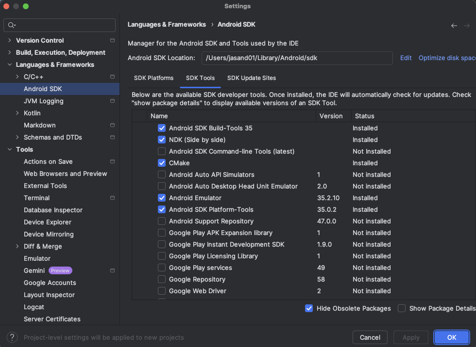

In this Learning Path, you will learn how to:

* Integrate Dawn (WebGPU) in an application.
* Use the APIs to render a simple 3D object.
* Profile and analyze the application.

The first step is to prepare a development environment with the required software:

* [Android Studio](https://developer.android.com/studio)
* [Arm Performance Studio](https://www.arm.com/products/development-tools/graphics/arm-performance-studio) 
* Python 3.10 or later

You can use any computer and operating system which supports the above software. 

## Install Android Studio and the Android NDK

1. Download and install the latest version of [Android Studio](https://developer.android.com/studio/).

2. Start Android Studio.

3. Open the `Settings` dialog.

4. Navigate to `Languages & Frameworks`, then select `Android SDK`.

5. In the `SDK Platforms` tab, check `Android 14.0 ("UpsideDownCake")`

6. In the `SDK Tools` tab check the following:
    * Check `Android SDK Build-Tools 35`
    * Check `NDK (Side by side)`
    * Check `CMake`

Click OK to install and update the selected components. 

## Install Arm Performance Studio

Profiling is an important step in the Android application development cycle. 

The default profiler in the Android Studio is great to profile CPU related metrics, but does not provide GPU details. 

Arm Performance Studio is a comprehensive profiling tool to profile both CPUs and GPUs. 

One of the components of Performance Studio is Streamline. Streamline captures data from multiple sources, including:

* Program Counter (PC) samples from running application threads.
* Samples from the hardware Performance Monitoring Unit (PMU) counters in Arm CPUs, Arm Mali GPUs, and Arm Immortalis GPUs.
* Thread scheduling information from the Linux kernel.
* Software-generated annotations and counters from running applications.

Install Arm Performance Studio using the [install guide](/install-guides/ams/).

{}
If you want to learn more about Arm Performance Studio and Streamline before continuing, refer to [Get started with Arm Performance Studio for mobile](https://learn.arm.com/learning-paths/smartphones-and-mobile/ams/ams/)
{}

Android Studio and Arm Performance Studio are now installed and you are ready to create a WebGPU Android application. 
