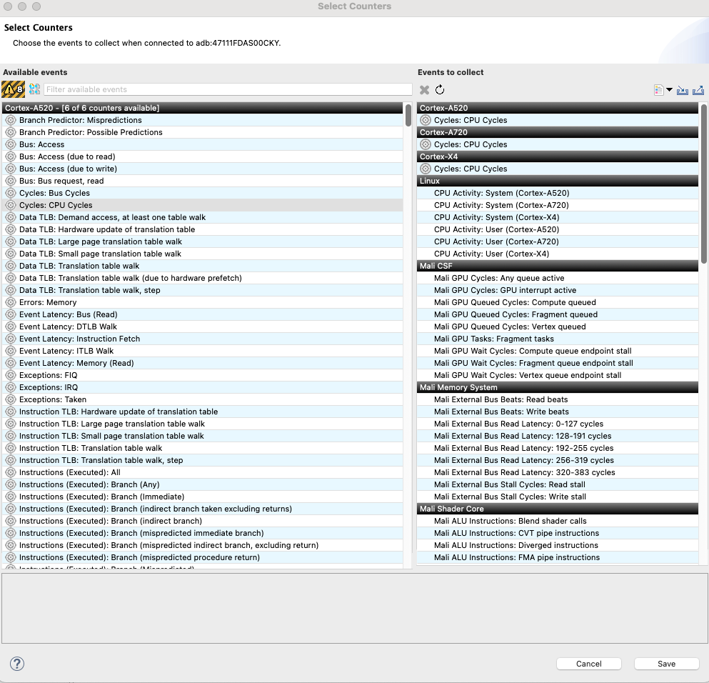

## Set up your development environment

In this Learning Path, you will learn how to

* Integrate Dawn (WebGPU) in the application.
* Use the APIs to render a simple 3D object.
* Profile and analyze the application.

Arm has worked with Dawn team to optimize the uploading data to GPU buffers for Mali GPUs. Arm has implemented a **fast path** mechanism wherein Vertex Queue starts processing in parallel while an earlier Fragment Queue is being processed.

The first step is to prepare a development environment with the required software:

* [Android Studio](https://developer.android.com/studio)
* Arm [Streamline](https://developer.arm.com/Tools%20and%20Software/Streamline%20Performance%20Analyzer) Performance Analyzer
* [Blender](https://www.blender.org/download/)
* Git.
* Python 3.10 or later.

## Install Android Studio and Android NDK

Follow these steps to install and configure Android Studio:

* Download and install the latest version of [Android Studio](https://developer.android.com/studio/).
* Start Android Studio and open the **Settings** dialog.
* Navigate to **Languages & Frameworks**, then **Android SDK**.
* In the **SDK Platforms** tab, check **Android 14.0 ("UpsideDownCake")**.
* In the **SDK Tools** tab
  1. Check **35.0.0** under **Android SDK Build-Tools 35**
  2. Check **27.x.xxxxxx** under **NDk(Side by side)**
  3. Check **3.xx.x** under **CMake** (latest is recommended)

## Install Arm Streamline

Follow these steps to install and configure Arm Streamline Performance Analyzer to capture Mali GPU related data

* Download and install latest version of [Streamline](https://developer.arm.com/Tools%20and%20Software/Streamline%20Performance%20Analyzer) for your Operating System
* Connect your phone to the development machine.
* Navigate to **Start tab**, select **Android (adb)**, select the device and then select the application to debug.
* Click on **Select Counters**

which should open a new window

* Search for **Mali Timeline Events: Perfetto**
* Make sure it is listed in the **Events to collect**
* Click Save

## Install Blender

Blender is a free software used to create graphic objects. In this learning path we will use it to create the 3D object that we are going to render. Download and install [Blender](https://www.blender.org/download/) for your Operating System.

* Click on **Add** and add the desired object(s).
* You can move the objects in the plane and also adjust the scale if needed.
* Once done, go to **File** --> **Export** --> **Wavefront (.obj**)
* Save it to desired location

