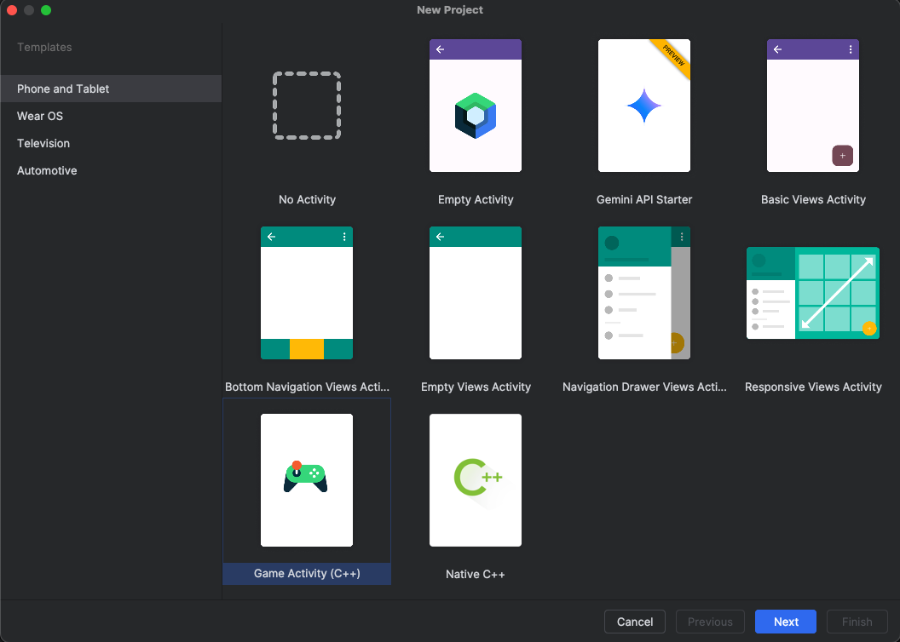
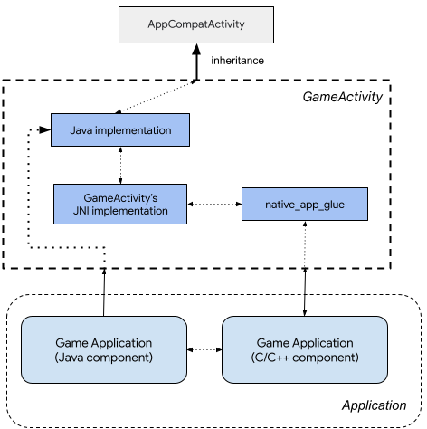

## Set up Android Project

After successful [Android Studio](./2-env-setup.md#install-android-studio-and-android-ndk) installation, open Android studio and create a new C++ game activity



GameActivity is a Jetpack library designed to assist Android games in processing app cycle commands, input events, and text input in the application's C/C++ code. GameActivity is a direct descendant of NativeActivity and shares a similar architecture:



With GameActivity, you can focus on your core game development and avoid spending excessive time dealing with the Java Native Interface (JNI) code.
GameActivity performs the following functions:

* Interacting with Android framework through the Java-side component.
* Passing app cycle commands, input events, and input text to the native side.
* Renders into a SurfaceView, making it much easier for games to interact with other UI components.

{}
You can find more information about Android Game Activity and its capabilities [here](https://developer.android.com/games/agdk/game-activity).
{}

## Upgrade application to include Dawn

The Android stock Game Activity framework uses OpenGLES3 for graphic purposes. We want to remove this dependency and replace it with WebGPU. We start by including the [webgpu.hpp](https://github.com/varunchariArm/Android_DawnWebGPU/blob/main/app/src/main/cpp/webgpu/include/webgpu/webgpu.hpp) header file in the project:

* Go to **project view** --> **app** --> **cpp**
* Create a new directory **webgpu** --> **include** --> **webgpu**

Next copy the remaining files in the [webgpu](https://github.com/varunchariArm/Android_DawnWebGPU/tree/main/app/src/main/cpp/webgpu) directory to corresponding directory in your project.
You can notice in the [FetchDawn.cmake](https://github.com/varunchariArm/Android_DawnWebGPU/blob/main/app/src/main/cpp/webgpu/FetchDawn.cmake) we are utilizing a stable `chromium/6536` branch of Dawn repository. We are downloading this branch and setting a few CMake options in the file for Dawn build.

{}
WebGPU is constantly evolving standard and hence its implementation, Dawn is also under active development. For sake of stability, we have chosen a stable branch for our development. Updating to latest or different branch may cause breakage.
{}

To add Dawn to our application, we have 2 options:

* Create a shared/static library from the Dawn source and use it in application.
* Download the source as a dependency and build it as part of the project build

We are choosing the second option, since it provides more debug flexibility.
The [webgpu/webgpu.cmake](https://github.com/varunchariArm/Android_DawnWebGPU/blob/main/app/src/main/cpp/webgpu/webgpu.cmake) and [CMakeLists.txt](https://github.com/varunchariArm/Android_DawnWebGPU/blob/main/app/src/main/cpp/CMakeLists.txt) file facilitates downloading and building WebGPU with Dawn implementation and integrating Dawn into our main project

We are also setting a few more Dawn build options

```bash
#Set Dawn build options
option(DAWN_FETCH_DEPENDENCIES "" ON)
option(DAWN_USE_GLFW "" ON)
option(DAWN_SUPPORTS_GLFW_FOR_WINDOWING "" OFF)
option(DAWN_USE_X11 "" OFF)
option(ENABLE_PCH "" OFF)
```

Finally make sure you include the built `webgpu` library into your project by

``` bash
# Configure libraries CMake uses to link your target library.
target_link_libraries(dawnwebgpu
        # The game activity
        game-activity::game-activity

        # webgpu dependency
        webgpu
        jnigraphics
        android
        log)
```

Now we have setup our project to download Dawn source code, build it and include it in our project. The `webgpu.hpp` header file acts like an interface, exposing all WebGPU functions and variables to our main Application.
