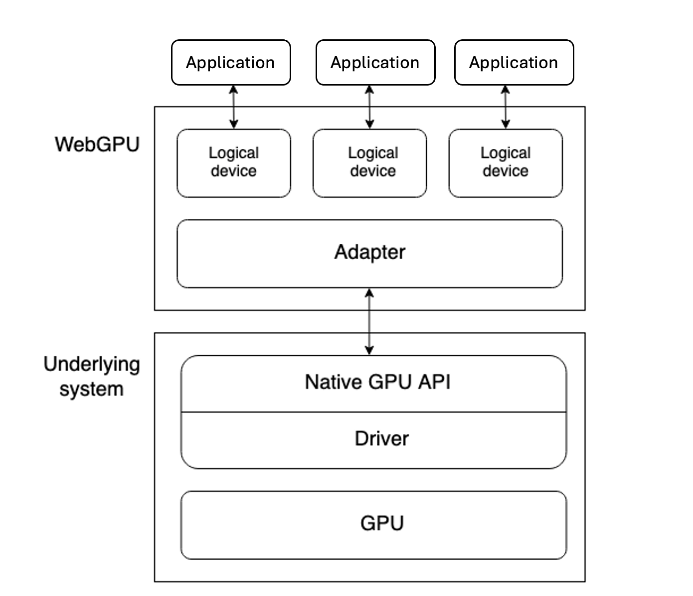
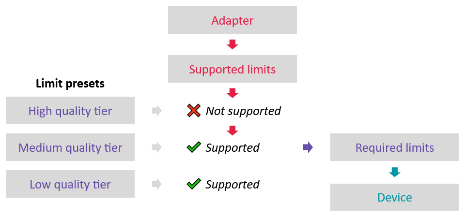

## Project Setup

With the `webgpudawn` library integrated, you can begin removing the extra files included as part of the stock Game Activity project. 

* Delete all the files from the top `cpp` directory, except `CMakeLists.txt`. 

    {}
You have already reviewed `CMakeLists.txt` in the previous section. 
{}

* Add the files `webgpuRenderer.cpp` and `webgpuRenderer.h` files for the WebGPU application. 

    Run the commands below to add a new `main.cpp` and WebGPU renderer files:

    ```console
    cp ~/Android_DawnWebGPU/app/src/main/cpp/main.cpp .
    cp ~/Android_DawnWebGPU/app/src/main/cpp/tiny_obj_loader.h . 
    cp ~/Android_DawnWebGPU/app/src/main/cpp/utils.cmake .
    cp ~/Android_DawnWebGPU/app/src/main/cpp/webgpuRenderer.cpp .
    cp ~/Android_DawnWebGPU/app/src/main/cpp/webgpuRenderer.h .
    cp -r  ~/Android_DawnWebGPU/app/src/main/cpp/glm .
    cp -r  ~/Android_DawnWebGPU/app/src/main/cpp/resources .
    ```

 

## Using Dawn WebGPU APIs

There are several layers of abstraction between a device GPU and an application running the WebGPU API.



It is useful to understand these layers as you begin to use WebGPU APIs in an application.

* Physical devices have GPUs. Most devices only have one GPU, but some have more than one.

* A native GPU API, which is part of the operating system, such as Vulkan or Metal. This is a programming interface allowing native applications to use the capabilities of the GPU. API instructions are sent to the GPU via a driver. It is possible for a system to have multiple native OS APIs and drivers available to communicate with the GPU, although the above diagram assumes a device with only one native API/driver.

* A WebGPU implementation like Dawn handles communicating with the GPU via a native GPU API driver. A WebGPU adapter effectively represents a physical GPU and driver available on the underlying system, in your code.

* A logical device is an abstraction which an application uses to access GPU capabilities. Logical devices are required to provide multiplexing capabilities. A physical device's GPU is used by many applications and processes concurrently. Each app needs to be able to access WebGPU in isolation for security and logic reasons.

### The adapter

Before requesting access to a device, you need to select an adapter. 

The same host system might expose multiple adapters if it has access to multiple physical GPUs. It might also have an adapter that represents an emulated/virtual device. Each adapter offers optional features and supported limits that it can handle. 

You can use these features and limits to determine the overall capabilities of the system before requesting the device. The adapter is used to access the capabilities of the user’s hardware, which are used to select the behavior of your application among different code paths. 

Once a code path is chosen, a device is created with the chosen capabilities. Only the capabilities selected for this device are  allowed in the rest of the application. This way, it is not possible to inadvertently rely on capabilities specific to a device.



{}
To use the adapter/device duality in an advanced way, you can set up multiple limit presets and select one depending on the adapter. 

In this scenario, there is a single preset and an abort early option if it is not supported.
{}

### Requesting the adapter

An adapter is not something you create, but rather something that you *request* using the function `requestAdapter()`.

Before doing this you need to create an instance using the `createInstance()` function. 

```C++
wgpu::Instance instance = createInstance(InstanceDescriptor{});
```

In order to display something on the screen, the operating system needs to provide a place to *draw*, this is commonly known as **a window**. 

The Game Activity provides a *pApp* member which exposes an Android Window. WebGPU can use an Android Window for rendering. 

WebGPU cannot use the *window* directly, but uses something called a "surface", which can be easily created using the window. 

```C++
wgpu::SurfaceDescriptorFromAndroidNativeWindow platformSurfaceDescriptor = {};
platformSurfaceDescriptor.chain.next = nullptr;
platformSurfaceDescriptor.chain.sType = SType::SurfaceDescriptorFromAndroidNativeWindow;
platformSurfaceDescriptor.window = app_->window; //app_ comes from the game activity
wgpu::SurfaceDescriptor surfaceDescriptor = {};
surfaceDescriptor.label = "surfaceDescriptor";
surfaceDescriptor.nextInChain = reinterpret_cast<const ChainedStruct*>(&platformSurfaceDescriptor);
wgpu::Surface surface = instance.createSurface(surfaceDescriptor);
```

Once a Surface is available, you can request the adapter using the `requestAdapter()` function as shown below:

```C++
wgpu::RequestAdapterOptions adapterOpts{};
adapterOpts.compatibleSurface = surface;
wgpu::Adapter adapter = instance.requestAdapter(adapterOpts);
```

After successful adapter creation, you can query basic information such as the GPU vendor, underlying graphics APIs, and more. 

```C++
wgpu::AdapterInfo adapterInfo;
adapter.getInfo(&adapterInfo);
__android_log_print(ANDROID_LOG_INFO, "NATIVE", "%s", "vendor..");
__android_log_print(ANDROID_LOG_INFO, "NATIVE", "%s", adapterInfo.vendor);
__android_log_print(ANDROID_LOG_INFO, "NATIVE", "%s", "architecture..");
__android_log_print(ANDROID_LOG_INFO, "NATIVE", "%s", adapterInfo.architecture);
__android_log_print(ANDROID_LOG_INFO, "NATIVE", "%s", "device..");
__android_log_print(ANDROID_LOG_INFO, "NATIVE", "%s", adapterInfo.device);
__android_log_print(ANDROID_LOG_INFO, "NATIVE", "%s", "description..");
__android_log_print(ANDROID_LOG_INFO, "NATIVE", "%s", adapterInfo.description);
std::string backend = std::to_string((int)adapterInfo.backendType);
__android_log_print(ANDROID_LOG_INFO, "NATIVE", "%s", "backendType..");
__android_log_print(ANDROID_LOG_INFO, "NATIVE", "%s", backend.c_str());
```

### Creating a device

In order to create a device that meets the requirements for the application, you need to specify *required limits*. 

There are few options to set the limits:

* Choose default limits:

```C++
wgpu::RequiredLimits requiredLimits = Default;
```

* Query the Adapter's *supported limits*, and use them as *required limits*:

```C++
wgpu::SupportedLimits supportedLimits;
adapter.getLimits(&supportedLimits);
wgpu::RequiredLimits requiredLimits = Default;
requireLimits.limits = supportedLimits.limits;
```

* Query the Adapter's *supported limits*, and define specific *better* limits in the *required limits*:

```C++
wgpu::SupportedLimits supportedLimits;
adapter.getLimits(&supportedLimits);
wgpu::RequiredLimits requiredLimits = Default;
requiredLimits.limits.maxVertexAttributes = 3;
requiredLimits.limits.maxVertexBuffers = 1;
requiredLimits.limits.minStorageBufferOffsetAlignment = supportedLimits.limits.minStorageBufferOffsetAlignment;
requiredLimits.limits.minUniformBufferOffsetAlignment = supportedLimits.limits.minUniformBufferOffsetAlignment;
//Define other limits as required

```

{}
Setting *better* limits might not be preferable, as doing so might have a consequential performance impact. To improve portability across devices and implementations, applications should generally only request better limits if they are required. 

It is recommended that you to read more about ["Supported Limits"](https://developer.mozilla.org/en-US/docs/Web/API/GPUSupportedLimits) and ["Limits"](https://gpuweb.github.io/gpuweb/#limits).
{}

Use the `requestDevice()` API to request device:

```C++
wgpu::DeviceDescriptor deviceDesc;
deviceDesc.label = "My Device";
deviceDesc.requiredFeatureCount = 0;
deviceDesc.requiredLimits = &requiredLimits;
deviceDesc.defaultQueue.label = "The default queue";
wgpu::Device device = adapter.requestDevice(deviceDesc);
__android_log_print(ANDROID_LOG_INFO, "NATIVE", "%s", "Got device");
static auto errorCallback = device.setUncapturedErrorCallback([](ErrorType type, char const* message) {
    __android_log_print(ANDROID_LOG_ERROR, "NATIVE", "%s", "Got device error");
    __android_log_print(ANDROID_LOG_ERROR, "NATIVE", "%s", "error type:");
    std::string t = std::to_string((int)type);
    __android_log_print(ANDROID_LOG_ERROR, "NATIVE", "%s", t.c_str());
    __android_log_print(ANDROID_LOG_ERROR, "NATIVE", "%s", "error message:");
    __android_log_print(ANDROID_LOG_ERROR, "NATIVE", "%s", message);
});
```

{}
While creating a device, use the callback function `setUncapturedErrorCallback`. This helps in capturing validation and other errors with the WebGPU device. 
{}

You can now move on to learn how to render 3D objects. 