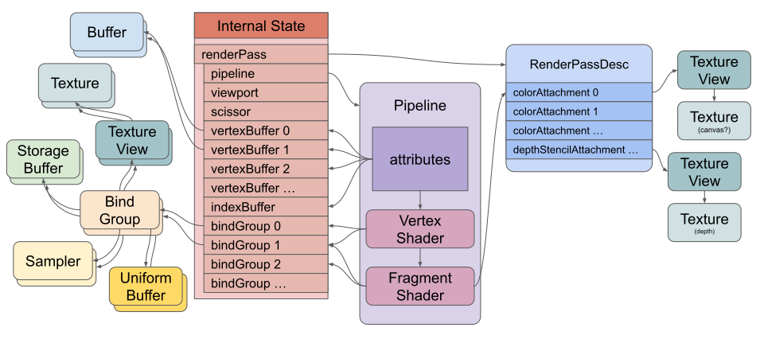

## Command Queue

Graphic applications have to deal with 2 processors, one CPU and other GPU. These 2 processors run on different timelines. For optimal performance  commands intended for the GPU are batched and fired through a command queue. The GPU consumes this queue whenever it is ready, and this way processors minimize the time spent idling for their sibling to respond. WebGPU device has a single queue, which is used to send both commands and data. We can get it with `wgpuDeviceGetQueue`.
WebGPU offers 3 different ways to submit work to this queue:

* wgpuQueueSubmit
* wgpuQueueWriteBuffer
* wgpuQueueWriteTexture

{}
Other graphics API allow one to build multiple queues per device, and future version of WebGPU might as well. But for now, one queue is already more than enough for us to play with! If you wish to learn more, please refer to the [Command Queue](https://eliemichel.github.io/LearnWebGPU/getting-started/the-command-queue.html)
{}

## Getting started to render a 3D object

WebGPU is a very simple system. All it does is run 3 types of functions on the GPU: Vertex Shaders, Fragment Shaders, and Compute Shaders.

* A Vertex Shader computes vertices. The shader returns vertex positions.
* A Fragment Shader computes colors, they indirectly write data to textures. That data does not have to be colors.
* A Compute Shader is more generic. It’s effectively just a function you call and say “execute this function N times”

Here is a simplified diagram of WebGPU setup to draw triangles by using a vertex shader and a fragment shader:



The main things to notice in the above image are:

* There is a **Pipeline**. It contains the vertex shader and fragment shader the GPU will run. You could also have a pipeline with a compute shader.
* The shaders reference resources (buffers, textures, samplers) indirectly through **Bind Groups**.
* The pipeline defines attributes that reference buffers indirectly through the internal state.
* Attributes pull data out of buffers and feed the data into the vertex shader.
* The vertex shader may feed data into the fragment shader.
* The fragment shader writes to textures indirectly through the render pass description.

To execute shaders on the GPU, you need to create all of these resources and set up this state. Creation of resources is relatively straightforward.

{}
Most WebGPU resources can not be changed after creation. You can change their contents but not their size, usage, format, etc… If you want to change any of that stuff you create a new resource and destroy the old one.
{}

## Render Pipeline

In order to achieve high performance real-time 3D rendering, the GPU processes shapes through a predefined pipeline. The pipeline itself is always the same but we can configure it in many ways. To do so, WebGPU provides a Render Pipeline object. The figure below illustrates the sequence of data processing stages executed by the render pipeline.


Render Pipeline have to 2 main types of stages, **fixed-function** and **programmable**.

### Fixed Functions stages

Pipeline description consists of the following steps:

* Describe vertex pipeline state
* Describe vertex pipeline state
* Describe primitive pipeline state
* Describe fragment pipeline state
* Describe stencil/depth pipeline state
* Describe multi-sampling state
* Describe pipeline layout

The fixed function stages are well documented and you can refer to [code](https://github.com/varunchariArm/Android_DawnWebGPU/blob/main/app/src/main/cpp/webgpuRenderer.cpp#L256) and [further reading](https://eliemichel.github.io/LearnWebGPU/basic-3d-rendering/hello-triangle.html#lit-24) for configuring them. Configuring these stages is straight forward and is similar to other graphics APIs.

### Programmable stage

There are two programmable stages, vertex and fragment programmable stages. Both of them uses **Shader Module**

### Shaders

Both the vertex and fragment programmable stages can use the same shader module or have individual shader modules. Shader module is kind of a dynamic library (like a .dll, .so or .dylib file), except that it talks the binary language of your GPU rather than your CPU’s.

### Shader Code

The shader language officially used by WebGPU is called WebGPU Shading Language, [WGSL](https://gpuweb.github.io/gpuweb/wgsl/). All implementation of WebGPU supports it, Dawn also offers the possibility to provide shaders written in [SPIR-V](https://www.khronos.org/spir)

{}
Also note that WGSL was originally designed to be a human-editable version of SPIR-V programming model, so transpilation from SPIR-V to WGSL is in theory efficient and lossless (use [Naga](https://github.com/gfx-rs/naga) or [Tint](https://dawn.googlesource.com/tint) for this).
{}

It is highly recommended to understand WGSL syntax and capabilities to better program in WebGPU.

### Shader Module Creation

It is simple to create a Shader module in WebGPU:

```C++
ShaderModuleDescriptor shaderDesc;
ShaderModule shaderModule = device.createShaderModule(shaderDesc);
```

By default the `nextInChain` member of `ShaderModuleDescriptor` is a `nullptr`.
The `nextInChain` pointer is the entry point of WebGPU’s extension mechanism. It is either null, or pointing to a structure of type `WGPUChainedStruct`. It may recursively have a next element (again, either null or pointing to some `WGPUChainedStruct`). Second, it has a struct type `sType`, which is an enum telling in which struct the chain element can be cast.
To create a shader module from WGSL code, we use the `ShaderModuleWGSLDescriptor` SType. IN Dawn, a SPIR-V shader can similarly be created using the `WGPUShaderModuleSPIRVDescriptor`.

The field shaderCodeDesc.chain corresponds to the chained struct when cast as a simple `WGPUChainedStruct`, which must be set to the corresponding SType enum value:

```C++
ShaderModuleWGSLDescriptor shaderCodeDesc;
// Set the chained struct's header
shaderCodeDesc.chain.next = nullptr;
shaderCodeDesc.chain.sType = SType::ShaderModuleWGSLDescriptor;
// Connect the chain
shaderDesc.nextInChain = &shaderCodeDesc.chain;
shaderCodeDesc.code = shaderSource;
```

In our project, we have used a helper function [`loadShaderModule`](https://github.com/varunchariArm/Android_DawnWebGPU/blob/main/app/src/main/cpp/webgpuRenderer.cpp#L450), which reads the shader code from a file and creates a shader module for the device.

### Create Render Pipeline

The shaders might need to access input and output resources (buffers and/or textures). These resources are made available to the pipeline by configuring a memory layout.
Now we can finally create a *render pipeline*  by calling the `createRenderPipeline()` :

```C++
wgpu::RenderPipelineDescriptor pipelineDesc;
//Configure fixed and programable stages
wgpu::RenderPipeline pipeline = device.createRenderPipeline(pipelineDesc);
```
