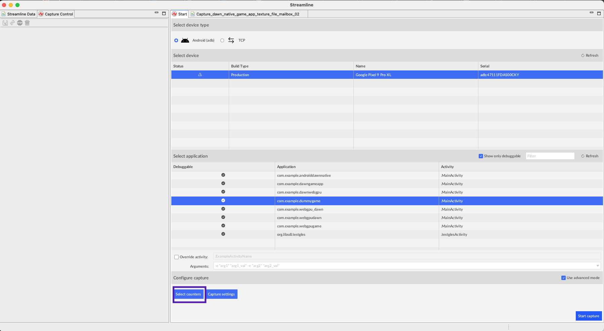
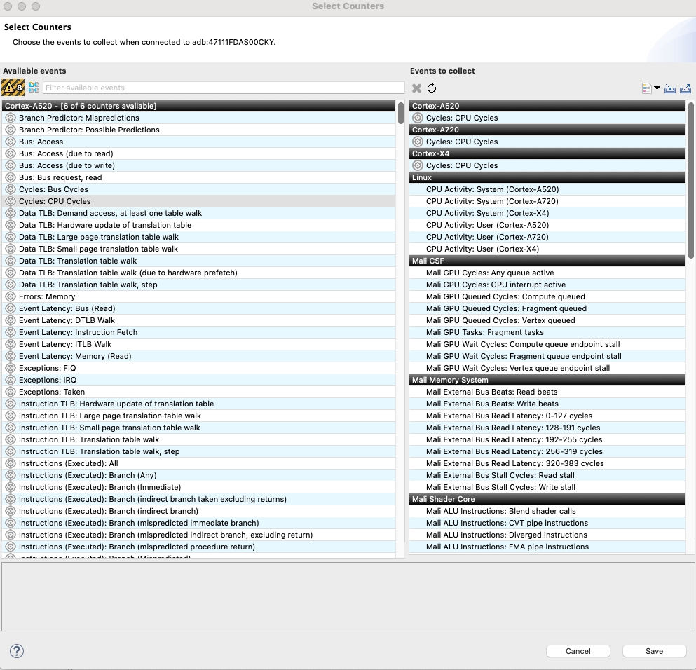
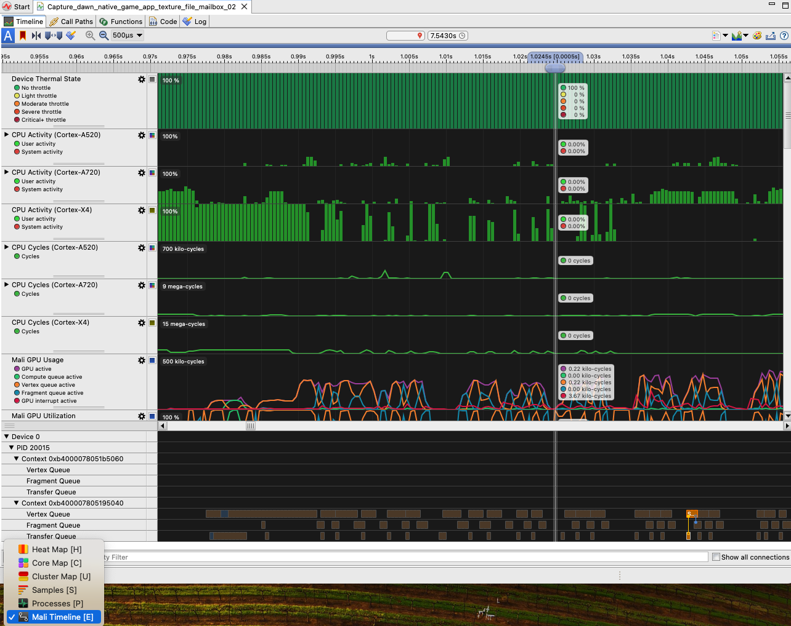
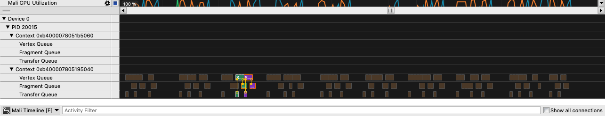

## Set up Arm Streamline

Follow these steps to configure Arm Streamline Performance Analyzer to capture Mali GPU-related data:

* Confirm that your Android device is connected to the development machine.
* Navigate to the **Start** tab, select **Android (adb)**, select the device, and then select the application to debug.
* Select **Select Counters**.

This opens a new window:

* Search for **Mali Timeline Events: Perfetto**.
* Check that it is listed in **Events to collect**.
* Select **Save**.

## Profiling the application using Streamline

Once you have selected the device, the application, and the metrics to be collected, click on the **start capture** button. 

This automatically starts the application and begins collecting the profiling data. 

Make sure the application is running correctly on your Android device. After a few seconds, you can stop the capture process. 

Wait until Streamline completes processing the data. 

Switch to **Mali Timeline** view as shown below:

You might have to zoom into the data up to the maximum (**500 us**), as you are rendering a simple 3D object. 

You can analyze two consecutive frames as shown below:

Arm has worked with the Dawn team to optimize data uploading to GPU buffers for Mali GPUs. 

Arm has implemented a **Fast Path** mechanism where the Vertex Queue starts processing in parallel while an earlier Fragment Queue is simultaneously being processed. 

As you can see from the above picture, there is some overlap between the Fragment Queue of first frame, and the Vertex Queue of the consecutive frame. 

This demonstrates that the application is hitting the **Fast Path** that Arm has implemented to optimize performance of Dawn for Mali GPUs. 

The overlap is small as the application is rendering the same simple 3D object under a different orientation. You can extend the application to render complex objects with multiple *Uniform Buffers*. This demonstrates the overlap in more detail.

{}
You can experiment with different counters in Streamline and also explore other CPU profiling data.
{}
