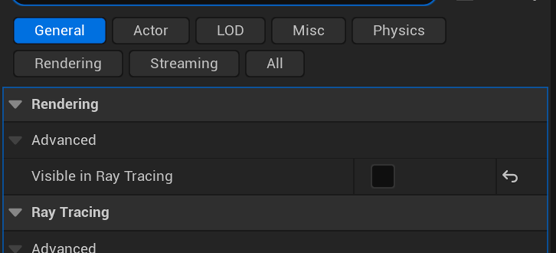

## Only Add Important Objects into Ray Tracing

Exclude the actors which are not contributing to lighting from ray tracing. Exclude the small actors from ray tracing since they can only contribute very little to the final lighting and may also cause noise for indirect lighting. In actor detail panel, uncheck `Visible in Ray Tracing` to exclude the actor from ray tracing.

