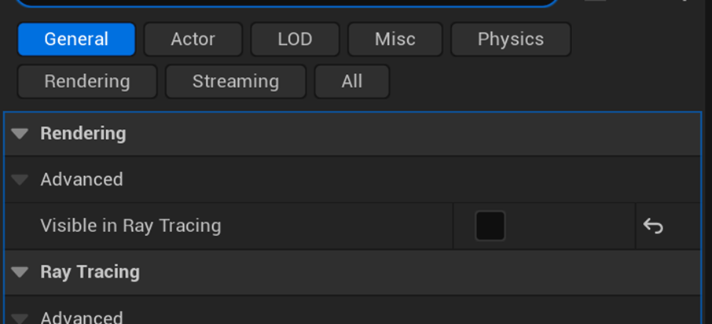

As explained in the previous section, the acceleration structure stores all geometry data for ray traversal. This means that ray traversal can be faster if there is less geometry data in the acceleration structure. The first optimization is to remove unnecessary geometry data from the acceleration structure.

Exclude actors that do not contribute to lighting from ray tracing. Additionally, exclude small actors from ray tracing since they contribute very little to the final lighting and may cause noise in indirect lighting. In the actor details panel, uncheck `Visible in Ray Tracing` to exclude the actor from ray tracing.

