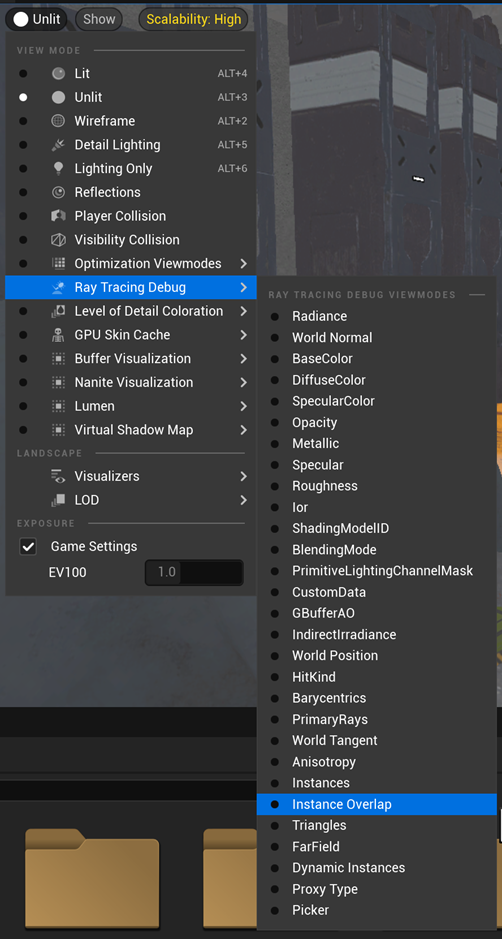
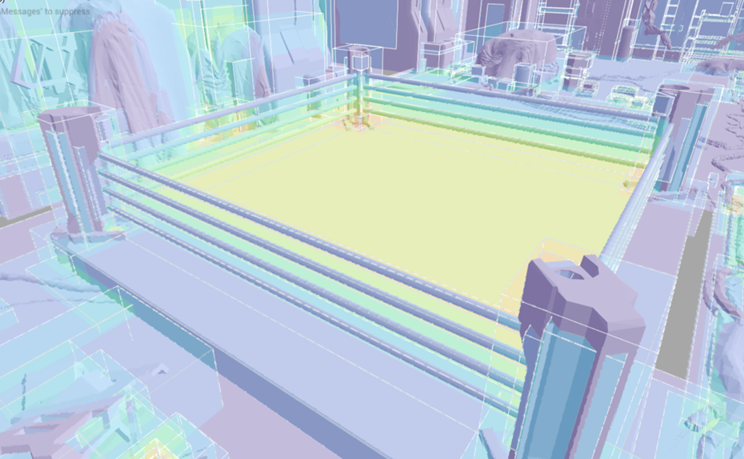
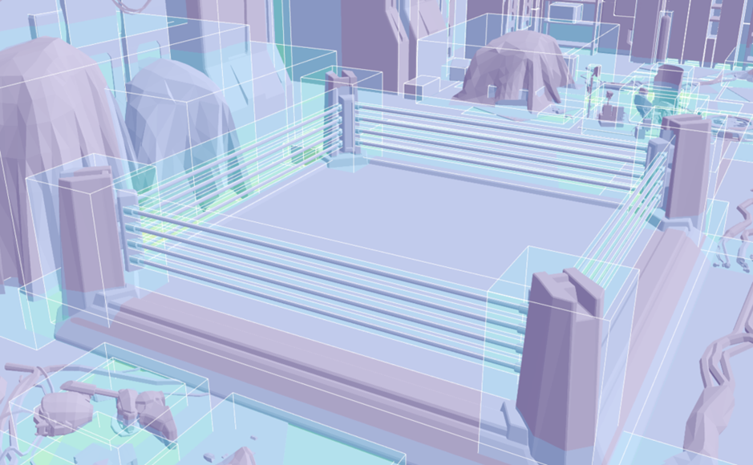

## Optimize Acceleration Structure

To get the best performance of ray traversal, you need to reduce the overlap of meshes as much as possible. The overlap will increase the cost of ray traversal because the hardware needs to check more meshes which may never has a hit with the ray. So we need to make sure the bounding box of each actor covers the least empty space.

You can use `Instance Overlap` view under ray tracing debug of Unreal editor to check the overlap of your level. 

The color of the view presents the degree of overlap. The closer to yellow the color is, the more overlap there is. You can see there is a big yellow area in the middle of the screen which means a lot of overlap there. That's caused by the mesh which combines all 4 pillars of the boxing ring and cover the empty area over the stage. 

After reorganizing the scene objects, we split the pillars to 4 meshes. As you can see from the next image, the yellow area has been eliminated and now we have less overlap in the same scene.

