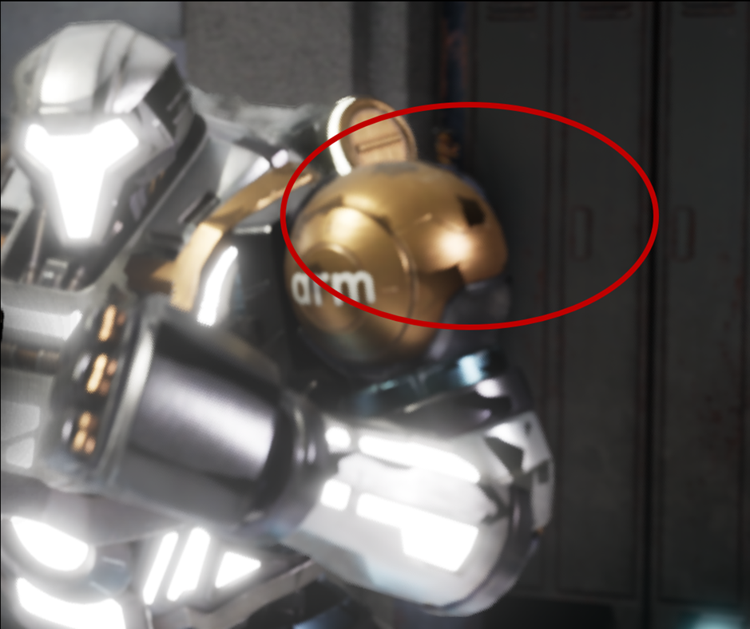

## Reduce Acceleration Structure Run-time Update Cost
The acceleration structure of static meshes is built offline and wouldn't be updated at run-time. But The acceleration structure of skinned mesh needs to be updated at run-time so it will have some updating cost. To redduce the updating cost, you can use higher LOD level of skinned mesh for ray tracing.

One thing need to be mentioned is that there may be some artifacts if you turn on ray tracing shadow when using higher LOD level of skinned mesh for ray tracing. The artifact is caused by the difference between the rendering mesh and ray tracing mesh.

