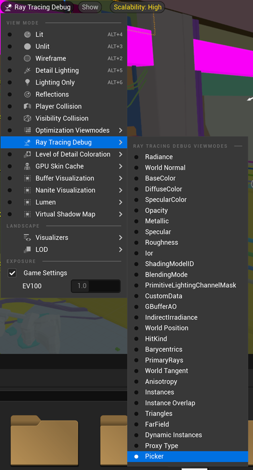
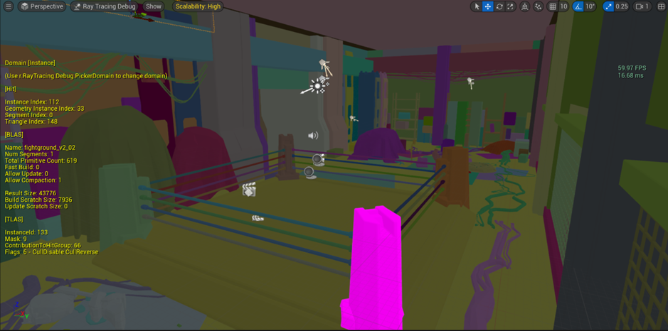

The next optimization is around instanced actors. Instanced actors can share the same geometry data in the BLAS of the acceleration structure, thereby saving memory usage and increasing cache hits. To achieve the best performance and memory efficiency when using hardware ray tracing, you should use object instancing as much as possible.

Here are the steps for checking the instancing status in Unreal Editor:

1. Use command `r.RayTracing.Debug.PickerDomain 1` to select the instance mode for picker:

2. In the Unreal editor, under **Ray Tracing Debug**, select **Picker**:

3. Use the mouse cursor to select the instance you want to check. The acceleration structure information for this instance will be displayed on the screen. Use the detailed information under **[BLAS]** to verify if two instances share the same BLAS data:

