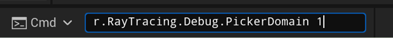

## Take Good Advantage of Instancing
Instanced actor can share the same geometry data in BLAS of acceleration structure hence save the memory usage and increase the cache hit. So you should try to use object instancing as many as possible when using hardware ray tracing to get the best performance and memory usage. 

You can also use Picker view under ray tracing debug of Unreal editor to check the instancing status of acceleration structure. Here are the steps for checking the instancing status in Unreal editor:

1. Use command “r.RayTracing.Debug.PickerDomain 1” to select instance mode for picker.

1. Select `Picker` view under Ray Tracing Debug on viewport of Unreal editor.

1. Use mouse cursor to select the instance which you want to check then there will be acceleration structure information of this instance on the screen. Use the detail information under [BLAS] to check if two instance share the same BLAS data.
