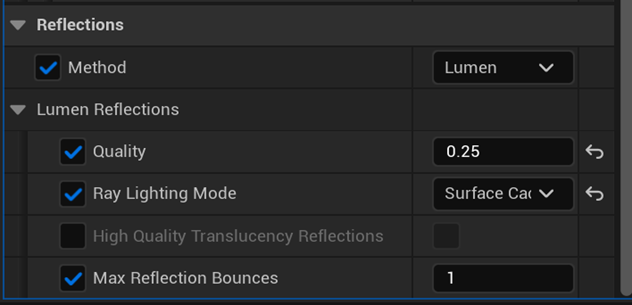

## Lumen General Setting Optimizations

## Global Illumination Settings
These global illumination parameters are used in our Lumen content - "Steel Arms".

### Lumen Scene Detail
•	Higher value can make sure smaller objects can also contribute to Lumen lighting but will also increase GPU cost

### Final Gather Quality
•	Control the density of the screen probes, higher value increase GPU cost 

•	**1.0** should reach a good balance between performance and quality for mobile game

### Max Trace Distance
•	Control how far the ray tracing will go, keep it small can decrease GPU cost

•	Don’t set it bigger than the size of the scene

•	Smaller value can also reduce some ray incoherence

### Scene Capture Cache Resolution Scale
•	Control the surface cache resolution, smaller value can save memory

### Lumen Scene Lighting Update Speed
•	Can keep it low if the lighting changes are slow to save GPU cost

•	**0.5 ~ 1.0** should reach a good balance between performance and quality for mobile game

### Final Gather Lighting Update Speed
•	Can keep it low if slow lighting propagation is acceptable

•	**0.5 ~ 1.0** should reach a good balance between performance and quality for mobile game

 
 ## Lumen Reflection Settings
 These reflection parameters are used in our Lumen content - "Steel Arms".

### Reflection Quality
•	Control the reflection tracing quality, basically the resolution of the reflection

### Ray Lighting Mode
•	The default mode is `Surface Cache` mode which reuses the surface cache data for reflection 

•	`Hit Lighting` mode is available when using hardware ray tracing, it evaluates direct lighting instead of using surface cache

•	Hit Lighting mode has higher quality with higher GPU cost

•	Hit Lighting mode can reflect direct lighting of skinned mesh which surface cache mode can't

•	Surface cache mode is recommended for mobile game

### Max Reflection Bounces
•	Control the amount of reflection bounces, higher value has higher GPU cost

•	**1** is recommended for mobile game

