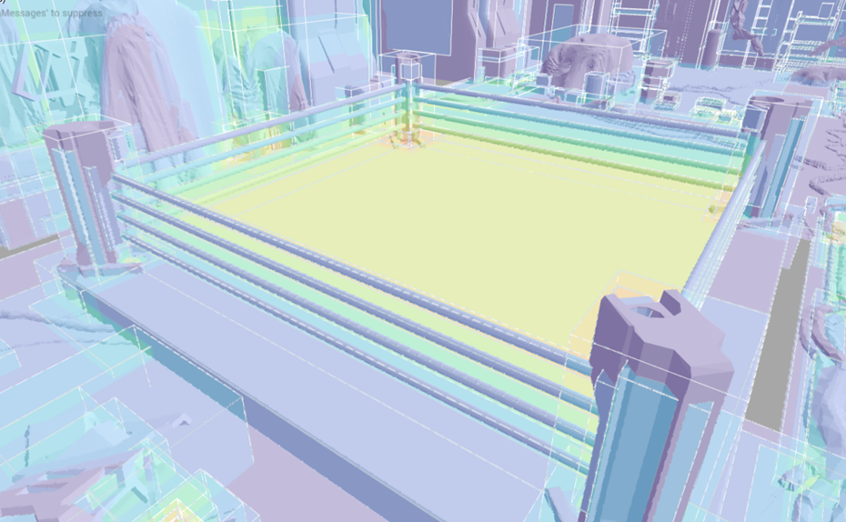

To achieve the best performance in ray traversal, it is essential to minimize the overlap of meshes. Overlapping meshes increase the cost of ray traversal because the hardware needs to check more meshes, many of which may not intersect with the ray. Therefore, it is crucial to ensure that the bounding box of each actor covers the least amount of empty space.

You can use the **Instance Overlap** view under the **Ray Tracing Debug** options in the Unreal Editor to check the overlap in your level, as shown below:

The color in the image shown below indicates the degree of overlap. The closer the color is to yellow, the more overlap there is. In the image, you can see a large yellow area in the middle of the screen, indicating that there is a significant overlap. This is caused by the mesh that combines all four pillars of the boxing ring and covers the empty area over the stage.

After reorganizing the scene objects, we have split the pillars into four separate meshes. As shown in the next image, the yellow area has been eliminated, resulting in less overlap in the same scene.

