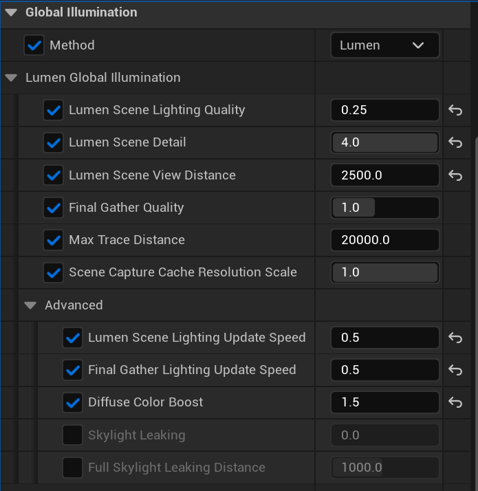
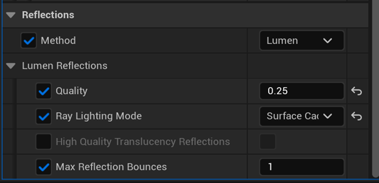

We now look at how best to optimize with the Global Illumination settings. To use Lumen in your game scene, you can add a **Post Process Volume** actor (found under Place Actors > Visual Effects). Within the details panel of **Post Process Volume**, there are several options that you can change and amend. During the development of the Lumen content, **“Steel Arms”**, we found a few recommended values for these options that are suitable for Android devices. The following images show all of the option values that were used in **“Steel Arms”** with some additional explanation provided.

## Global Illumination Settings

### Lumen Scene Detail
•	Higher values ensure that smaller objects contribute to Lumen lighting but they do increase the GPU cost.

### Final Gather Quality
•	This controls the density of the screen probes but note that higher values will increase the GPU cost.

•	**1.0** strikes a good balance between performance and quality for mobile games.

### Max Trace Distance
•	This controls how far the ray tracing will go; keeping the number small decreases the GPU cost.

•	Do not set it to be larger than the size of the scene.

•	Smaller values can also reduce ray incoherence.

### Scene Capture Cache Resolution Scale
•	This controls the surface cache resolution; smaller values save memory.

### Lumen Scene Lighting Update Speed
•	This can be kept low if lighting changes are slow to save GPU cost.

•	**0.5 ~ 1.0** strikes a good balance between performance and quality for mobile games.

### Final Gather Lighting Update Speed
•	This can be kept low if slow lighting propagation is acceptable.

•	**0.5 ~ 1.0** strikes a good balance between performance and quality for mobile games.
 
 ## Lumen Reflection Settings

### Reflection Quality
•	This controls the reflection tracing quality, essentially the resolution of the reflection.

### Ray Lighting Mode
• The default (and recommended for mobile games) mode is **Surface Cache**, which reuses surface cache data for reflection.

• The **Hit Lighting** mode is available when using hardware ray tracing; it evaluates direct lighting instead of using the surface cache. It offers better quality but at a higher GPU cost and can also reflect the lighting of skinned meshes which **Surface Cache** mode cannot. **Hit Lighting** is not yet supported on mobile devices.

### Max Reflection Bounces
• This controls the number of reflection bounces; higher values increase the GPU cost.

• **1** is recommended for mobile games.

This learning path has taken you through some key areas and best practices for using and optimizing hardware ray tracing with Lumen. 
