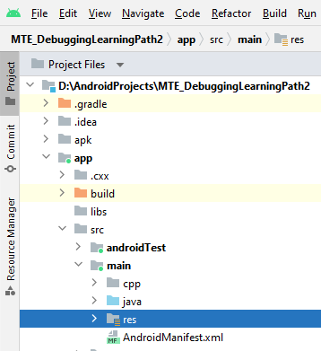

## Enabling MTE in the Android project
There are different ways of enabling MTE in Android projects. For detailed description see [Enabling MTE in Android projects](https://source.android.com/docs/security/test/memory-safety). This learning path will enable MTE in the application manifest.
To open the application manifest switch the project view to Project Files and expand *app->src->main->res* folders as shown in the picture below. Double click on *AndroidManifes.xml* file to open it. 




```
<?xml version="1.0" encoding="utf-8"?>
<manifest xmlns:android="http://schemas.android.com/apk/res/android"
    xmlns:tools="http://schemas.android.com/tools"
    package="com.example.mte_test">

    <application
        android:allowBackup="true"
        android:dataExtractionRules="@xml/data_extraction_rules"
        android:fullBackupContent="@xml/backup_rules"
        android:icon="@mipmap/ic_launcher"
        android:label="@string/app_name"
        android:roundIcon="@mipmap/ic_launcher_round"
        android:supportsRtl="true"
        android:theme="@style/Theme.AppCompat.Light.NoActionBar"
        tools:targetApi="31"
        android:memtagMode="sync"
        tools:ignore="MissingPrefix">
        <activity
            android:name=".MainActivity"
            android:exported="true">
            <intent-filter>
                <action android:name="android.intent.action.MAIN" />
                <category android:name="android.intent.category.LAUNCHER" />
            </intent-filter>
        </activity>
    </application>
</manifest>

```
The line below within the *application tag* in the Android manifest, enables MTE in *sync* mode in the application. 
```
android:memtagMode="sync"
```
The attribute *memTagMode* can have the following values: *off*, *sync*, *async*, and *asymm*.

If the *android:memtagMode* attribute is not specified, then MTE is disabled.
This learning path will use the the *sync* value of *memtagMode* attribute.
In synchronous mode (*sync*), a mismatch between the tag in the address and the tag in memory
causes the processor to abort execution immediately and it terminates the process with SIGSEGV (code SEGV_MTESERR) - a synchronous exception. This identifies the precise instruction and address that caused
the failure. This is the only mode recommended to use when debugging your application with MTE. 
You can find detailed information on MTE modes in the [MTE Guide for Android OS](https://documentation-service.arm.com/static/660d6857aec7154a17ee1c5f?token=). 

The last step in the preparation to use MTE in your Google Pixel 8 phone when debugging the application in Android Studio, is to enable MTE in the phone settings. For this, follow the indications provided in the learning path [Memory Tagging Extension on Google Pixel 8](https://learn.arm.com/learning-paths/smartphones-and-mobile/mte_on_pixel8/).

