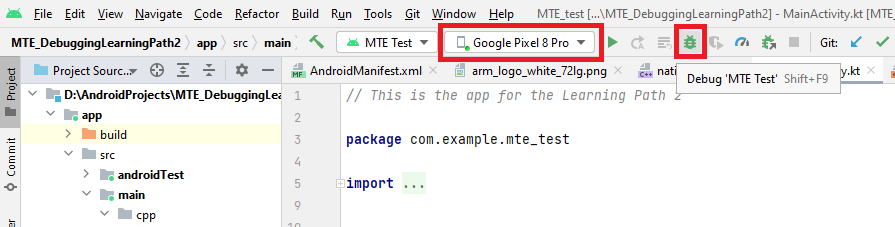
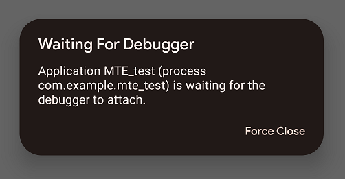
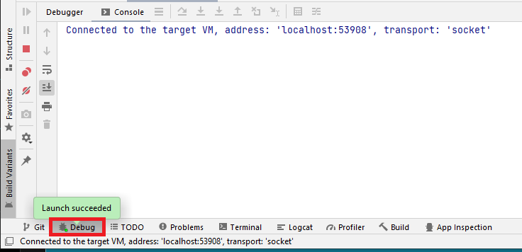
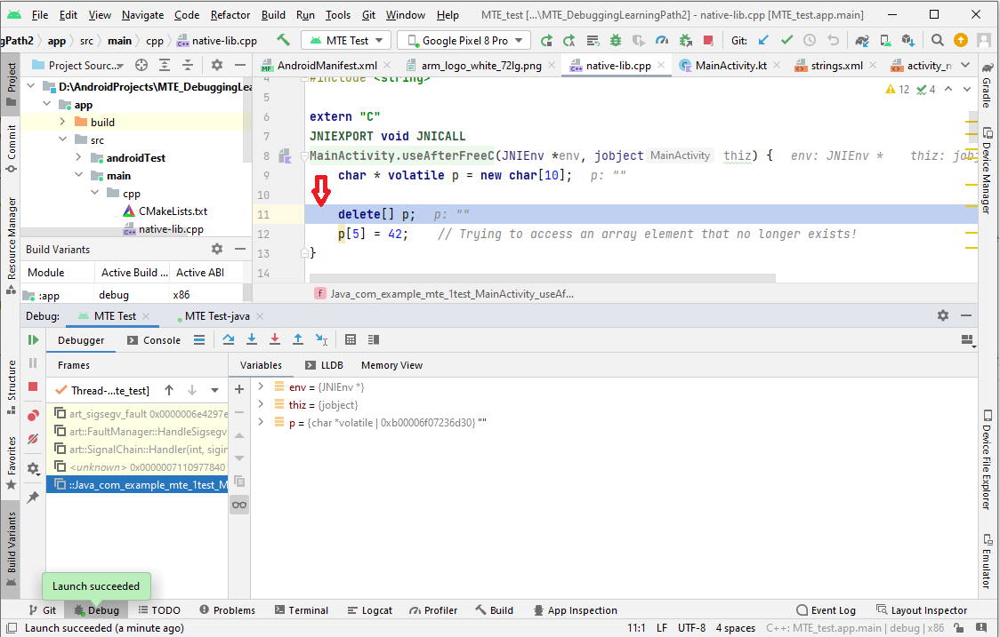

## Debug in Android Studio

You are now ready to debug the MTE Test application in Android Studio.

Connect your Google Pixel 8 smartphone to your computer with the MTE Test project opened in Android Studio.

In the image below, you should see the device name in the box, as highlighted.

Press the *Debug* button as shown in the image above to build and start debugging the application. Look at your device in the location where the application starts. 

You see the message below on your screen. Wait until the application interface shows up.

Press the *Debug* button at the bottom of the Android Studio window, as shown in the image below. 

This opens the debug console. The first time you do this, it can take about a minute for the console to show that Android Studio is "connected to the target VM".

You can now debug the application. 

Look at your device where the application is running.

You can press any of the buttons of the application. For example, you can press the first button that implements the case *Use After Free*.  As MTE is enabled, it detects a mismatch between the tag in the address, and the tag in memory. The application crashes. 

The debug process takes you to the line immediately before the instruction that triggers the memory safety bug, as shown in the image below.

Press the red square button at the top-right to stop debugging.