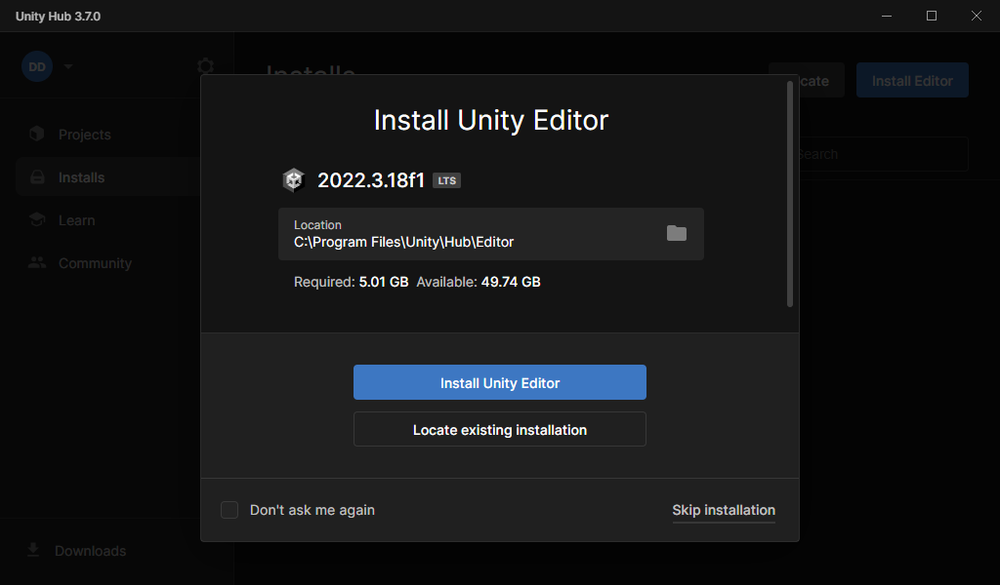
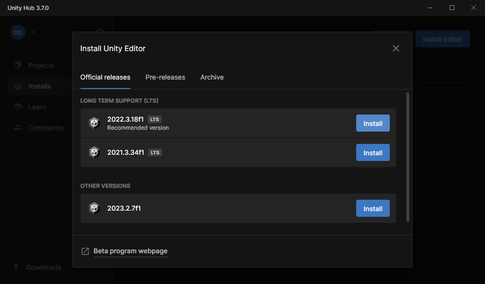
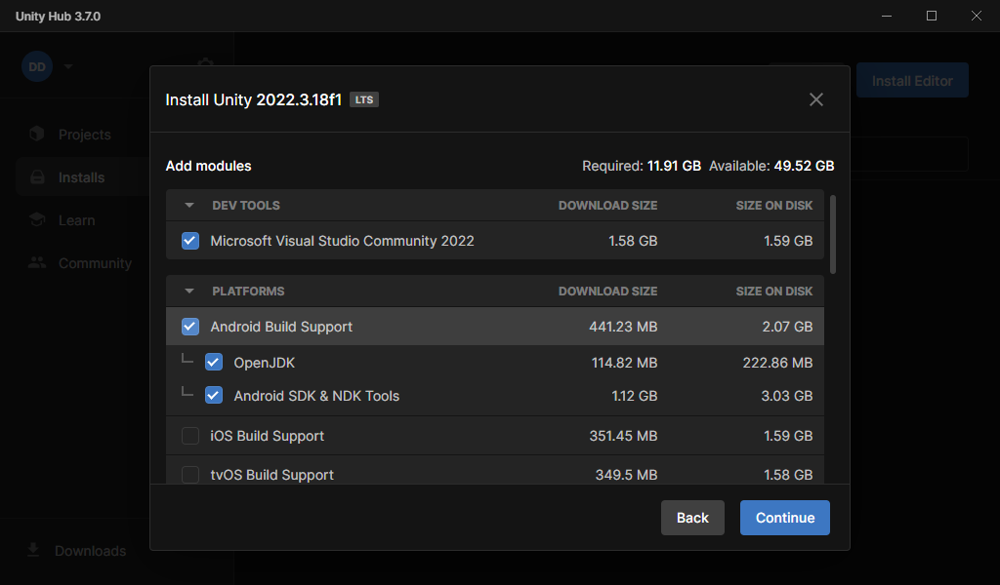
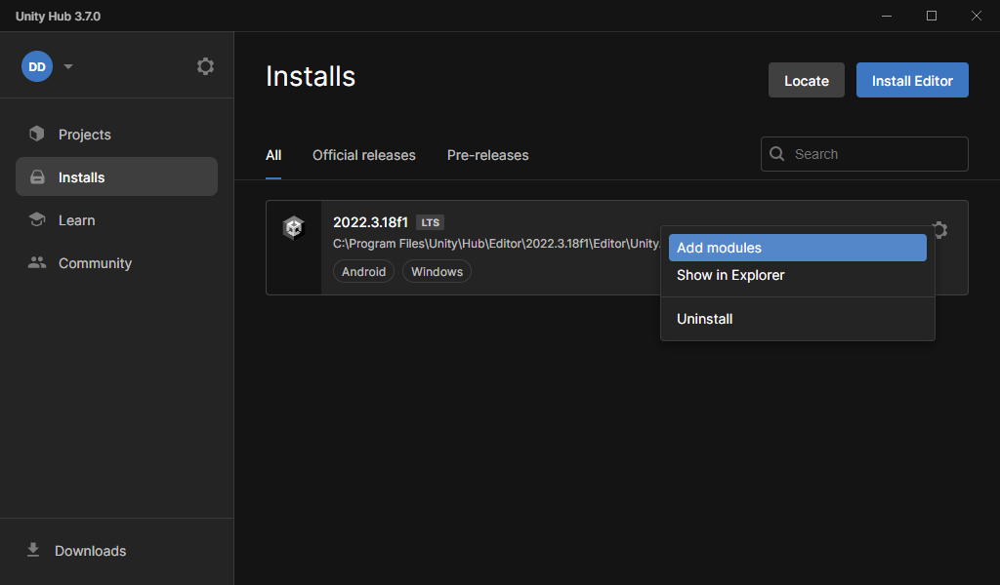
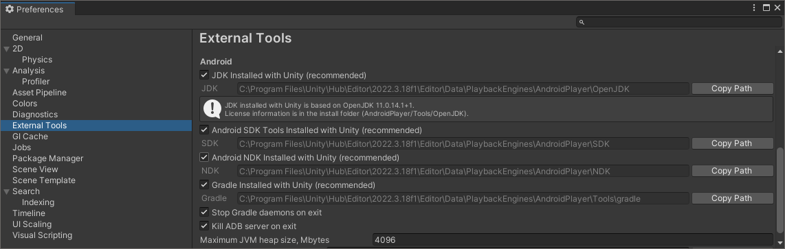
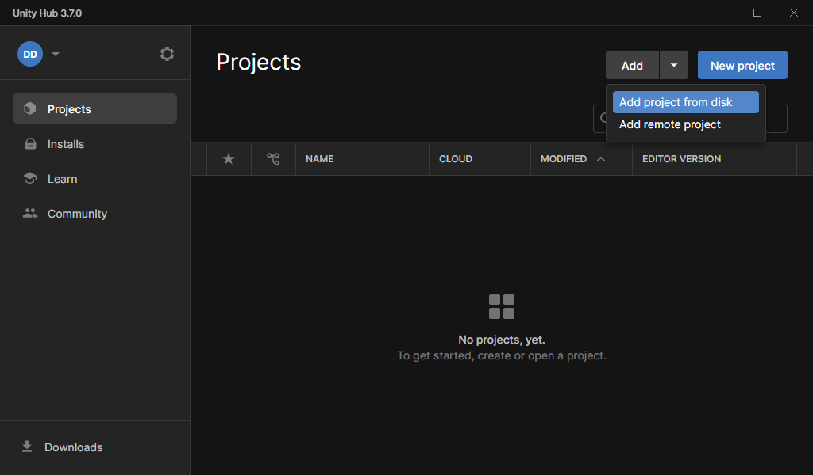
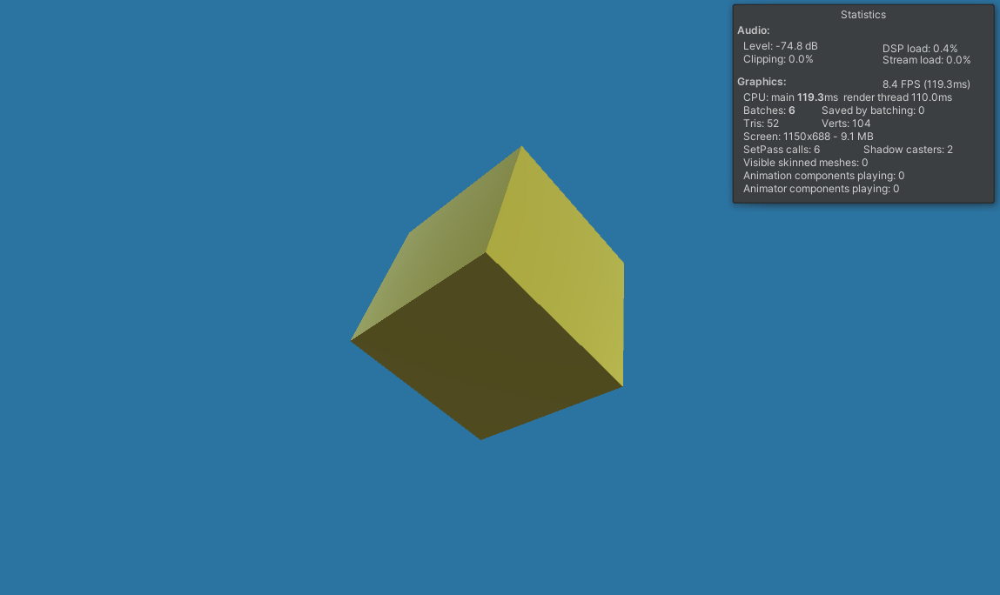

## Set up your development environment

In this learning path we will look at building and deploying a simple project to an Android device. We will then take a look at how to profile on device and examine the first few steps you might want to take when investigating your application's performance.

We will prepare three things before we can get going:

1. Install Unity (latest version recommended)
2. Add Android Build Support
3. Extract the sample project from this learning path

## 1. Install Unity with Android build support

First off, if you haven't already got Unity, we recommend following their steps to get the latest version. The simplest way to get Unity is via their installation manager called Unity Hub. Unity Hub will let you manage multiple installations of Unity and also provide quick access to your projects.

- Download Unity Hub now by following the instructions at [unity.com/download](https://unity.com/download)

- Run the hub once it has downloaded. If you are not already logged in, you will be prompted to either log in or create an account.

- Once logged in, if you don't already have any editor versions installed, Unity may recommend the latest Long-Term Support version.

- Go ahead and install the editor they suggest. If you don't see the above screen, you can always install a version of Unity manually. Click on the _Installs_ tab on the left to see the list of installed editors (which will likely be empty):

")

- Click on the recommended version. On the next screen we will add the Android module:

You should see a list of optional features to install with your editor. You can install Android build support now. In the list, click on "Android Build Support".

You now have Unity and Android support. If you forgot to tick Android Build Support or you already had a version of Unity without it, follow the next section to download Android support separately.

### 2. Install Android build support on pre-existing versions of Unity

Follow these steps if you already have a version of Unity and just need to add the Android build support. Unity Hub lets you install modules on top of existing installations. Each editor version you install can have different modules installed on top.

- Click on the _Installs_ tab on the left to see your list of editor installations. Then click on the _cog_ button and select _Add Modules_:

- You will be presented with the module list. Select _Android Build Support_ and any other modules you wish to install. Then click _Continue_.

- Once you have installed Android Build Support, you have everything you need for this learning path.

### Android SDK and NDK

Android Build Support installs and manages the Android SDK and Android NDK for you. If you ever need to access the SDK or NDK directly, you can find them in the _External Tools_ tab of Unity Editor Preferences (menu option _Edit->Preferences_).

## 3. Extract and open the Unity project

We have provided a simple project to accompany this learning path. To open it in Unity, please follow these instructions:

- Unzip the [simple profiling example](supporting-files/simple-profiling-example.zip) to your computer

- In Unity Hub, from the _Projects_ tab, select _Add project from disk_ from the drop-down menu:

- Navigate to your unzipped project directory and click "Add project"

You will see your project listed in the _Projects_ tab in Unity Hub.

- You can now click on the project to open it. We used Unity 2022.3.18f1 to create the sample; if you use a different version, you will get a warning. The project is very simple and should be safe to convert. However, if in doubt, we recommend installing 2022.3.18f1 via the Unity Hub as we have already showed.

- The project will now open in Unity. Once loaded (the first time can take a while), click on the _Play_ button to run the sample. This will run the project inside the editor. You will see a spinning cube.

- In the top right of the _Game_ window, click on _Stats_ to show the _Statistics_ popup. You will notice the frame rate is much lower than you might expect. For such a simple example we could reasonably expect to hit the maximum rate of the display, e.g., 60fps or better.

Later we'll use the Profiler to investigate but, before that, we'll deploy to Android to check if the behavior is the same.
