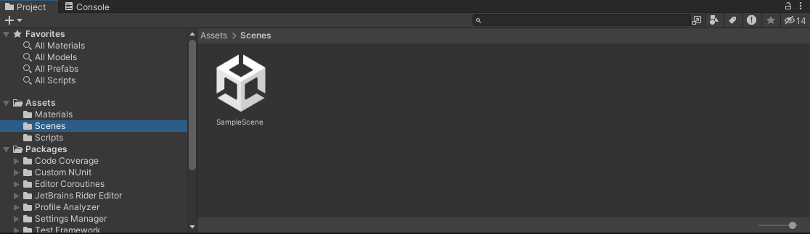
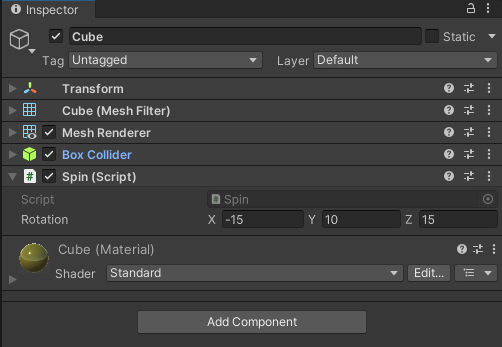

## Open the sample project

We have Unity installed with Android build support, and we have a spinning cube running too slowly! We can now start to investigate what's wrong.

1. Open the project in Unity (if you haven't already).

1. Open the _SampleScene_ scene by double-clicking the scene file from the _Project_ tab:

We will see a really simple scene with just a few objects:

- Main Camera
- Directional Light
- Cube

We haven't made any modifications to the camera or the directional light but if you click on the Cube object, you will see that we have added a custom script called _Spin.cs_.

As you can see, the _Spin_ component looks very basic; it simply applies a rotation to the _Cube_ every frame. The speed of which can be changed using the _Rotation_ parameter.

In the next section, you will build the project and deploy it to your Android device. In a real-life case it is good practice to confirm which devices are being affected by which issues.
