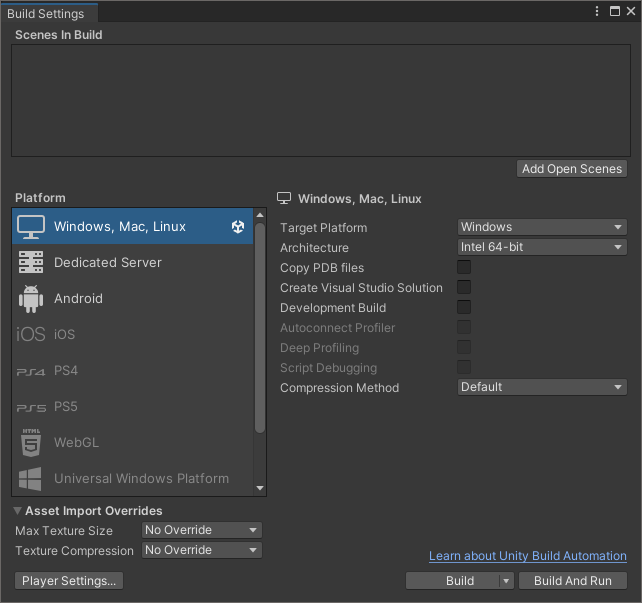
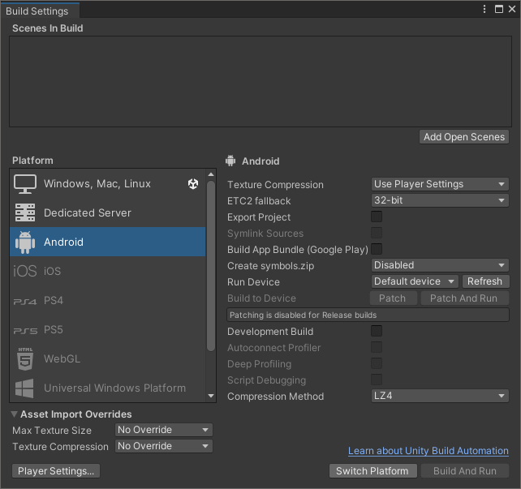
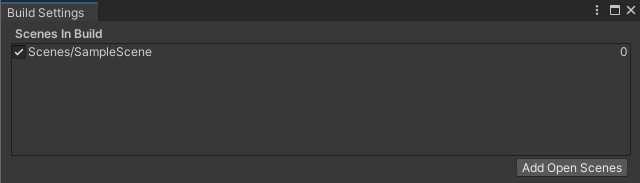

## Build for Android

Open the sample project (if you haven't already) and open the _SampleScene_ as per the previous section.

We're going to build the sample for Android. To do so takes just a few steps and they are all achieved from the _Build Settings_ window.

1. First off, we need to switch the project to _Android_.

1. Select _File->Build Settings_ to show the Build Settings window:

    

1. Notice how the project is currently in "Windows, Mac, Linux" mode. We need to switch to Android.

1. Select _Android_ on the left and then click on _Switch Platform_. This will take a few moments as it re-builds the assets for the Android mode (this step can take longer the first time it is done for any project).

    

1. We must now tell Unity which scene to open when the app runs. This affects all platforms. Click on _Add Open Scenes_ to add the opened sample scene to the _Scenes in Build_ list. We will only need to do this once.

That's all we need to do to simply run the app. There are a couple more steps required to run the profiler but we'll cover those later.

## Prepare your Android device for development

To deploy to your Android device, we will need to enable the _Android Developer Options_ and _USB Debugging_ on your device:

1. Go to your Android settings app

1. Scroll to the bottom to find _Developer Options_. If you do not see this option, follow the instructions for [configuring developer options](https://developer.android.com/studio/debug/dev-options).

1. In _Developer Options_ ensure the _On_ option is enabled.

1. Scroll down to find and enable _USB Debugging_.

## Deploy to your Android device

Connect your Android device to your computer using a USB cable. Unity may take a few moments to recognize it.

Android may ask for confirmation before enabling the connection.

In the _Build Settings_ window:

1. Ensure your device appears in the _Run Device_ menu and select it.

1. Select _Build and Run_. Choose a location to save your build.

1. The project will now build for Android and deploy to your device.

You will see the spinning cube running slowly. On recent Android devices, we would definitely expect it to run more quickly (at 60 frames per second).

We're now ready to dive into the Unity Profiler.
