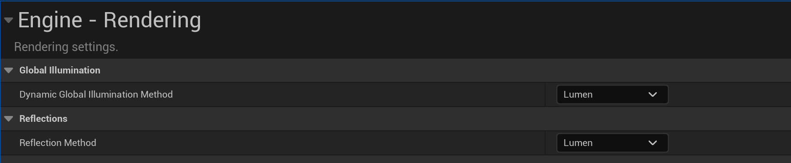
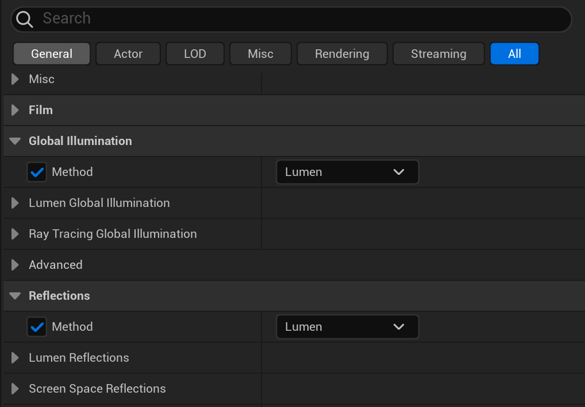

To enable Lumen in your Unreal project, open the Project Settings window and select `Lumen` in the `Global Illumination` section under `Engine - Rendering`, as shown in Figure 1.

The reflection setting is separate from Global Illumination, but you can also select `Lumen` as the reflection method in the `Reflections` section under `Engine - Rendering`, as shown in Figure 1.

Another way to enable Lumen is by creating a **Post Process Volume** actor in the scene and selecting `Lumen` in the `Global Illumination` sections in the Post Process Volume details panel, as shown in Figure 2. You can also select `Lumen` as the reflection method here.

