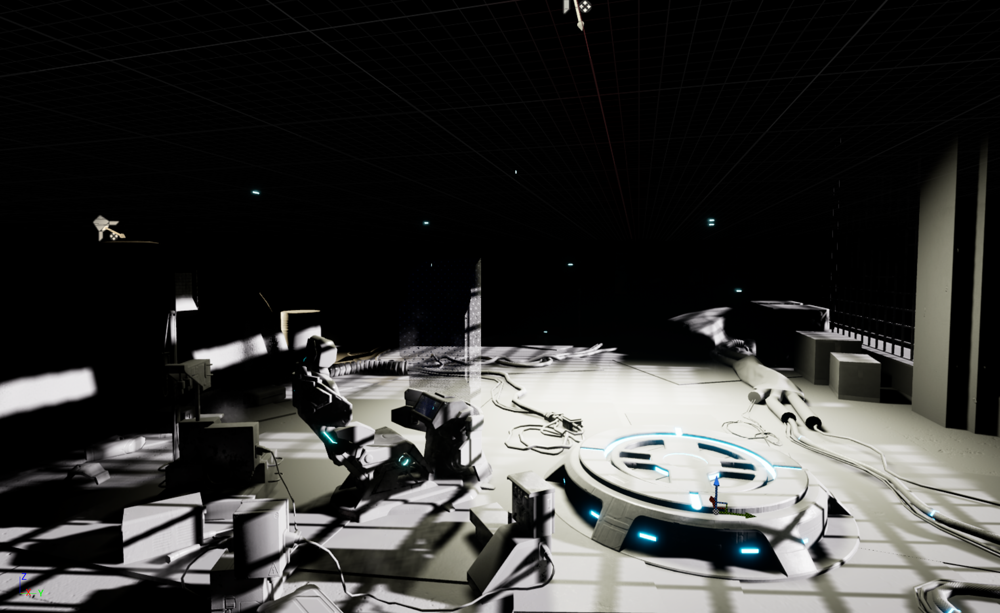
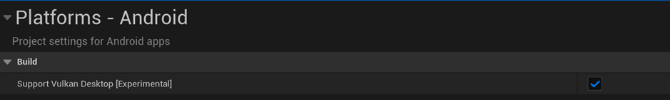
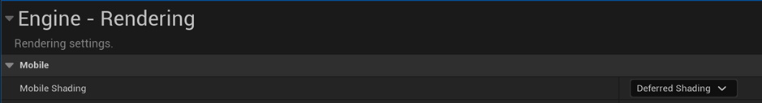
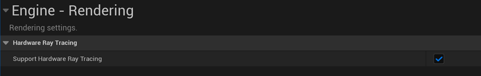
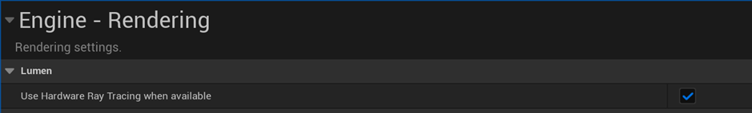

## Unreal Engine Setup
Lumen is the latest dynamic global illumination solution of Unreal engine which also supports hardware ray tracing. When lighting the indoor scene, only direct lighting can't generate high quality rendering result. To generate the best lighting result, you will also need indirect lighting. Lumen provides a new ray tracing based solution which allows the developers to render both dynamic direct lighting and indirect lighting at run-time.




To use hardware ray tracing Lumen for your application, you will need to set up a few options to enable hardware ray tracing support on Lumen for Android devices. This article will show you how to set up all options before using Unreal Engine to build your application.

### Enable SM5 Shader Format
Lumen is enabled only when the SM5 shader format is enabled. In the project setting, under Platforms – Android page, enable `Support Vulkan Desktop [Experimented]` option to enable SM5 shader format support.





###  Select Deferred Shading Mode
Currently, Lumen only supports deferred shading mode. So in the project setting, under Engine – Rendering page, select `Deferred Shading` for Mobile Shading option.



###  Enable Support Hardware Ray Tracing
To enable hardware ray tracing for lumen, first you need to enable it for engine. In the project setting, under Engine - Rendering page, enable `Support Hardware Ray Tracing` option.


 

###  Enable Use Hardware Ray Tracing when available
Lumen supports both software and hardware ray tracing. To enable hardware ray tracing for lumen then, in the project setting, under Engine - Rendering page, enable `Use Hardware Ray Tracing when available` option. This setting will tell the application to use hardware ray tracing first, then use software ray tracing if hardware ray tracing is not supported on the device. 
 



###  Set Up Console Variables
Finally, you will also need to set up 2 console variables in your engine configuration file. `r.Android.DisableVulkanSM5Support=0` can remove the restriction of using SM5 shader format. `r.RayTracing.AllowInline=1` enables the Ray Query shader support for Vulkan.
```C 
r.Android.DisableVulkanSM5Support=0
r.RayTracing.AllowInline=1
```
