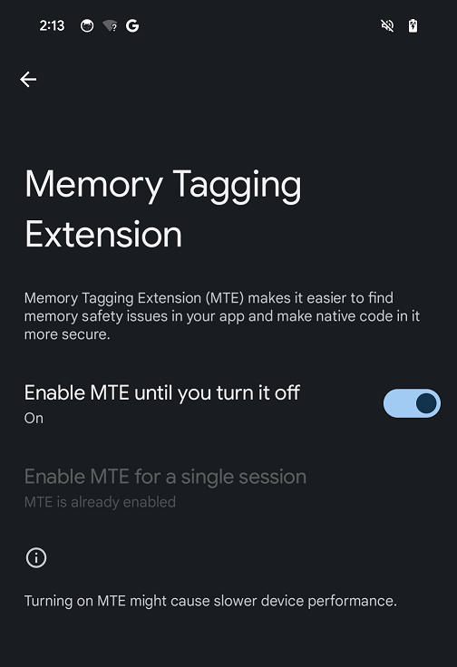

## Enabling Memory Tagging Extension on Pixel 8 

Google Pixel 8 is the first smartphone supporting MTE out-of-the-box.
To enable MTE on your Pixel 8 you first need to enable Developer options.

Follow the steps below to enable Developer Options on your Pixel 8:
* On your device, find the Build number option in Settings -> About phone -> Build number.

* Tap the Build number option seven times until you see the message "You are now a developer!" This enables Developer options on your device.

* Return to the previous screen and tap the System option. The just enabled Developer options will be at the bottom. 

[This is a comment that will be hidden.]: # 

MTE is now available as part of Developer options. Tap on Developer options and next tap on Memory Tagging Extension option. You will see in your screen the picture below:

