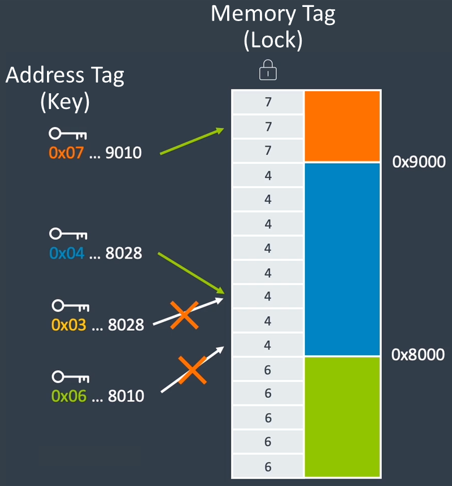

## Memory Tagging Extension: working principle

According to Google, memory bugs are the top contributor to Android security vulnerabilities. Memory bugs are responsible also for higher lifetime costs in SW development and poor user experience.
Additionally, developers know how difficult could be finding a memory bug.

The Memory Tagging Extension developed by Google and Arm is aimed at providing developers with the right tool to easily detect memory bugs, and with this, improve robustness and security of Android apps.

MTE working principle is based on a Lock and Key model. Memory locations are tagged by adding four bits of metadata to each 16 bytes of physical memory. Tagging memory implements the lock. Pointers, and therefore virtual addresses, are modified to contain the key.
In order to implement the key bits without requiring larger pointers, MTE uses the Top Byte Ignore feature of the Armv8-A Architecture. This allows the top byte to store metadata. In MTE four bits of the top byte are used to provide the key. 

At runtime the CPU checks that the pointer and the metadata tags match, on each load and store. Android apps that incorrectly store information in the top byte of the pointer are guaranteed to break on an MTE-enabled device. 

