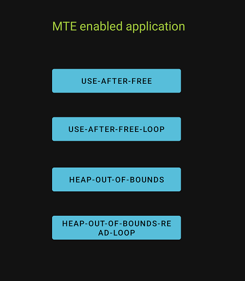

## MTE Test Application

`MTE_test.apk` is an application that implements the most common types of memory bugs. By pressing any button on the application shown below, you can execute code containing a memory bug. If MTE is enabled on your device, MTE will detect the memory violation and make the application crash. You can then retrieve a bug report. This report contains useful information to identify the cause of the crash and where it happened.

## Installing the MTE Test Application

Follow the steps below to install `MTE_test.apk` on your Google Pixel 8:

* Navigate to [this repository](https://github.com/rlopez3d/mte_test_app). Open the "apk" folder and click on "MTE_test.apk" file. Use the download icon on the right to download the apk to your desktop machine.

* Connect your Pixel 8 to the USB port.

* Open a console and change the directory `cd` to where you downloaded the apk.

* Execute the command `adb devices`. The console should display the list of attached devices.

* Execute the command `adb install MTE_test.apk`. The console should display that the apk has been installed successfully.

* You should now see the Android icon of the app with the name `MTE_test` on your phone.

