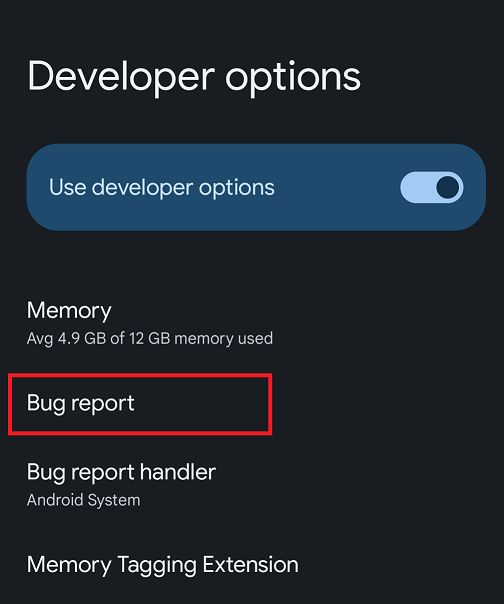
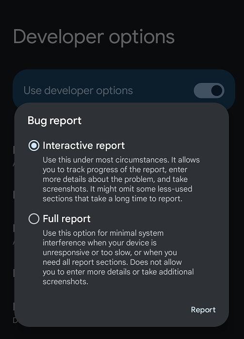
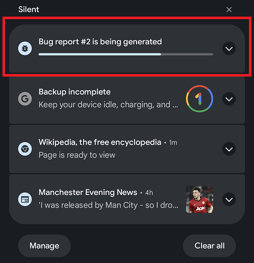
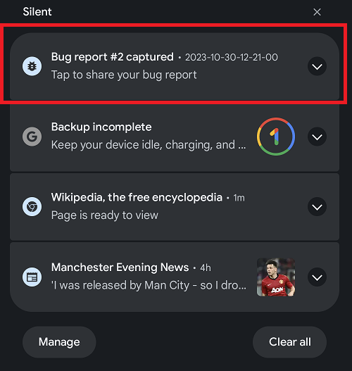
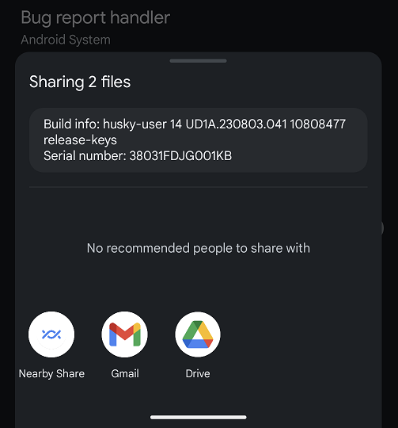

## Capturing the Bug Report
A bug report contains device logs, stack traces, and other diagnostic information to help you find and fix bugs in your application. If MTE is enabled on the device, the bug report will contain specific additional information about the memory bug. To capture a bug report on your Google Pixel 8, use the Bug report option available in Developer options menu, as shown below.

Tap Bug report option to capture the bug report. Leave selected the Interactive report option in the next screen and tap Report at the bottom.

At this point the bug report generation starts. You can see the progress of the bug report generation by sliding down the notification panel as shown below. By tapping on the drop-down icon on the right you can set a name to the bug report, and add a useful comment that will help you identify it later.   

Once finishes the bug report generation you can share it by tapping on the notification.

The bug report is a big text file containing useful information to know the cause of the crash and where it happened. The phone screen is not the best format to visualized it. It is better to do it in your desktop machine on a big screen. You can send the report to any of the available options on your phone. 

YOUR CONTENT GOES HERE

