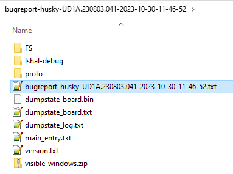
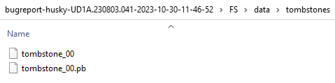
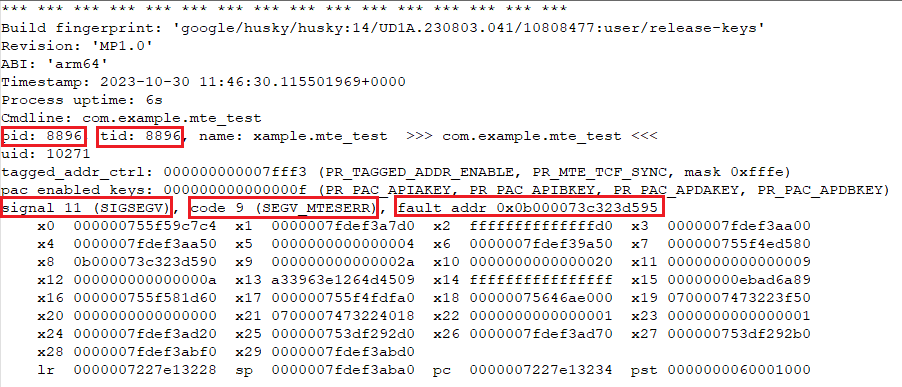
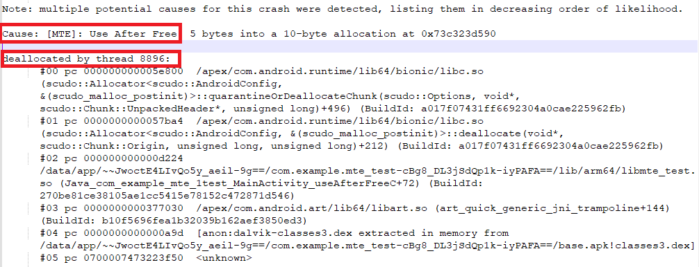

## Bug Report Content

The bug report is a zip file. Once you have it on your desktop machine, you need to decompress it to access the content. After unzipping the file, you will see the folder structure below and the bug report txt file. Husky is the code name for Google Pixel 8 Pro and it is used when generating the name of the bug report file.

More detailed information is written to a tombstone file located in `FS/data/tombstones` folder as shown below:

## Interpreting the Bug Report

The bug report contains diagnostic output for system services, error logs, and system message logs (logcat). The system messages include stack traces when the device throws out an error. When running MTE in SYNC mode, the Android allocator records stack traces for all allocations and deallocations and uses them to produce the bug report.

When a tag mismatch is encountered, the processor aborts execution immediately and terminates the process with SIGSEGV, using code SEGV_MTESERR, and logs information about the memory access and the faulting address. In addition, the crash report shows the process ID, the thread ID, and the cause of the crash, as shown below:

The line commencing with "signal 11 (SIGSEGV)" shows that an abort signal was received, with code SEGV_MTESERR, caused by an access to memory address `0x0b000073c323d595`.

More detailed information is written in the tombstone file. It contains detailed data about the crashed process, including the following:
* Stack traces for all the threads in the crashed process, including the thread that caught the signal
* A full memory map
* A list of all open file descriptors

The tombstone file also includes an explanation of each memory error, such as use-after-free, or buffer overflow, and the stack traces of the relevant memory events. These reports provide more contextual information and make bugs easier to trace and fix.

For more information about how to interpret bug reports, refer to the following Android documentation resources:
* [MTE User Guide for Android OS](https://developer.arm.com/documentation/108035/latest/) 
* [Android OS Documentation: Diagnosing Native Crashes](https://source.android.com/docs/core/tests/debug/native-crash)
* [Android OS Documentation: Debugging Native Android Platform Code](https://source.android.com/docs/core/tests/debug)

