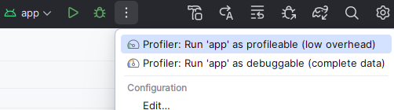
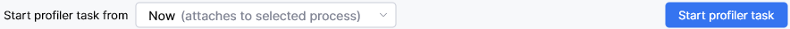
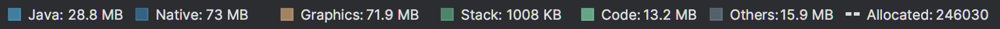

## Android Memory Profiling
Memory is often a problem in ML, with ever bigger models and data. For profiling an Android app's memory, Android Studio has a built-in profiler. This can be used to monitor the memory usage of your app, and to find memory leaks.

To find the Profiler, open your project in Android Studio and click on the *View* menu, then *Tool Windows*, and then *Profiler*. This opens the Profiler window. Attach your device in Developer Mode with a USB cable, and then you should be able to select your app's process. Here there are a number of different profiling tasks available.

Most likely with an Android ML app you'll need to look at memory both from the Java/Kotlin side and the native side. The Java/Kotlin side is where the app runs, and may be where buffers are allocated for input and output if, for example, you're using LiteRT (formerly known as TensorFlow Lite). The native side is where the ML framework will run. Looking at the memory consumption for Java/Kotlin and native is 2 separate tasks in the Profiler: *Track Memory Consumption (Java/Kotlin Allocations)* and *Track Memory Consumption (Native Allocations)*.

Before you start either task, you have to build your app for profiling. The instructions for this and for general profiling setup can be found [here](https://developer.android.com/studio/profile). You will want to start the correct profiling version of the app depending on the task.

For the Java/Kotlin side, you want the **debuggable** "Profile 'app' with complete data", which is based off the debug variant. For the native side, you want the **profileable** "Profile 'app' with low overhead", which is based off the release variant.

### Java/Kotlin

If you start looking at the [Java/Kotlin side](https://developer.android.com/studio/profile/record-java-kotlin-allocations), choose *Profiler: Run 'app' as debuggable*, and then select the *Track Memory Consumption (Java/Kotlin Allocations)* task. Navigate to the part of the app you wish to profile and then you can start profiling. At the bottom of the Profiling window it should look like Figure 2 below. Click *Start Profiler Task*.

When you're ready, *Stop* the profiling again. Now there will be a nice timeline graph of memory usage. While Android Studio has a nicer interface for the Java/Kotlin side than the native side, the key to the timeline graph may be missing. This key is shown below in Figure 3, so you can refer to the colors from this.

The default height of the Profiling view, as well as the timeline graph within it is usually too small, so adjust these heights to get a sensible graph. You can click at different points of the graph to see the memory allocations at that time. If you look according to the key you can see how much memory is allocated by Java, Native, Graphics, Code etc.

Looking further down you can see the *Table* of Java/Kotlin allocations for your selected time on the timeline. With ML a lot of your allocations are likely to be byte[] for byte buffers, or possibly int[] for image data, etc. Clicking on the data type will open up the particular allocations, showing their size and when they were allocated. This will help to quickly narrow down their use, and whether they are all needed etc.

### Native

For the [native side](https://developer.android.com/studio/profile/record-native-allocations), the process is similar but with different options. Choose *Profiler: Run 'app' as profileable*, and then select the *Track Memory Consumption (Native Allocations)* task. Here you have to *Start profiler task from: Process Start*. Choose *Stop* once you've captured enough data.

The Native view doesn't have the same nice timeline graph as the Java/Kotlin side, but it does have the *Table* and *Visualization* tabs. The *Table* tab no longer has a list of allocations, but options to *Arrange by allocation method* or *callstack*. Choose *Arrange by callstack* and then you can trace down which functions were allocating significant memory. Potentially more useful, you can also see Remaining Size. 

In the Visualization tab you can see the callstack as a graph, and once again you can look at total Allocations Size or Remaining Size. If you look at Remaining Size, you can see what is still allocated at the end of the profiling, and by looking a few steps up the stack, probably see which allocations are related to the ML model, by seeing functions that relate to the framework you are using. A lot of the memory may be allocated by that framework rather than in your code, and you may not have much control over it, but it is useful to know where the memory is going.

## Other platforms

On other platforms, you will need a different memory profiler. The objective of working out where the memory is being used is the same, and whether there are issues with leaks or just too much memory being used. There are often trade-offs between memory and speed, and they can be considered more sensibly if the numbers involved are known.
